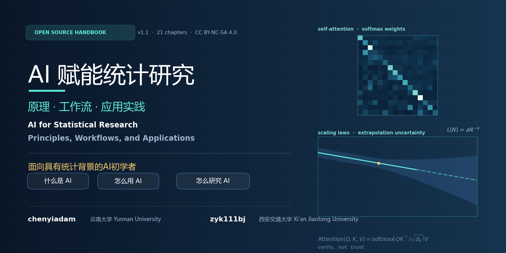

<div align="center">



# AI for Statistical Research: Principles, Workflows, and Applications

**AI 赋能统计研究：原理、工作流与应用实践**

[简体中文](./README.md) | [English](./README_EN.md)

[](./chapters/)
[](./README.md)
[](./LICENSE)
[](./CHANGELOG.md)

</div>

---

An open-source technical handbook on large language models and AI for mathematics, written **for students with a statistics background who are new to AI**.

> **A note on language.** The 21 chapters are currently written in Chinese. This English README describes the project in full; chapter-level English translation is on the roadmap (see [CONTRIBUTING.md](./CONTRIBUTING.md)).

## Authors

| Author | Affiliation | GitHub |
|---|---|---|
| chenyiadam | Yunnan University (云南大学) | [@chenyiadam](https://github.com/chenyiadam) |
| zyk111bj | Xi'an Jiaotong University (西安交通大学) | [@zyk111bj](https://github.com/zyk111bj) |

This project is jointly developed and maintained by the two authors.

---

## 1. What This Project Solves

A student with statistical training who is starting to learn AI faces three questions: **what AI is, how to use AI, and how to do research on AI**.

Existing materials fall into two camps. Engineering tutorials explain how to call APIs and set parameters, but say little about the internal mechanisms of LLMs and never ask what makes an output trustworthy. Survey papers cover the newest systems and methods, but offer no operational path — the reader knows AlphaProof won an IMO silver medal, yet still does not know what to do with the unproven lemma sitting in their own notes.

Students from a statistics background face a third obstacle: most materials assume the reader is already fluent in machine-learning vocabulary, even though much of that vocabulary has direct counterparts in statistical language — nobody has written the mapping down.

This project attempts to fill that gap, under three self-imposed constraints:

1. **Verification first.** The whole book keeps returning to one standard: what makes an output trustworthy. This thread connects topics that look unrelated — the reward signal in preference alignment is an estimator with sampling variability; hallucination can be derived as a consequence of calibration failure; AI-generated mathematics should be checked by a formal kernel (Lean) or a deterministic executor (an evaluator). These three verification mechanisms are not equally reliable; Section 12.14 ranks them.
2. **Operability.** Wherever content can be expressed as commands, scripts, templates, or checklists, an executable version is given. Where that is impossible (e.g., "design a good evaluator"), a checklist is provided instead of unverifiable advice.
3. **Statistical training as the foundation.** The target reader has been trained in estimation, testing, asymptotic theory, and causal identification, but has not systematically studied machine learning. For this reader, much of the machinery of LLMs can be mapped one-to-one onto known concepts: self-attention is kernel-weighted averaging; CLIP's InfoNCE is a conditional logistic regression in disguise; DDPM corresponds to denoising score matching; LoRA is a low-rank assumption. The book supplies these mappings instead of letting AI remain an isolated new vocabulary.

The book assumes no machine-learning background, and does not assume the reader wants to become a machine-learning expert. It assumes a reader who needs to judge which AI results are trustworthy, which workflows are worth deploying, and which problems belong on a PhD topic shortlist.

---

## 2. Focus Chapters

The current edition runs to 21 chapters. The focus chapters are:

### Chapters 10–14

- Reproducible usage of AI math tools: verbatim prompt templates for statement translation, tactic completion, error explanation, and proof restructuring (§10.8.11, §11.5.7, §13.7.5, §14.7.6); experience-based parameter guidance with do-it-yourself comparison protocols; and result-verification checklists anchored to the Lean kernel and deterministic executors (§10.8.10, §11.9.7, §13.7.7).
- Hand-held walkthroughs: formalizing $|x+y| \le |x| + |y|$ from scratch (§10.8.12) with a first-person record of a first Lean session (§10.8.13); translating and auditing statistical statements (§11.5.7, §11.9.7); a miniature neuro-symbolic loop (§12.16); a FunSearch-style toy search with a "false champion" post-mortem (§13.10); and the full path from claiming an issue to submitting a PR (§14.7.7–14.7.8).

### Chapter 21

- All four practices were replicated end-to-end on local hardware: training a 6.85M-parameter model from scratch (RTX 3060, bf16), a local Qwen2.5-0.5B chat and FastAPI service, a regression-diagnostics Skill, an MCP server making real arXiv calls, and a 36-configuration Monte-Carlo grid on heteroskedastic size distortion. Run logs, metrics, and audit records are archived in [`_experiments/`](./_experiments/ch21-应用实践/README.md) for readers to cross-check.
- A new §21.8 on automated workflow agents: coding agents (GitHub Copilot, Codex, Claude Code, Cursor, OpenCode), local-execution agents (Open Interpreter), and platform-type products (Coze, Dify, WorkBuddy) — positioning, installation, and selection guidance.
- A new AI-assisted derivation archive (`_experiments/ch21-应用实践/ai-derivations/`): for five mathematical/statistical propositions behind Chapter 21, a complete "prompt — derivation — numerical verification" record with a re-runnable verification script.

---

## 3. The Map: Three Questions, Three Threads

```text
What AI is      ───  Ch. 2–5      data → architecture → training & alignment → multimodal & agents
                                      (principles: mechanisms and their limits)

How to use AI   ───  Ch. 6–9      prompting → Skill/Agent → coding agents → deployment
                     Ch. 19       compute, cost, and engineering conditions
                                      (tools: reusable workflows)

How to study AI ───  Ch. 10–14    formal verification → theorem proving → program search → human–AI collaboration
                     Ch. 15–18    frontier bottlenecks → statistics × AI → reproducibility → safety & ethics
                     Ch. 20–21    resource tables → four complete practices
                                      (research: getting your hands dirty)
```

The threads are not a reading order. Chapter 1 is a compressed version of the whole book; after reading it, jump to any chapter:

| If you want to … | Start at | Continue to |
|---|---|---|
| Judge whether an AI paper's claim is trustworthy | §15.10, §16.5 | §4.11, §9.5 |
| Wrap a repeated analysis into a reusable tool | §7.6–7.11 | §8.14, §21.3 |
| Check one of your own inequalities or limit theorems with AI | Ch. 10 | Ch. 11, §10.8 |
| Find a publishable statistics topic | §16.15 | §4.13, §16.1–16.11 |
| Build a research/training setup on a limited budget | Ch. 19 | §21.2 |
| Decide whether a piece of AI functionality is worth adopting in your group | §8.1, §9.1, §9.7 | Ch. 18 |

---

## 4. Table of Contents

### Part I　Introduction

| Chapter | Contents |
|---|---|
| [Ch. 1　Introduction: The Landscape of AI-Empowered Research](./chapters/01-引言-AI赋能科研的基本图景.md) | The 2026 LLM competitive landscape; four modes of AI entering research; five technical routes of AI theorem proving; Skill automation; the full training stack; structural weaknesses; Git/conda/Shell as engineering prerequisites |

### Part II　What AI Is: Principles

| Chapter | Contents |
|---|---|
| [Ch. 2　Corpora and Tokenization](./chapters/02-数据语料与分词.md) | The corpus landscape; deduplication and quality filtering (MinHash LSH, perplexity); open-source tooling; BPE; three tokenizers; word-embedding lineage; data mixture and curriculum learning; licensing |
| [Ch. 3　Transformer, Attention, and Model Architecture](./chapters/03-Transformer注意力与模型架构.md) | Self-attention as kernel regression; multi-head attention; FFN as basis expansion; LayerNorm/RMSNorm; RoPE and ALiBi; MHA→MQA→GQA→MLA; MoE; state-space and hybrid architectures |
| [Ch. 4　Training, Alignment, and the Model Ecosystem](./chapters/04-训练对齐与模型生态.md) | Pretraining as likelihood; SFT; RLHF as Bradley–Terry; DPO as a log-likelihood ratio; GRPO and baseline variance reduction; LoRA/QLoRA; closed- vs open-weight camps; selective reporting in benchmark evaluation |
| [Ch. 5　Multimodality and Agent Principles](./chapters/05-多模态与智能体原理.md) | ViT and inductive bias; CLIP as matched case-control sampling; DDPM and score matching; the LLaVA recipe; natively multimodal models; the four agent elements; graph-augmented and retrieval-augmented agents |

### Part III　How to Use AI: Tools

| Chapter | Contents |
|---|---|
| [Ch. 6　Prompt Engineering](./chapters/06-提示词工程.md) | In-context learning as posterior prediction; CoT / Self-Consistency / ReAct / ToT / PAL; a hallucination-audit checklist; 11 research prompt templates; automatic prompt optimization; prompt-injection defense |
| [Ch. 7　Agents, Tool Calling, and Skill Automation](./chapters/07-Agent工具调用与Skill自动化.md) | Planning–memory–tools–execution; Function Calling and MCP; the SKILL.md spec and progressive disclosure; dynamic tool retrieval and its multiple-testing analogy; multi-agent orchestration; seven research Skill templates |
| [Ch. 8　AI Coding and Research Automation](./chapters/08-AI编程与科研自动化.md) | Claude Code / Copilot / Cursor / Windsurf / Gemini CLI / Aider compared; code as a verifiable intermediate representation; automated data analysis; literature management with RAG; automated experiments; reproducible workflows; R integration |
| [Ch. 9　Deployment, Serving, and Operations](./chapters/09-部署上线与持续运营.md) | Inference engine selection; quantization error formulas and a statistical evaluation protocol; continuous batching; monitoring as statistical process control (X-bar/R/EWMA); the complete statistics of A/B testing; routing and cost optimization |

### Part IV　How to Study AI: AI for Math

| Chapter | Contents |
|---|---|
| [Ch. 10　Formal Verification and Proof Assistants](./chapters/10-形式化验证与证明助手.md) | Curry–Howard and the trusted computing base; Lean 4 and the four proof assistants; searching Mathlib4; miniF2F; LeanDojo; autoformalization and judging translation fidelity |
| [Ch. 11　Verifying Mathematical and Statistical Theorems with AI](./chapters/11-用AI验证数学与统计定理.md) | A nine-step operating procedure; quantifier order and convergence modes in statistical statements; three complete formalization case studies (Cauchy–Schwarz; Chebyshev/LLN; unbiasedness and consistency of an estimator); counterexample search; conjecture generation; 12 failure modes |
| [Ch. 12　Neuro-Symbolic Theorem Proving Systems](./chapters/12-神经符号定理证明系统.md) | The generator–verifier loop formalized; AlphaProof; AlphaGeometry; DeepSeek-Prover-V2; GPT-f; Aristotle; Claude FLT; AI4SLT (formalizing statistical learning theory); the Anderson conjecture; Kakeya; the Erdős counterexample; the reliability hierarchy of four verification mechanisms |
| [Ch. 13　Program Search, Evolution, and Automated Discovery](./chapters/13-程序搜索进化算法与自动发现.md) | The search paradigm and proposal distributions; FunSearch; AlphaEvolve; AlphaTensor; the Ramanujan Machine; the MIT open-source reimplementation; **evaluator design methodology**; readable code as mathematical insight; connections to optimal design and subset selection |
| [Ch. 14　Human–AI Collaboration, Crowdsourcing, and Large-Scale Formalization](./chapters/14-人机协作众包与大规模形式化工程.md) | The Blueprint workflow; the Equational Theories project (4,694 laws); formalizing PFR; Prove2Me; Terence Tao's public assessment of AI; crowd workflows; credit assignment and controversies |

### Part V　How to Study AI: Statistics × AI

| Chapter | Contents |
|---|---|
| [Ch. 15　Frontiers: Reasoning, Multimodality, Efficient AI, Interpretability](./chapters/15-推理多模态高效AI与可解释性前沿.md) | The data bottleneck and a recursion for model collapse; extrapolation uncertainty in scaling laws; test-time compute and the statistical efficiency of majority voting; VLMs; agents; AI4Science; post-hoc vs mechanistic interpretability; the identification limits of causal AI |
| [Ch. 16　Statistics × AI](./chapters/16-统计与AI交叉.md) | Bias–variance of ECE; conformal prediction and the impossibility of conditional coverage; statistical modeling of hallucination; quality control for synthetic data; methodology for AI evaluation (McNemar, cluster bootstrap, CUPED); LoRA's generalization; Bayesian model averaging; multiple comparisons; **six PhD entry points for statistics students** |
| [Ch. 17　Reproducibility, Audit, and Verification Infrastructure](./chapters/17-可复现审计与验证基础设施.md) | Environmental uncertainty as a variance component; containers ≠ reproducibility; experiment tracking; executable reports; verification logs (including failures); data/model card templates; a 30-item reproduction checklist; cloud snapshots |
| [Ch. 18　Safety, Ethics, Compliance, and Research Integrity](./chapters/18-安全伦理合规与学术诚信.md) | Threat modeling; OWASP LLM Top 10; the noise-vs-sampling-variance trade-off in differential privacy; estimation bias in federated learning; license compatibility; disclosing AI use; human subjects; fairness impossibility results; audit logs |

### Part VI　Resources and Practice

| Chapter | Contents |
|---|---|
| [Ch. 19　Compute, Cost, and Engineering Conditions](./chapters/19-算力成本与工程条件.md) | API pricing; GPU purchase and rental; VRAM estimation formulas; three workstation tiers; **a sample-size–precision trade-off model for budget allocation**; preemption as non-random missingness; 30% sensitivity analysis; full AutoDL/Alibaba Cloud walkthroughs |
| [Ch. 20　Cases, Toolchains, and Resource Tables](./chapters/20-案例工具链与资源总表.md) | 10 prompt templates; 3 SKILL.md skeletons; a proof-case document template; 15 groups of reproduction commands; five cross-indexed tables (projects / papers / toolchains / cloud & hardware / learning resources, ≈280 entries) |
| [Ch. 21　Applications and Practice](./chapters/21-应用实践.md) | Practice 1: full-stack training (MiniMind low-compute track + LLaMA-Factory standard track); Practice 2: building a research Skill (complete `regression-diagnostics` example); Practice 3: an MCP server and agent integration; Practice 4: a complete Monte-Carlo study of size distortion under heteroskedasticity; §21.8 on automated workflow agents. Local replication evidence lives in [`_experiments/`](./_experiments/ch21-应用实践/README.md) |

Supplementary resources live in [`resources/`](./resources/):

- [`resources/术语表.md`](./resources/术语表.md) — a bilingual glossary with chapter references (in Chinese)
- [`resources/阅读路线图.md`](./resources/阅读路线图.md) — reading plans by background and time budget (in Chinese)

---

## 5. Quick Start

### 30 minutes: decide whether this book is useful to you

Read §1.3, §1.4, and §1.7 of [Chapter 1](./chapters/01-引言-AI赋能科研的基本图景.md), then [§16.15](./chapters/16-统计与AI交叉.md) (six entry points for beginners). Together these cover the book's methodological position and its expected output.

### Half a day: build one working pipeline

Set up a data-analysis pipeline following [§8.15](./chapters/08-AI编程与科研自动化.md), then wrap the most repeated step into a Skill following [§7.10](./chapters/07-Agent工具调用与Skill自动化.md). You will end with a reusable tool, not a chat transcript.

### Two weeks: apply AI to a real derivation

Compress the 4-week plan of [Chapter 10](./chapters/10-形式化验证与证明助手.md): install Lean and clear Natural Number Game on days 1–3; complete the first case of [§11.4](./chapters/11-用AI验证数学与统计定理.md) on days 4–7; take one of your own unformalized lemmas through the nine-step procedure on days 8–14.

### One weekend: run the replication package for Chapter 21

Following [`_experiments/`](./_experiments/ch21-应用实践/README.md), replicate all four practices on a CPU-only machine or a single 12GB GPU: train a 6.85M-parameter model from scratch, stand up a local chat and API service, serve an MCP server that queries arXiv for real, and finish the heteroskedastic Monte-Carlo loop. Every script's expected output has been verified locally, and run logs are archived in the repository.

### Requirements

The book assumes day-to-day data-analysis ability in Python or R and basic command-line skills — **no machine-learning background**. A GPU is not required: Chapters 6, 7, 11, 16, 17, and 18 can be practiced entirely on a laptop; Chapters 19 and 21 provide low-compute alternatives (see the MiniMind track in §21.2.16).

---

## 6. Repository Structure

```text
ai-for-statistics/
├── README.md                 Chinese readme
├── README_EN.md              this page (English)
├── LICENSE                   CC BY-NC-SA 4.0
├── CONTRIBUTING.md           contribution guide and style rules
├── CHANGELOG.md              release notes
├── _tools/                   repository maintenance tooling
│   ├── check_links.py        batch reachability check for all external links
│   └── link_report.*         latest check report (JSON and Markdown)
├── _experiments/             local replication package (companion to Ch. 21)
│   └── ch21-应用实践/       scripts, configs, run logs, and AI-derivation archive
├── assets/
│   ├── cover.png             project cover image
│   └── make_cover.py         cover generation script (Python + matplotlib)
├── chapters/                 the book, one Markdown file per chapter (in Chinese)
│   ├── 01-引言-AI赋能科研的基本图景.md   (Ch. 1  Introduction)
│   ├── 02-数据语料与分词.md             (Ch. 2  Corpora and Tokenization)
│   ├── 03-Transformer注意力与模型架构.md (Ch. 3  Architecture)
│   ├── 04-训练对齐与模型生态.md          (Ch. 4  Training and Alignment)
│   ├── 05-多模态与智能体原理.md          (Ch. 5  Multimodality and Agents)
│   ├── 06-提示词工程.md                 (Ch. 6  Prompt Engineering)
│   ├── 07-Agent工具调用与Skill自动化.md  (Ch. 7  Agents and Skills)
│   ├── 08-AI编程与科研自动化.md          (Ch. 8  AI Coding)
│   ├── 09-部署上线与持续运营.md          (Ch. 9  Deployment)
│   ├── 10-形式化验证与证明助手.md        (Ch. 10 Formal Verification)
│   ├── 11-用AI验证数学与统计定理.md      (Ch. 11 Verifying Theorems)
│   ├── 12-神经符号定理证明系统.md        (Ch. 12 Neuro-Symbolic Provers)
│   ├── 13-程序搜索进化算法与自动发现.md  (Ch. 13 Program Search)
│   ├── 14-人机协作众包与大规模形式化工程.md (Ch. 14 Human–AI Collaboration)
│   ├── 15-推理多模态高效AI与可解释性前沿.md (Ch. 15 Frontiers)
│   ├── 16-统计与AI交叉.md               (Ch. 16 Statistics × AI)
│   ├── 17-可复现审计与验证基础设施.md    (Ch. 17 Reproducibility)
│   ├── 18-安全伦理合规与学术诚信.md      (Ch. 18 Safety and Ethics)
│   ├── 19-算力成本与工程条件.md          (Ch. 19 Compute and Cost)
│   ├── 20-案例工具链与资源总表.md        (Ch. 20 Resource Tables)
│   └── 21-应用实践.md                   (Ch. 21 Practice)
└── resources/
    ├── 术语表.md             bilingual glossary (Chinese)
    └── 阅读路线图.md         reading plans (Chinese)
```

Markdown templates, Skill definitions, and command scripts inside the chapters can be copied directly. All code blocks are language-tagged; Lean blocks are tagged `lean` and render in any Lean-aware editor.

---

## 7. A Note on Timeliness

Some information in this domain decays quickly. The repository handles this in three ways; please keep them in mind when citing:

1. **Prices, rankings, benchmark scores.** API prices, hardware quotes, and leaderboard numbers in Chapters 1, 4, and 19 are marked with their as-of dates. They will likely be stale within a few months; for real decisions (especially procurement and cost accounting), defer to the vendor's current pricing.
2. **Event-level claims from 2026.** The timeline in §1.4 and several cases in Chapter 12 rely on recent public reporting. Results without peer-reviewed papers or public code are flagged as "reported" and have not been independently verified.
3. **Content that does not decay.** The derivations in Chapters 2–4, the formal methods of Chapters 10–11, the statistical methods of Chapters 16–18, and the evaluator-design principles of Chapter 13. These have shelf lives measured in years and are the parts worth reading first.

If you find factual errors, dead links, or improvable wording, please open an issue per [`CONTRIBUTING.md`](./CONTRIBUTING.md).

---

## 8. License and Citation

The text is released under **CC BY-NC-SA 4.0** (see [`LICENSE`](./LICENSE)): free to copy, adapt, and redistribute with attribution and share-alike; no commercial use.

Third-party projects, papers, datasets, and tools referenced in the text remain the property of their respective owners, under their own licenses, whose official statements govern. In the resource tables of Chapter 20, the licensing status of each entry follows its original source.

Suggested citation (BibTeX):

```bibtex
@book{ai_for_statistics_2026,
  title     = {AI for Statistical Research: Principles, Workflows, and Applications},
  author    = {chenyiadam and zyk111bj},
  year      = {2026},
  publisher = {GitHub},
  note      = {Open-source technical handbook, 21 chapters. Chinese edition:
               《AI 赋能统计研究：原理、工作流与应用实践》},
  url       = {https://github.com/chenyiadam/ai-for-statistics}
}
```

---

## 9. Authors and Acknowledgments

### Authors

- **chenyiadam** (Yunnan University) — [@chenyiadam](https://github.com/chenyiadam)
- **zyk111bj** (Xi'an Jiaotong University) — [@zyk111bj](https://github.com/zyk111bj)

### Acknowledgments and boundaries

This book aggregates a large amount of publicly available material: arXiv papers, GitHub projects, official documentation, course materials, and public reporting. Links to all of these are given in the text; their authors and maintainers are the true foundation of this book.

One boundary should be stated plainly: the authors come from a statistics background and are learners of AI, not developers of any of the systems described. Descriptions of AlphaProof, Lean 4, Mathlib4, and similar systems draw on public materials and community documentation, not first-hand development experience. One further point about how this book was written: much of its technical content — installation procedures of open-source projects, syntax conventions, common commands — is fixed boilerplate with little room for free play, so a substantial share of the first draft consists of condensations of the original sources, later revised and edited into a uniform voice. For design trade-offs inside those systems, defer to the official technical reports and code repositories. The reliability ranking of verification mechanisms in §12.14 and the methodology of Chapter 16 are this book's own judgments, and disagreement is welcome.
