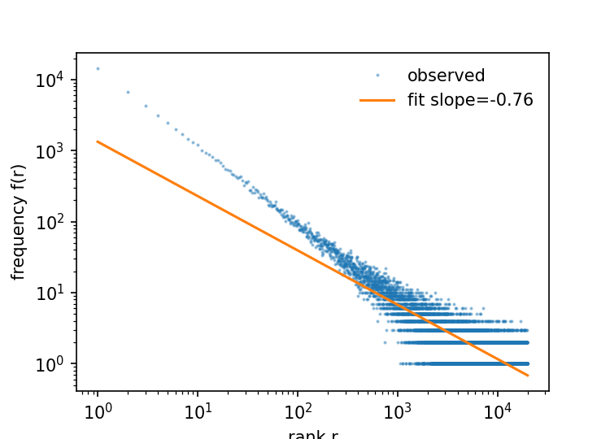

# 第2章 数据语料与分词


## 本章导读

统计推断的结论质量受制于抽样设计；大语言模型的能力同样受制于训练语料的构成。本章顺着"数据源 → 清洗 → 离散化 → 向量化 → 配比与合法性"这条流水线展开，处理的是模型看得见的世界如何被建造出来。2.1 节先给出现代预训练语料的来源地图，并把它放到抽样调查的框架中讨论覆盖偏差，2.1.3 节以 Zipf 定律刻画词频分布的重尾性质及其对建模的含义；2.2 与 2.3 节讨论清洗与去重的算法原理和开源工具链，其中 2.2.1 节给出 MinHash 估计量的无偏性、方差与 LSH 的两类错误概率，2.2.6 节把清洗整体理解为对经验分布的一次重加权；2.4 至 2.6 节处理文本到 token 序列的离散化问题，这是语言模型唯一的输入形式，也是很多人误判模型行为的原因；2.7 与 2.8 节回顾词向量从静态到动态的演进，并说明现代模型中 Embedding 层如何被端到端联合训练；2.9 节讨论数据配比与课程学习，这是语料层面的"加权估计"；2.10 节处理版权、许可与个人隐私保护。第 3 章将在这些 token 序列之上搭建架构，第 4 章在此基础上讨论预训练与对齐。

## 2.1 语料库全景

大模型的知识边界由训练数据决定。当前主流预训练语料生态如下（规模为各数据集公开宣称的统计量，随版本更新会变化，以官方页面为准）：

| 语料库 | 规模 | 提供方 | 获取地址 | 用途 |
|--------|------|--------|---------|------|
| Common Crawl | 约 250B 网页（18 年爬取） | 非营利组织 | https://commoncrawl.org/ | GPT/Llama 等模型的核心原始数据来源 |
| FineWeb | 15T tokens（清洗去重后） | HuggingFace | https://huggingface.co/datasets/HuggingFaceFW/fineweb | 当前最大开源预训练数据集，基于 datatrove 清洗 |
| FineWeb-Edu | FineWeb 的教育子集 | HuggingFace | https://huggingface.co/datasets/HuggingFaceFW/fineweb-edu | 高质量教育内容筛选版 |
| The Pile | 825GB 混合语料 | EleutherAI | https://pile.eleuther.ai/ | 经典多源语料（含 arXiv/GitHub/书籍） |
| RedPajama | 1.2T tokens | Together AI | https://www.together.ai/blog/redpajama | Llama 的完全开源复现版语料 |
| C4 | 156B tokens | Google | https://huggingface.co/datasets/allenai/c4 | T5/BERT 时代经典语料 |
| RefinedWeb | 5T tokens | TII UAE | https://huggingface.co/datasets/tiiuae/falcon-refinedweb | FineWeb 的原型 |

原始网页数据中混杂广告、乱码、重复内容，须经过严格清洗才能用于训练。数据处理正是许多统计学家所擅长的领域：去重、去噪、分布检验、采样策略等。

### 2.1.1 规模的度量单位

语料规模有三种常见口径，比较时必须对齐单位：一是原始文档字节数（GB/TB），包含 HTML 标签等噪声；二是清洗后纯文本的字节数，通常比前者小一个量级；三是 token 数，即经过分词器切分后的单元数，是真正决定训练步数的量。英文文本大致 1 token 对应 3 至 4 个字符或 0.75 个单词，但这个换算系数与语言、领域文本类型（代码、数学公式、聊天记录）都有关，跨数据集比较 served size 时应自行测量而非套用常数。Common Crawl 每月发布一次抓取快照，其 WARC 原始归档体量远大于清洗后可用于训练的文本量，"用到几个 Common Crawl 快照"与"用了多少 token"是两个不同问题。

### 2.1.2 抽样视角下的覆盖误差

把训练语料看作一次抽样，可以立刻识别出几类误差。抽样框是 Common Crawl 的网络爬虫能够覆盖的链接集合；目标总体则是模型应当掌握的人类知识的全部载体。两者之间的缺口构成覆盖误差（coverage error）：需要登录或付费的内容、由 JavaScript 动态渲染的页面、以 PDF 和图片形式存在的文档、以及绝大多数纸质书籍与期刊，都系统性缺失或严重不足。低资源语言的网页数量远小于其使用总体占比，导致多语言模型在尾部语言上的表现难以通过单纯放大数据量来弥补。

第二类问题是抽样权重的不可知。网页被爬虫收录的概率取决于链接结构、站点规模与 robots 协议，与文本质量没有稳定的正相关关系；同时同一份内容常以多个 URL、多个镜像、多个版本出现（这一条正是 2.2 节去重要处理的）。这类数据的性质接近便利样本而非概率样本，任何基于"网页多即代表重要"的隐式假设都不可靠。一个可行的补救思路是把已知的、具有明确来源结构的子集（书籍、期刊、百科、代码仓库）视为已知抽样框，用它们在训练阶段做后分层加权，也就是 2.9 节的数据配比；另一条思路是用少量已知来源的高质量数据训练判别器，对整个语料打质量分并按分筛选，其地位与调查数据处理中的倾向得分加权相近。

### 2.1.3 Zipf 定律：词频分布的重尾性质

在动手清洗之前，先认识语料本身的分布形状。对词级统计，词频按秩排列近似服从幂律，即 Zipf 定律（Zipf's law）：第 $r$ 高频词型的频率 $f(r)\propto r^{-s}$，自然语言文本的 $s$ 通常接近 1。这条重尾分布对预训练语料至少有三个直接后果。

第一，头部极少数词型占据大部分 token。头部约 100 个词型即可覆盖一半以上的语料，这些高频词的 n-gram 统计量在很小的样本上就已稳定。第二，尾部极长且单例词（只出现一次的词型，hapax legomena）占词型数的多数，这些词型的频率估计方差极大，模型对它们的"知识"接近记忆而非泛化；2.4.2 节的词表大小权衡正是围绕这一尾部分布展开的。第三，重尾意味着有限样本对分布的截断不可忽略：实际观测到的词型数随语料规模增长（Heaps 定律，Heaps' law，$V(N)\propto N^{\beta}$，$\beta$ 通常在 0.4 至 0.6 之间），因此"语料里没有出现某个词"更多是采样不足的证据，而不是该词不存在的证据。这与抽样调查中小域估计（small area estimation）面临的困境同构。

下面的演示在一个参数已知的合成 Zipf 分布上采样，观察两个统计现象：双对数回归能否恢复幂律指数；以及直接对"出现次数大于等于 1"的观测做回归会产生多大的截断偏差（代码依赖 numpy 与 matplotlib，种子固定，结果可复现）：

```python
import numpy as np
import matplotlib
matplotlib.use("Agg")                 # 无显示器环境下的绘图后端
import matplotlib.pyplot as plt

rng = np.random.default_rng(7)
s_true = 1.1
n_vocab = 20000                       # 词表容量（潜在词型总数）
ranks = np.arange(1, n_vocab + 1)
p = ranks ** (-s_true)
p /= p.sum()                          # 归一化成词频分布
N = 100000                            # 合成语料总 token 数
counts = rng.multinomial(N, p)

keep = counts > 0
r_obs = ranks[keep].astype(float)
f_obs = counts[keep].astype(float)

slope, intercept = np.polyfit(np.log(r_obs), np.log(f_obs), 1)
print(f"实际出现的词型数 = {int(keep.sum())}")
print(f"全部观测的双对数回归斜率 = {slope:.3f}")

hi = f_obs >= 10                      # 只用高频头部拟合，避开采样截断
slope_hi, intercept_hi = np.polyfit(np.log(r_obs[hi]), np.log(f_obs[hi]), 1)
print(f"仅用频次 >= 10 的头部词型拟合斜率 = {slope_hi:.3f}")
print(f"仅出现 1 次的词型数 = {int((counts == 1).sum())}")

fig, ax = plt.subplots(figsize=(5, 3.6))
ax.loglog(r_obs, f_obs, ".", ms=2, alpha=0.4, label="observed")
ax.loglog(r_obs, np.exp(intercept) * r_obs ** slope, "-", lw=1.5,
          label=f"fit slope={slope:.2f}")
ax.set_xlabel("rank r"); ax.set_ylabel("frequency f(r)")
ax.legend(frameon=False)
fig.savefig("zipf.png", dpi=150)
```

在本地环境（Python 3.10.20，numpy 1.26.4，matplotlib 3.10.8）实际运行的结果如下，随机数种子已固定，数字应可复现到小数点后两位：

```text
实际出现的词型数 = 10538
全部观测的双对数回归斜率 = -0.765
仅用频次 >= 10 的头部词型拟合斜率 = -1.013
仅出现 1 次的词型数 = 5281
```



这里最值得留意的是斜率对比：真实参数 $s=1.1$，但把全部观测（包括大量只出现一两次的尾部词型）直接丢进双对数回归，得到的斜率是 $-0.765$，明显偏离真值；只保留频次充足的头部词型后，估计回到 $-1.013$。原因是尾部观测被"至少出现一次"的采样下限截断，次数为 1 的词型在双对数图上排成一条水平带，把回归线尾部压平。做语料统计时若直接在原始词频表上拟合幂律而不检查截断，得到的指数很可能是有偏的；更稳妥的做法是采用专门处理截断计数的估计方法（如对数似然下的截断幂律拟合），或者至少像上面那样只在高频段做诊断性回归。

## 2.2 数据清洗核心步骤

清洗流水线通常按"去重 → 质量过滤 → 毒性过滤 → 格式归一"的顺序执行。顺序不是任意的：先去重可以让后续质量判定的计算量大幅下降，也避免同一份低质内容因为重复出现而污染阈值估计。

### 2.2.1 去重：从精确匹配到近似去重

精确去重依赖文档内容的密码学哈希（如 SHA-256），代价低但对改写、增删段落无能为力。因此工业界普遍采用基于 n-gram 集合相似度与 MinHash 的近似去重。

定义文档 $D$ 的 $n$-gram 集合 $S_D$，两文档的 Jaccard 相似度为 $J(A,B)=|S_A\cap S_B|/|S_A\cup S_B|$。MinHash 的核心事实是：对随机置换 $\pi$，有精确等式

$$\Pr\big(\min \pi(S_A)=\min \pi(S_B)\big)=J(A,B)$$

也就是说单个哈希位置的取值一致的指示变量是 Jaccard 相似度的一个无偏估计量，取 $k$ 个独立置换得到的指示变量均值则以 $O(k^{-1/2})$ 的速率收敛，MinHash 本质是一个随机化的无偏估计，而非启发式技巧。进一步用 banding 技术把签名向量切成 $b$ 个 band，每个 band 内 $r$ 个元素（$k=br$），两个文档成为候选对的概率为

$$P(s)=1-(1-s^r)^b$$

这是一条 S 形曲线，在 $s\approx (1/b)^{1/r}$ 处最陡，正是按目标相似度阈值选择 $b,r$ 的依据。工程上还常额外做段落级去重（因为同一段样板文本跨文档重复）与 URL 级去重（同一站点大量近乎相同的页面）。

#### 估计量的无偏性与方差

把 MinHash 明确当作估计量来对待，可以回答"签名要多长才够"这类问题。设单个哈希位置上两文档取值一致的指示变量为 $I$，则 $I\sim\mathrm{Bernoulli}(J)$，$k$ 维签名给出的估计量 $\hat J=\frac1k\sum_{i=1}^k I_i$ 无偏，方差为

$$\mathrm{Var}(\hat J)=\frac{J(1-J)}{k}$$

在理想化的 min-wise 独立置换假设下各 $I_i$ 相互独立；工程上用通用哈希函数族模拟随机置换，独立性只是近似成立，因此上式应理解为量级参考而非精确值。方差的实用意义是给出样本量：方差在 $J=1/2$ 处最大，若想把标准误控制在 $\pm 0.01$，需要 $k\approx J(1-J)/\mathrm{se}^2$；而 $J$ 接近 0 或 1 时所需的维数小得多。这也是 text-dedup 默认 `num_perm=256` 一类配置的统计含义，对预期阈值附近的文档对，估计的标准误在 $0.03$ 上下。

#### banding 的两类错误与阈值选择

LSH banding 可以看作一个假设检验：原假设"两文档不是近重复"，检验统计量是"是否存在一个 band 内 $r$ 行全部一致"。对真实相似度为 $s$ 的文档对，成为候选对的概率是 $P(s)=1-(1-s^r)^b$，于是有两类错误：

- 假阳性（false positive）：真实相似度低于阈值的文档对被误判为候选，概率即 $P(s)$。假阳性的代价可控，因为候选对还要经过精确 Jaccard 复核才能删除，复核把假阳性率压回零，只多花计算量。
- 假阴性（false negative）：真实相似度达到阈值的文档对没有任何 band 全一致，概率为 $(1-s^r)^b$。假阴性不可恢复，被漏掉的重复文档直接进入训练集，这正是参数选择的主要风险来源。

两条曲线的交点位置由 $b$ 与 $r$ 的相对比例控制：$r$ 增大使阈值 $(1/b)^{1/r}$ 上移（更严格，假阴性增加），$b$ 增大使阈值下移（更宽松，假阳性增加）。与假设检验的类比在此完全成立：选择 $b,r$ 就是选择显著性水平与功效的权衡点，而代价不对称时（漏掉重复文档的后果比多复核一批候选更严重），应把曲线的陡峭段放在目标阈值的左侧。下面的示意展示了签名矩阵如何被切成 band 并产生候选对：

```text
文档签名矩阵（每列一个文档，k = br 行，此处 b = 2, r = 3 作示例）
              文档A   文档B   文档C
         ┌  第1行    7       7       2  ┐
 band 1  │  第2行    3       3       9  │  A、B 三行全同 → 成为候选对
         └  第3行    5       5       4  ┘
         ┌  第4行    1       6       8  ┐
 band 2  │  第5行    9       2       2  │  无任何 band 全同 → 不成为候选
         └  第6行    4       7       1  ┘
            ……（实际使用中 b 通常取数十，r 取 4~16）

候选规则：只要有一个 band 内 r 行全部相等，两文档即进入精确 Jaccard 复核
候选概率：P(s) = 1 - (1 - s^r)^b，s 为真实 Jaccard 相似度
```

#### 最小实现与验证

不依赖 datasketch 一类的现成库，仅用标准库 `hashlib` 模拟哈希置换族，就能把上面两条性质完整验证一遍。以下脚本做了三件事：对一对真实文档计算精确 Jaccard 与 64 维 MinHash 估计；用 Monte Carlo 验证估计量的无偏性与方差公式；再模拟 banding 过程验证候选概率公式（代码只依赖 numpy 与标准库）：

```python
import hashlib
import numpy as np

rng = np.random.default_rng(42)

def shingles(text, k=5):
    """k-shingling：把文本转成长度为 k 的字符片段集合"""
    return {text[i:i + k] for i in range(len(text) - k + 1)}

def jaccard(A, B):
    return len(A & B) / len(A | B)

base = "统计学家使用随机抽样估计总体参数并对估计量的方差进行评估以给出置信区间"
dup = base.replace("评估", "评价")          # 近重复（改写两词）
unrel = "机器学习模型通过最小化训练集上的经验风险来学习参数"

def h(item, seed, p=(1 << 61) - 1):
    """第 seed 个哈希函数：sha1 映射到素数域，模拟一次随机置换"""
    digest = hashlib.sha1(str(seed).encode() + item.encode()).digest()
    return int.from_bytes(digest[:8], "big") % p

def minhash_signature(S, k=64):
    return [min(h(x, s) for x in S) for s in range(k)]

print("== 单对文档的 Jaccard 估计 ==")
for a, b, label in [(base, dup, "近重复对"), (base, unrel, "无关对")]:
    A, B = shingles(a), shingles(b)
    J = jaccard(A, B)
    sigA = np.array(minhash_signature(A))
    sigB = np.array(minhash_signature(B))
    Jhat = (sigA == sigB).mean()
    print(f"{label}: 精确 J = {J:.3f}, 64 维签名估计 = {Jhat:.3f}")

J_true, k, R = 0.8, 64, 200000
agree = rng.random((R, k)) < J_true     # 每个哈希位置一致与否 ~ Bernoulli(J)
Jhats = agree.mean(axis=1)
print("== 估计量性质的 Monte Carlo 验证 ==")
print(f"真实 J = {J_true}, {R} 次重复: 估计均值 = {Jhats.mean():.4f}")
print(f"方差: 模拟 = {Jhats.var():.6f}, 理论 J(1-J)/k = {J_true*(1-J_true)/k:.6f}")
print(f"标准误: 模拟 = {Jhats.std():.4f}, 理论 = {np.sqrt(J_true*(1-J_true)/k):.4f}")

b, r = 16, 4    # k = br = 64, 曲线中点 s* = (1/b)^(1/r) = 0.5
def candidate_prob(s, trials=100000):
    agree = rng.random((trials, b * r)) < s
    bands = agree.reshape(trials, b, r)
    return (bands.all(axis=2).any(axis=1)).mean()

print(f"== banding 候选概率 (b={b}, r={r}) ==")
for s in [0.2, 0.4, 0.5, 0.6, 0.8, 0.9]:
    sim = candidate_prob(s)
    theo = 1 - (1 - s**r)**b
    print(f"s={s:.1f}: 模拟候选概率 = {sim:.4f}, 理论 = {theo:.4f}")
```

输出如下：

```text
== 单对文档的 Jaccard 估计 ==
近重复对: 精确 J = 0.722, 64 维签名估计 = 0.719
无关对: 精确 J = 0.000, 64 维签名估计 = 0.000
== 估计量性质的 Monte Carlo 验证 ==
真实 J = 0.8, 200000 次重复: 估计均值 = 0.8000
方差: 模拟 = 0.002484, 理论 J(1-J)/k = 0.002500
标准误: 模拟 = 0.0498, 理论 = 0.0500
== banding 候选概率 (b=16, r=4) ==
s=0.2: 模拟候选概率 = 0.0248, 理论 = 0.0253
s=0.4: 模拟候选概率 = 0.3409, 理论 = 0.3396
s=0.5: 模拟候选概率 = 0.6431, 理论 = 0.6439
s=0.6: 模拟候选概率 = 0.8909, 理论 = 0.8915
s=0.8: 模拟候选概率 = 0.9998, 理论 = 0.9998
s=0.9: 模拟候选概率 = 1.0000, 理论 = 1.0000
```

两处验证与理论吻合得很好：$J=0.8$ 时 200000 次重复的估计均值恰为 0.8000，模拟方差 $0.002484$ 对比理论值 $J(1-J)/k=0.002500$，差异在 Monte Carlo 误差范围内；banding 候选概率的模拟值与理论公式 $1-(1-s^r)^b$ 在六个 $s$ 取值上的偏差均不超过 $0.002$，与 100000 次模拟的抽样误差量级相符。在练习中遇到的一个容易忽视的细节是：shingling 的粒度（字符级还是词级、$n$ 取多大）会系统性改变 $J$ 的取值，粒度越细，改写越容易被识别，但对短文档的区分度也随之下降，工程上需要在真实样本上比较几种粒度后再定。

**注：签名的含义**
这里的“签名”是 MinHash 签名，这是信息检索/近似去重文献中的通用叫法，中文常译为“最小哈希签名”或“签名矩阵”。

**什么是签名**
对于文档的 shingle 集合 $S$，用 $k$ 个不同的哈希函数 $h_0, h_1, \dots, h_{k-1}$，取每个哈希函数作用在 $S$ 所有元素上的最小值，得到一个长度为 $k$ 的向量：
$$\text{sig}(S) = \big(\min_{x \in S} h_0(x),\ \min_{x \in S} h_1(x),\ \dots,\ \min_{x \in S} h_{k-1}(x)\big)$$
代码里就是这两行：
```python
def minhash_signature(S, k=64):
    return [min(h(x, s) for x in S) for s in range(k)]
```
即：第 $s$ 个哈希函数把集合 $S$ “洗牌”（模拟随机置换），签名的一位就是洗牌后排在最前面的那个元素。这就像给文档生成了一个固定长度的“指纹”（故称签名/指纹），把任意大小的集合压缩成 64 个整数。

**为什么这样设计**
MinHash 的核心性质：两个集合的最小哈希值相等的概率恰好等于 Jaccard 相似度
$$P\big(\min_{x \in A} h(x) = \min_{x \in B} h(x)\big) = J(A, B)$$
直观理解：随机洗牌后，$A \cup B$ 中排在最前的元素，落在 $A \cap B$ 里的概率正是交集占并集的比例。
于是签名中每一位都是 $J$ 的一次 Bernoulli 抽样，64 位一致的频率就是 $\hat{J}$，这正是代码第一部分验证的内容（估计均值接近精确 $J$，方差接近 $J(1-J)/k$）。

**为什么叫“签名”**
- 它比原始集合小得多（集合可能上千个元素，签名只有 64 个数）；
- 它不可逆，无法从签名还原原文；
- 相似文档得到相似的签名。


### 2.2.2 质量过滤

主流做法有三类。第一类是启发式规则，源自 Gopher 等工作的整理：文档词数或字符数落在合理区间、平均词长与停用词占比正常、末尾无过多的标点与省略号、“JavaScript is not available”一类样板词的出现、重复行与重复 n-gram 的比例上限。这类规则可视为一组显式的 edit rules。

第二类是模型打分：用一个在高质量语料（如 Wikipedia、教科书页面）上训练的 $n$-gram 语言模型计算文档的困惑度（perplexity），$\mathrm{PPL}(D)=\exp\{-\frac1N\sum_t\log p(x_t\mid x_{<t})\}$，困惑度过高的文档被视为噪声剔除。在这套语言下，困惑度阈值是一个定义在 $n$-gram 模型上的尾部概率准则，其行为与大样本统计中的尾部剔除异曲同工。FineWeb-Edu 那一路则是用一个在少量高质量种子样本上训练的二分类器给每篇文档打分，只保留高分文档；打分器的训练数据与人类/模型标注偏好之间的关系，决定了这一步引入的系统性偏差。

第三类是语言识别（如 fastText 的语种识别模型给文档打语种标签与置信度）与长度过滤，目的是把目标语种之外的文档隔离出去，必要时单独处理而不是简单丢弃。

困惑度过滤的行为可以在一个极小的模拟中观察清楚。下面的脚本用字符级 bigram 模型加一平滑（Laplace smoothing）做参考语言模型：先在一段"正常"的统计主题句子上训练，再给三种合成文档打困惑度，正常语序的句子、把字序打乱的句子、由训练集外字符组成的乱码（训练集外字符被映射到一个均匀分布的额外行，等价于实践中字节回退的做法）。代码只依赖 numpy：

```python
import numpy as np

normal_sentences = [
    "统计学通过数据推断总体规律",
    "回归分析用于刻画变量之间的关系",
    "抽样调查需要考虑覆盖误差与无回答误差",
    "置信区间给出了估计的不确定性范围",
    "假设检验控制第一类错误的发生概率",
    "极大似然估计在正则条件下具有相合性",
    "贝叶斯方法将先验分布与数据结合",
    "时间序列分析关注观测之间的自相关结构",
]
train = "".join(normal_sentences * 4)

chars = sorted(set(train))
idx = {c: i for i, c in enumerate(chars)}
V = len(chars)

# 字符级 bigram，加一平滑（Laplace smoothing）
big = np.ones((V + 1, V + 1))          # 第 V 行/列留给训练集外的字符
for a, b in zip(train, train[1:]):
    big[idx[a], idx[b]] += 1
big /= big.sum(axis=1, keepdims=True)

def ppl(text):
    logp = []
    for a, b in zip(text, text[1:]):
        ia = idx.get(a, V)
        ib = idx.get(b, V)
        logp.append(np.log2(big[ia, ib]))
    return 2 ** (-np.mean(logp))

docs = {
    "同域正常文档": "假设检验的第一类错误概率由显著性水平控制",
    "同域换序文档": "的率检检误错一第由制平水显性著差控",
    "乱码文档":     "j迷#3宫z^x@乱~码$%片&段*组(合)",
}
for name, text in docs.items():
    print(f"{name}: PPL = {ppl(text):.2f}")

THRESH = 80.0
for name, text in docs.items():
    verdict = "保留" if ppl(text) < THRESH else "剔除"
    print(f"阈值 {THRESH}: {name} -> {verdict}")
```

输出：

```text
同域正常文档: PPL = 49.62
同域换序文档: PPL = 106.41
乱码文档: PPL = 102.37
阈值 80.0: 同域正常文档 -> 保留
阈值 80.0: 同域换序文档 -> 剔除
阈值 80.0: 乱码文档 -> 剔除
```

这个模拟有两点可以注意。其一，困惑度的绝对数值没有跨模型可比性：这里同域文档的 PPL 高达 49.62，原因只是参考模型在极小语料上训练，若据此把阈值设在"教科书上常见的 10 到 20"就会“全军覆没”；阈值必须相对当前参考模型校准，其地位接近拟合优度检验中临界值依赖具体统计量分布。其二，乱码文档（102.37）与同域换序文档（106.41）的困惑度几乎相同，而两者在语义上完全不同，n-gram 困惑度度量的是局部符号共现的规律性，无法区分"无意义"与"有意义但非常规"。对诗歌、古文、代码这类天然高困惑度的文体，这一失效模式需要注意。

### 2.2.3 毒性与个人信息过滤

毒性（toxicity）过滤一般用分类器识别暴力、仇恨等非健康内容；个人信息与凭据（邮箱、手机号、API key、密钥串）则多用正则规则与命名实体识别配合处理。过滤策略有两种：整篇丢弃与局部掩码。整篇丢弃的代价是引入内容偏差，少量风格直白但内容正常的文档会被分类器误伤，导致特定文体、特定社群的内容被系统性稀释；采用掩码可以在抑制有害内容的同时降低偏差，代价则是留下语义不连贯的片段。无论哪种，均应记录被删除文档的数量、来源分布与触发规则，形成可审计的日志，这一点与官方统计机构的数据编辑档案要求是一致的。

### 2.2.4 格式统一

HTML 到纯文本的转换需在保真与去噪之间取舍：正文提取工具（如 trafilatura、jusText、resiliparse）可以剔除导航栏、侧边栏、cookie 提示与广告，代价是有时会连同表格、代码块一并删除。样板模板（同一站点重复出现的行）可以用跨文档的行频统计估计出来再统一移除。是否保留 Markdown、LaTeX 公式与缩进，取决于下游是否需要模型读懂结构化符号，对统计方向的语料，LaTeX 公式与表格应当显式保留，这决定了模型能否处理带公式的文献。

### 2.2.5 清洗步骤与统计方法的对照

| 清洗步骤 | 工程实现 | 统计学对应物 | 主要失效模式 |
|---------|---------|-------------|------------|
| 精确去重 | 文档哈希集合 | 重复记录识别、主键唯一性检查 | 无法识别改写与近重复 |
| 近似去重 | MinHash + LSH banding | 相似度无偏估计、一类/二类错误权衡 | 阈值过高导致误删 paraphrase |
| 启发式过滤 | 长度、符号比、重复行规则 | 数据编辑规则、异常值剔除 | 规则与领域不匹配 |
| 困惑度过滤 | $n$-gram LM 打分 | 尾部概率准则、拟合优度 | 罕见领域（如古文、方言）被误杀 |
| 分类器打分 | 二分类/回归 + 阈值 | 倾向得分、判别分析 | 训练集偏差被传导到语料 |
| 语言识别 | fastText 语种判别 | 判别分析、混淆矩阵 | 低资源语种召回不足 |
| 毒性过滤 | 分类器 + 规则 + 掩码 | 误判代价不对称的判别问题 | 选择性删除带来的内容偏差 |

### 2.2.6 清洗作为重加权：经验分布如何被改变

把清洗的每一步统一写成一个加权操作，若干条看似独立的规则就有了共同的数学形状。设原始语料上的经验分布为 $\hat P$，清洗规则对每篇文档给出一个权重 $w(x)\in[0,1]$：硬过滤对应示性函数 $w=\mathbf 1\{x\in R\}$，打分过滤（质量分类器、困惑度、语种置信度）对应连续权重，掩码则介于两者之间。清洗后的分布是

$$\tilde P(x)=\frac{w(x)\,\hat P(x)}{\sum_{x'} w(x')\,\hat P(x')}$$

即原分布被权重函数 $w$ 倾斜（tilting）后的再归一化。任何下游统计量，词频、n-gram 概率、领域占比，都被乘以权重比 $w(x)/E_{\hat P}[w]$。这个视角下可以立即读出两条结论。第一，只要 $w$ 与某个维度（语种、领域、文体、社群）相关，清洗就是对该维度的选择性抽样，与截断回归和样本选择问题中的机制相同，且这种偏差不会因为语料总量大而消失。第二，打分过滤比硬过滤温和，是因为连续权重等价于软性的重要性加权，边际分布被平滑地倾斜而非阶梯式截断，但倾斜的方向仍由打分模型的偏好决定。

这一视角也给出了可操作的审计方案。清洗前后各做一次分层统计（按来源、语种、文体分层），比较留存率；留存率在某一层明显低于其他层，就等于检测到了选择性偏差的存在，形式上正是常规的构成效应分解。对被删除文档做小规模抽样并人工复核分类正确率，等价于对"剔除"这个二分类器做一次带金标准的效度检验。第 1 章 1.6.3 节曾提示"清洗等价于一次有偏的重加权"，这里给出的是它的具体形式与检查办法。

## 2.3 开源清洗工具链

三套常用工具覆盖了单机到集群的不同规模：

- datatrove（HuggingFace 官方大规模数据处理库）：https://github.com/huggingface/datatrove
- text-dedup（文本去重工具集）：https://github.com/ChenghaoMou/text-dedup
- BigScience 数据准备文档：https://github.com/bigscience-workshop/data_tooling

| 工具 | 定位 | 典型规模 | 主要组件 |
|------|------|---------|---------|
| datatrove | 端到端流水线，支持本地与 Slurm/Spark 集群 | 万亿 token 级 | Reader、Extractor、Filter、Deduplication、Writer、Executor |
| text-dedup | 专注去重（精确/MinHash/后缀数组等） | 百 GB 到 TB 级 | minhash、simhash、suffix_array、ccnet 等模块 |
| BigScience data_tooling | 方法论文档与可复用脚本 | 参照 Root 的规模 | 记录 Catalan、BigScience 语料的完整处理流程 |

datatrove 的流水线由若干 pipeline step 串联，每个 step 接收并返回 `Documents` 生成器。下面给出单机版的最小可运行示例（库接口版本迭代较快，实际使用时以仓库 `examples/` 目录为准）：

```python
from datatrove.executor.local import LocalPipelineExecutor
from datatrove.pipeline.readers import JsonlReader
from datatrove.pipeline.filters import (
    GopherQualityFilter,          # Gopher 论文整理的启发式规则集
    LanguageFilter,               # fastText 语种判别，此处保留中英文
)
from datatrove.pipeline.writers import JsonlWriter

pipeline = [
    JsonlReader("data/raw/", text_key="text"),              # 读取原始 jsonl / warc / parquet
    LanguageFilter(language_threshold=0.65, languages=["zh", "en"]),
    GopherQualityFilter(min_doc_words=80, max_doc_words=20000),
    JsonlWriter("data/cleaned/"),                            # 输出清洗后语料
]

executor = LocalPipelineExecutor(pipeline=pipeline, workers=16, tasks=16)
executor.run()  # 每个 worker 处理一个 shard，天然并行
```

自定义规则比调用现成 filter 更常见，下面是一段可独立运行的 Gopher 风格过滤器：

```python
import re
# 依据 Baker & Smith, Gopher (DeepMind, 2021) 公开的启发式规则整理
def gopher_like_filter(text: str) -> dict:
    words = text.split()
    n = len(words)
    if not (50 <= n <= 100000):                       # 文档长度上下限
        return {"keep": False, "reason": "length"}
    if len(text) / max(n, 1) > 100:                   # 平均词长过长，疑似乱码或表格
        return {"keep": False, "reason": "avg_word_len"}
    if text.count("...") > 10 or text.count("…") > 10:  # 省略号堆叠，疑似截断/占位
        return {"keep": False, "reason": "ellipsis"}
    lines = [l.strip() for l in text.splitlines() if l.strip()]
    dup_line = 1 - len(set(lines)) / max(len(lines), 1)
    if dup_line > 0.30:                               # 重复行占比过高，疑似模板页
        return {"keep": False, "reason": "dup_lines"}
    bullets = sum(l.startswith(("*", "-", "•")) for l in lines)
    if bullets / max(len(lines), 1) > 0.90:           # 通篇列表，多为目录或索引
        return {"keep": False, "reason": "bullet_list"}
    return {"keep": True, "reason": "pass"}
```

MinHash 近似去重是计算量最大的一步，datatrove 将其拆成签名、分桶、聚类、过滤四个可独立提交的阶段，便于在集群上逐个推进；text-dedup 则提供了更省事的命令行入口：

```bash
# 安装
pip install -U text-dedup
# MinHash 去重：num_perm 为签名长度，threshold 为 Jaccard 阈值
python -m text_dedup.minhash \
    --path "HuggingFaceFW/fineweb" \
    --name "sample-10BT" \
    --split "train" \
    --column "text" \
    --num_perm 256 \
    --threshold 0.7 \
    --batch_size 10000 \
    --output "data/deduped"
# 精确去重（对完全相同的文档，成本最低，宜先执行）
python -m text_dedup.exact --path "data/deduped" --column "text" --output "data/exact_deduped"
```

工程上有两点常被忽略。一是去重粒度：文档级去重解决镜像与转载，段落级去重解决样板与许可证声明，两者不能互相替代；去重粒度过粗会留下大量重复句子，使模型在某些固定表述上过拟合。二是去重的副作用需要在下游指标上验证，仅凭"删掉了多少比例"无法判断是否有益，标准做法是对同一训练预算分别训练两个小模型比较困惑度与下游任务准确率。

## 2.4 Token的数学定义

Token 是模型处理文本的最小单位，既不是字符也不是单词，而是介于两者之间的子词单元。模型看到的世界是 token 序列，一切输入输出（文本/图像/音频）最终都映射为 token。

形式化地，设字母表 $\Sigma$ 上的字符串集合为 $\Sigma^\ast$，词表 $V=\{1,\dots,|V|\}$，分词器是一个确定性映射 $\tau:\Sigma^\ast\to V^\ast$，把任意字符串切为 $(v_1,\dots,v_n)$。中文示例："统计学"可能被切分为"统计"+"学"两个 token；"你好世界"可能切分为"你"+"好"+"世界"。英文示例：低频词 `unbelievable` 常被切成 `un` + `believ` + `able`，因为每个片段在语料中都足够常见。

三个由此而来的量值得坚持测量：

- fertility（繁殖率）：一个单词被切成的平均 token 数 $F=\frac{1}{|\text{words}|}\sum_w |\tau(w)|$。$F$ 越大说明该语言或领域被切得越碎，直接抬升推理成本与显存占用。
- 压缩率：字符数与 token 数之比。中文常见在实践中低于英文，意味着同样的知识密度需要更多 token；这也是中文语境下长文档更容易撞上上下文上限的原因之一。
- 未登录率：单字/单字节回退 token 的占比。byte 级 BPE 保证任何字节串都可编码，严格意义上没有未登录词，但回退比例过高意味着该文本不在分词器的训练分布之内，效果会明显退化。

### 2.4.1 分词作为离散化的信息损失

对统计学者而言，token 化是一次按语料频率做出的离散化（binning）：连续的字符串空间被一个从语料频率中学出的词典映射到有限符号集。这个映射不是无损的，模型无法访问子词的内部结构，因此模型数不清一个单词里有几个字母，也难以精确操作单个字符。理解这一点可以避免对模型能力的大量误判。

值得把"损失了什么"列成清单，因为它决定了模型能力的边界。第一，子词内部的形态结构不可见：`unbelievable` 被切成 `un`、`believ`、`able` 之后，模型看到的是三个符号的并置，字符级的位置信息（哪个字母在第几位）不再可访问，数位数、字符串反转、字谜类任务因此表现不稳定。第二，切分边界抹掉了字符级的局部结构，例如表格中按列对齐的数字在不同行可能被切成完全不同的 token 序列，对齐信息在 token 层面不可见。第三，字节回退虽然保证了任意输入可编码，但回退产出的字节序列对模型是不透明的，罕见字符串实际被映射到了"未见过的噪声通道"。

与直方图分箱做一类比或许有帮助：把连续变量分箱后，箱内变化全部损失，分箱位置决定了偏差的形状；BPE 的合并边界正是从频率学出来的数据驱动分箱，分箱位置本身是估计出来的随机对象，语料换了，边界就移了。因此严格地说，分词器的参数也是"估计量"，它带有自己的抽样误差，并会把这部分不确定性传导给下游模型；用不同分词器在同一语料上训练得到的模型不可直接比较，混淆了分词差异与模型差异的归因，在文献中并不罕见。

### 2.4.2 词表大小的偏差—方差权衡

词表大小 $|V|$ 是分词设计中最核心的一个超参数，从统计视角看它是一个典型的偏差—方差问题。$|V|$ 较小时，每个 token 在语料中出现次数多，其 Embedding 向量与输出 softmax 行的估计方差小，训练稳定；但 fertility 高，同样的文本被切成长序列，模型需要在更长的位置跨度上捕捉依赖，且高频短 token 承载的语义含量低，序列的组合结构更碎片化。$|V|$ 较大时，序列短、单 token 语义密度高；但 Zipf 尾部（见 2.1.3 节）意味着新增的 token 落在低频区，出现次数可能只有几十甚至几次，其参数估计方差大、训练不充分，等价于在样本稀疏的 bin 上做估计。词表大小与 Embedding 参数量 $|V|\times d$ 的关系见 2.8 节。

这个权衡没有解析最优解，可行的做法是把它当作一个用数据回答的实证问题：在目标语料上训练多组不同 $|V|$ 的分词器，测量 fertility、尾部 token 的频次分布，再用固定的小模型比较各配置下的验证损失。实践中还要加上一条约束，下游若包含公式、代码、低资源语言，尾部 token 的占比会上升，按通用语料选出的 $|V|$ 偏小的可能性较大。词表与模型效果在架构层面的关联，详见第 3 章。

## 2.5 BPE算法原理

BPE 最初是数据压缩算法，后被引入 NLP。核心思想：迭代合并最高频字符对，逐步扩充词表：

```
初始化：将文本拆成单字符 → l o w e r
统计频率：发现"l o"出现最频繁 → 合并为"lo"
迭代：lo w e r → low e r → lower
重复直到词表达到预设大小（如 GPT-4 约 10 万）
```

写成算法：

```python
from collections import Counter, defaultdict

def train_bpe(corpus, num_merges):
    """corpus: Dict[str, int]，键为单词、值为频次；执行固定 num_merges 次合并。
    每次合并恰好向词表新增一个符号，因此合并步数与词表大小一一对应。"""
    vocab = Counter()                       # step 1: 词频统计
    for word, freq in corpus.items():
        vocab[" ".join(list(word)) + " </w>"] += freq

    merges = []                             # 记录每一步的合并规则，用于推理阶段复现
    for _ in range(num_merges):
        pairs = Counter()
        for token_seq, freq in vocab.items():
            symbols = token_seq.split()
            for i in range(len(symbols) - 1):
                pairs[(symbols[i], symbols[i + 1])] += freq   # step 2: 统计相邻符号对频次
        if not pairs:
            break
        best = max(pairs, key=pairs.get)                      # step 3: 取频次最高的一对
        merges.append(best)
        vocab = merge_pair(best, vocab)                       # step 4: 全局替换并回到 step 2
    return merges, get_token_vocab(vocab)

def merge_pair(pair, vocab):
    """把词表中所有 token 序列里出现的 pair 合并为一个符号"""
    new_vocab, pat, rep = Counter(), " ".join(pair), "".join(pair)
    for token_seq, freq in vocab.items():
        new_vocab[token_seq.replace(pat, rep)] += freq
    return new_vocab

def get_token_vocab(vocab):
    tokens = set()
    for token_seq in vocab:
        tokens.update(token_seq.split())
    return tokens

# 推理：对新单词按训练阶段学到的合并顺序贪心执行
def encode(word, merges):
    symbols = list(word) + ["</w>"]
    for a, b in merges:                        # 按学习顺序而非频次二次排序
        i, out = 0, []
        while i < len(symbols):
            if i < len(symbols) - 1 and (symbols[i], symbols[i + 1]) == (a, b):
                out.append(a + b); i += 2
            else:
                out.append(symbols[i]); i += 1
        symbols = out
    return symbols
```

两个实现细节。其一，`merge_pair` 里的累加必须用 `Counter`（或 `defaultdict(int)`）而不能用普通 dict：不同单词合并后可能得到相同的符号序列，普通 dict 对首次出现的键做 `+=` 会抛 `KeyError`。其二，停止条件用固定的合并步数 `num_merges`，而不是"当前符号数达到目标"，后者不可靠，因为符号总数会随合并先增后减（老的单字符符号可能被完全吸收），用它做循环条件可能永远达不到目标值。完整语料上跑一遍（词表构成：英文 low/lower/lowest/newest/widest 加中文"统计/统计学/统计学家/数学/数学家"，各带频次），迭代过程是：

```text
语料（词及频次）：low×5  lower×2  lowest×6  newest×6  widest×3
                 统计×8  统计学×5  统计学家×2  数学×4  数学家×3

初始切分：l o w </w>   l o w e r </w>   l o w e s t </w>   统 计 </w>  ...

第 1 步  统计相邻符号对：(e,s)×15  (s,t)×15  (t,</w>)×15  (l,o)×13  (统,计)×15 ...
第 2 步  合并频次最高者（并列时取先遍历到的）：l o w e s t </w> → l o w es t </w>
第 3 步  在全部词上同步替换，回到第 1 步：
         (es,t)×15 → est → (est,</w>)×15 → est</w>
         (统,计)×15 → 统计 → (计,学)×7 → ...
         每一步把一对相邻符号固化为一个新 token，直至达到设定的合并步数
```

取 `num_merges=12` 的演示代码与实际运行输出如下（初始符号集为 15 个单字符加 `</w>`，运行完全确定，与随机种子无关）：

```python
corpus = {
    "low": 5, "lower": 2, "lowest": 6, "newest": 6, "widest": 3,
    "统计": 8, "统计学": 5, "统计学家": 2, "数学": 4, "数学家": 3,
}
print(f"初始符号集大小 = {len(set(''.join(corpus)) | {'</w>'})}")
merges, vocab = train_bpe(corpus, num_merges=12)
for i, (a, b) in enumerate(merges, 1):
    print(f"  合并 {i:2d}: '{a}' + '{b}'")
print(encode("统计学", merges))
print(encode("newest", merges))
print(encode("lowers", merges))
```

输出

```text
初始符号集大小 = 16
  合并  1: 'e' + 's'
  合并  2: 'es' + 't'
  合并  3: 'est' + '</w>'
  合并  4: '统' + '计'
  合并  5: 'l' + 'o'
  合并  6: 'lo' + 'w'
  合并  7: '学' + '</w>'
  合并  8: '统计' + '</w>'
  合并  9: 'low' + 'est</w>'
  合并 10: 'n' + 'e'
  合并 11: 'ne' + 'w'
  合并 12: 'new' + 'est</w>'
['统计', '学</w>']
['newest</w>']
['low', 'e', 'r', 's', '</w>']
```

输出里有两个观察点。第一，前几步合并的频次处于并列状态：前三步的 `(e,s)`、`(s,t)`、`(t,</w>)` 都出现 15 次，第五、六步的 `(l,o)`、`(lo,w)` 都出现 13 次，并列时的取舍由遍历顺序决定，这个实现选择了先遍历到的一对；不同项目有各自的确定化规则，因此"同一语料、不同 BPE 实现、词表不同"是常态。第二，`encode('lowers')` 得到 `['low', 'e', 'r', 's', '</w>']`：`lowest</w>` 已经成词，而 `lowers` 的后缀没有对应合并规则，只能停在部分合并的状态，BPE 的切分对训练语料中出现过的组合有隐式的记忆偏好，这个性质正是 2.4.1 节讨论的离散化偏差的一个具体来源。

有几点需要说明。第一，BPE 是一种贪心算法，每步选择当前频次最高的合并对，不保证对给定词表大小全局最优；它与 Huffman 编码共享"自底向上、局部最优"的结构，但优化目标不同。第二，BPE 的合并规则可以从概率角度理解：Unigram 语言模型派的分词器（SentencePiece 的默认模式）显式地最大化 $\prod_{v\in\tau(s)} p(v)$，并用 Viterbi 算法找最优切分；BPE 则可看作对该目标的一个贪心近似。第三，训练多套 merge 顺序并在每次前向传播时随机启用一套（BPE dropout）是一种正则化，能让模型对切分扰动更鲁棒，其地位与统计学中的自助扰动/bootstrap 平滑相近。

<!--PART2-->

## 2.6 三大分词器对比

| 分词器 | 算法 | 代表模型 | 开源地址 | 特点 |
|--------|------|---------|---------|------|
| **tiktoken** | 字节级 BPE | GPT-3.5/4 | https://github.com/openai/tiktoken | 基于 Rust 实现，比 HuggingFace tokenizers 快 3-6 倍 |
| **SentencePiece** | Unigram 语言模型 | Llama/T5/BERT | https://github.com/google/sentencepiece | 语言无关，支持中文/日文等非空格分隔语言 |
| **WordPiece** | BPE 变体 | BERT 系列 | 集成在 HuggingFace transformers 中 | 用语言模型得分决定切分 |

tiktoken 性能数据：处理 1GB 文本比 HuggingFace tokenizers 快 3-6 倍，前缀树查询复杂度 O(1)。

三者的差别不在"切得好不好"这一层，而在训练准则与预处理假设上：

| 维度 | tiktoken (BPE) | SentencePiece (Unigram) | WordPiece |
|------|----------------|--------------------------|-----------|
| 优化准则 | 贪心合并最高频符号对 | 最大化 unigram 似然 $\prod_v p(v)$ | 最大化合并后似然增益 $\log p(ab)-\log p(a)-\log p(b)$ |
| 切分方式 | 顺序执行合并规则（确定性） | Viterbi 找最优切分；支持按概率采样产生多套切分 | 最长匹配 + 频次优先 |
| 空格处理 | 先做空格预切分 | 空格视为普通字符（用 `▁` 占位），语言无关 | 依赖空白边界，需预分词 |
| 中文适用性 | 字节回退保证可编码，但 fertility 偏高 | 较好，训练语料含中文时可直接学出汉字级 token | 较弱，需额外预分词 |
| 典型词表规模 | 约 10 万级 | 视模型而定，Llama 3 公开配置为 128256 | BERT 中文/英文约 2 万至 12 万 |

选型时有两条经验。第一，词表必须从待训练语料上重新学出，而不是复用另一个模型的词表：用英文主导词表处理中文会使 fertility 明显上升，表现为同样的文本消耗更多 token、上下文利用率下降、推理成本上升。第二，词表规模与词嵌入矩阵的规模直接相乘，词表扩大会抬高 Embedding 层参数量与显存占用（见 2.8 节），因此词表大小是压缩率、参数预算与训练稳定性之间的折中，而非越大越好。

用同一批文本测量三个分词器的 fertility 与压缩率，是判断某分词器是否适配目标领域的最直接办法：

```python
import tiktoken
enc = tiktoken.get_encoding("cl100k_base")
ids = enc.encode("在因果推断中，倾向得分匹配用于平衡协变量分布。")
print(len(ids), round(len("在因果推断中，倾向得分匹配用于平衡协变量分布。") / len(ids), 2))
# 输出 token 数与字符/token 比，用于与候选分词器对比
```
输出
```text
27 0.85
```

分词器的选择最终要通过模型效果来评价，而这层关联由架构特性决定。序列长度被 fertility 放大后，自注意力的计算量随长度平方增长，位置编码的可外推范围也被更快消耗，数学公式与代码这类 fertility 偏高的内容对上下文预算的挤占尤其明显；词表与隐藏维度共同决定 Embedding 矩阵的规模与初始化行为；尾部 token 的低频性则直接转化为其表示的学习不充分。这些机制都要到架构与训练的层面才能说清，详见第 3 章。从统计工作流出发来看：在确定语料与模型规模之前，先对目标领域文本（比如带公式的统计学讲义）测量各候选分词器的 fertility 与压缩率，这一步的成本几乎可以忽略，却常常提前暴露成本与上下文层面的隐患。

## 2.7 词向量演进

词向量的本质是将离散 token 映射为连续高维空间中的点，使语义相近的词距离相近。

**技术演进：**

1. Word2Vec（2013）：静态词向量，一词一向量
   - 论文：https://arxiv.org/abs/1301.3781
   - 开源：https://github.com/tmikolov/word2vec
2. GloVe（2014）：基于共现矩阵分解
   - 论文：https://nlp.stanford.edu/pubs/glove.pdf
   - 官网：https://nlp.stanford.edu/projects/glove/
3. BERT 双向上下文向量（2018）：动态词向量，一词多义
   - 论文：https://arxiv.org/abs/1810.04805
   - 开源：https://github.com/google-research/bert

当前主流：大模型直接将 token ID 通过 Embedding 层映射为隐藏维度向量（如 DeepSeek-V3 隐藏维度 7168），无需单独训练词向量，Embedding 层与整个模型端到端联合训练。

从统计学角度看，这条演进线内部有两种不同的估计原理。Word2Vec 的负采样目标把"区分真实上下文词与随机噪声词"转化为一个 logistic 判别问题，其理论源头是噪声对比估计（noise-contrastive estimation）与重要性采样：不去计算归一化常数（softmax 的分母需要对整个词表求和），而是用噪声分布做对比。这与不可计算归一化常数模型的对比估计方法一脉相承。GloVe 走的则是另一条路：显式构造共现计数矩阵 $X$，最小化加权平方损失 $\sum_{ij} f(X_{ij})\big(w_i^\top \tilde w_j + b_i + \tilde b_j - \log X_{ij}\big)^2$，本质是一个加权低秩矩阵分解，权重函数 $f$ 的作用等价于对方差随计数增大的观测做加权，这与加权最小二乘和方差稳定化的思路一致。

第四代之后，词向量不再是独立训练的产物。上下文相关的表示意味着同一个词在不同句子中的向量不同，"一词一向量"的假设被放弃；相应地，词相似度、类比推理（king - man + woman ≈ queen）这类基于静态几何性质的检验也随之失去基准地位，取而代之的是下游任务的迁移评测。

## 2.8 Embedding层与端到端训练

现代大模型的第一层是一个查找表：$E\in\mathbb{R}^{|V|\times d}$，第 $i$ 行的行向量作为 token $i$ 的输入表示。查找操作等价于 $E^\top e_i$，其中 $e_i$ 是 token $i$ 的 one-hot 向量，也就是说 Embedding 层就是一个没有偏置、输入为 one-hot 的线性层，其实践意义只是避免了稠密矩阵乘法。

三个由此而来的结论：

- 参数量随词表线性增长：$|V|\times d$。以 $|V|=128256$、$d=4096$ 计，仅输入嵌入就超过 5 亿参数；DeepSeek-V3 的隐藏维度为 7168，输入嵌入的参数量相应更大。若输出投影矩阵与输入嵌入共享权重（weight tying），这部分参数被两处共用，同时起到轻度正则化的作用；若不共享（untied），则需要再增加一份同规模的参数。
- 梯度是极端稀疏的：每个训练步只有出现在批次中的 token 对应行会更新，因此优化器状态（尤其 Adam 的动量与二阶矩）会成为显存与通信的瓶颈。工程上常用分片嵌入、流水线并行中的嵌入切分以及稀疏更新来处理。
- 表示空间由任务共同决定：由于 $E$ 与整个网络联合训练，token 的最终几何结构同时承载语义、句法与位置—频次的混合信息，不能期待它保留 Word2Vec 时代那种干净的线性类比结构。对统计学者来说，Embedding 矩阵是一张"潜在类别 × 潜变量"的打分表，与因子模型中的因子载荷矩阵形式相同，但它的估计目标不是重构共现矩阵，而是最小化自回归预测损失。

这一层还关联两个常见的设计选择。其一是低秩嵌入分解：把 $E$ 分解为 $E_1E_2$，先映射到较小的中间维度再升维，可在几乎不损失质量的前提下削减参数，代价是多一次矩阵乘法。其二是 Embedding 层的缩放与初始化：$1/\sqrt d$ 级别的初始化配合残差分支归一化，可以缓解深层网络早期的方差爆炸，这一点在第 3 章讨论残差与归一化时会回到。

## 2.9 数据配比与课程学习

当语料来自多个异质来源（网页、书籍、代码、数学、多语言对话）时，各来源在训练中的占比构成控制变量。配比问题可以用重要性加权的语言描述：设第 $m$ 个来源的真实分布为 $P_m$，我们期望最小化某个目标分布 $P^\ast$ 下的风险，而实际训练分布是混合分布 $P_\lambda=\sum_m \lambda_m P_m$。期望风险的差可以用似然比 $P^\ast/P_\lambda$ 加权修正，这正是一大类数据选择方法（如 DSIR 的重要性重采样）的原理，先用一个小规模的可信参考集估计密度比，再据此从大规模候选池中重采样。这类方法对熟悉统计学的研究者来说几乎没有门槛，但要留意：密度比的方差在高维文本特征上会非常大，实践中常退化为简单的直方图式分箱比值估计。

这个混合分布在训练过程中往往不是静态的，配比与课程学习经常组合成一个分阶段的投放方案。把各来源想象成若干条可调节流量的数据流，训练全程的投放节奏大致如下：

```text
 各来源数据池              混合器（配比 λ_m 可随时调整）        训练进程
┌────────────┐           ┌──────────────────────┐
│ 网页文本    │──────────▶│                      │   前期：通用文本为主，建立基础语言
│ 书籍期刊    │──────────▶│  按 λ_m 采样并拼批    │──▶  能力；质量阈值从严（只放高分文档）
│ 代码仓库    │──────────▶│  流式供给训练批次      │
│ 数学/公式   │──────────▶│                      │   中期：逐步纳入代码、数学、多语言
│ 多语言文本  │──────────▶└──────────────────────┘──▶  批次；质量阈值放宽（纳入中低分文档）
└────────────┘
                                                  末期（数据退火）：配比向最高质量、
                                                  最贴近目标分布的子集集中，同时学习率
                                                  衰减到最小值
```

图中三个阶段的边界、阈值与配比数值都没有公开的统一标准，各实验室的设置以各自技术报告为准；图的用途是给出"配比是控制变量、课程是调度策略"的整体形状，而非可复制的配方。

| 策略 | 做法 | 适用情形 | 主要风险 |
|------|------|---------|---------|
| 人工/启发式配比 | 按来源设定 $\lambda_m$，如网页 60%、代码 15%、数学 10%、书籍 10%、多语言 5% | 通用基座模型，算力充裕 | 配比与下游目标错配 |
| 参考集重采样 | 用目标分布的参考样本估计密度比并重采样 | 目标的下游场景清晰（如专注数学推理） | 密度比估计方差大 |
| 分组权重优化 | 用小模型做多组配比实验，外推到目标规模（DoReMi 一类方法） | 需要在多个下游指标间折中 | 小模型结论未必外推 |
| 上采样高频 epoch | 高质量子集重复若干遍 | 高质量数据稀缺 | 记忆化与重复惩罚 |
| 来源去重后再配比 | 先去重，再按剩余量分配权重 | 各来源重叠严重 | 去重改变了有效样本量 |

对"token 预算固定"这一约束，Chinchilla 缩放律（arXiv:2203.15556）给出的经验关系是模型参数量 $N$ 与训练 token 数 $D$ 满足 $C\approx 6ND$ 时，最优配置约为每个参数配 20 个训练 token。这条关系把配比问题从"占比多少"升级为"总量多少才有划算"，并直接解释了为什么算力固定的情况下盲目扩大模型规模会得不偿失。需要注意的是，缩放律是在特定语料与特定清洗流程上拟合出来的，$D$ 的有效性取决于 tokens 的质量而非数量；更换清洗方案后，参数需要重新拟合。

课程学习（curriculum learning）指按"先易后难"的顺序组织训练样本。在预训练语境下有三个可操作的变体：一是来源级的课程安排，先在通用文本上建立语言能力，再引入代码、数学等领域数据；二是难度阈值随训练推进放宽，即用质量分类器给文档打分，前期只用高分文档，后期逐步纳入中低分文档；三是数据退火（annealing），在训练末期把最优质、最贴近目标分布的数据集中投放，常伴随学习率一起衰减到最小值。退火之所以有效，直观上的解释是末期数据对最终参数的影响权重最大，这与加权估计中权重集中于少数观测的情形类似，也因此最危险：末期数据若有系统性缺陷，劣势会被最大化地传导到最终模型。

领域增量预训练（continued pretraining）是把通用基座继续在领域语料上训练，常见于医学、法律、金融中文等场景。它的三个实践约束是：学习率要显著低于预训练（通常一个数量级以上）；必须混入一定比例的通用语料以防灾难性遗忘；数据规模与模型规模的匹配仍遵循缩放律，领域 token 量不足时更稳妥的方案是换更小的模型而非硬训大模型。

合成数据的使用边界值得单独讨论。用强模型生成后再蒸馏训练确实是低成本获得指令数据的方式，但已有工作指出反复在自身生成数据上训练会导致分布塌缩（model collapse），表现为尾部事件的系统性丢失，分布逐步向模态集中，罕见但重要的样本被抹平。这与重复平滑/迭代重加权导致的方差低估是同一类现象。可操作的缓解办法包括：始终保留一定比例的真实数据、在生成阶段强制多样性采样并对生成结果去重去同、以及对尾部指标单独监控而非只看平均损失。

## 2.10 数据伦理与许可

训练数据的合法性涉及四个层面：爬取行为的合规性、内容的著作权、个人信息的处理、以及产出模型的使用条款。

| 层面 | 核心问题 | 常见处理 | 与官方统计实践的类比 |
|------|---------|---------|---------------------|
| 爬取合规 | robots.txt、站点服务条款、抓取频率 | 遵守 robots 协议、限速、删除请求响应机制 | 调查对象知情同意与被访者权利 |
| 著作权 | 书籍、论文、代码、图片未经授权使用 | 过滤已知受版权来源；或仅使用许可明确的数据 | 二手数据的使用授权链核查 |
| 个人信息 | 姓名、联系方式、病历、生物识别信息 | 规则 + NER 掩码；必要时差分隐私训练 | 统计披露控制、k-anonymity、机密性保护 |
| 再分发 | 数据集与模型权重的许可证是否兼容 | 选择 Apache 2.0 / MIT / CC-BY-SA 等兼容性好的许可 | 数据发布时的许可条款声明 |

许可兼容性是最需要注意的一步。CC-BY 系列允许再分发且只要求署名，CC-BY-SA 带有传染性条款，对下游衍生品的许可提出要求；部分商业数据源明确禁止用于模型训练；某些开放权重模型（如采用 Llama Community License 的 Llama 系列）附带月活跃用户上限与用途限制条款，再分发或商用前需要逐条核对。语料的发布方有义务提供数据来源说明，"我们不知道里面有什么"不能作为免责事由。

数据卡（datasheets for datasets）与数据来源声明是目前通行的做法：记录数据的采集动机、构成、采集过程、预处理操作、推荐用途与已知局限。对统计学者而言，这份文档的定位等同于调查中的技术报告与问卷说明，是评估结果可解释性的前提；缺少数据卡的数据集，任何在其上得到的基准结论都应标注为来源不明。

差分隐私训练（DP-SGD 等）使模型在不记忆单条样本的前提下学习总体规律，可以在数学上给出隐私损失的上界，代价是同等算力下模型质量下降、计算开销上升。它是对付记忆化与成员推断攻击（membership inference attack）最有说服力的手段，但对超大规模预训练而言，当前的开销仍相当可观。可授权数据的获取渠道是另一条更务实的路径：公共领域文献（如版权过期的作品与政府公开文件）、开放许可的百科与教科书、明确允许训练的开放代码仓库、以及出版方与权利组织达成的授权语料。

隐私之外，还有一类容易被忽视的伦理问题是“谁的声音被系统性删除”。毒性过滤、语言识别与质量分类器各自带有默认阈值，这些阈值来自少数高资源语种的标注习惯；在多语言、多文化的语料上直接套用，会系统性地降低非主流社群内容的比例。保留被过滤文档的分布统计与抽样清单、并对各子群的留存率做分层比较，是把这一偏差显性化的最低要求，其形式正是常规的构成效应分解。

## 本章小结

- 训练语料应当被当作一次非概率抽样来审视，Common Crawl 类网页数据与"人类知识总体"之间存在系统性的覆盖误差，缺口集中于付费内容、动态页面、PDF/图片文档与低资源语言。
- MinHash 的单个哈希位置碰撞指示变量是 Jaccard 相似度的无偏估计量，LSH banding 的候选概率 $P(s)=1-(1-s^r)^b$ 决定了召回率与精确度的权衡位置。
- 质量过滤的三类方法（启发式规则、困惑度、分类器打分）分别对应数据编辑规则、尾部概率准则与倾向得分，各自引入不同的系统性偏差。
- token 化是一次按语料频率做出的离散化，fertility 与字符/token 压缩率是衡量分词器是否适配目标语言与领域的核心可观测量，模型无法访问 token 内部结构。
- BPE 是贪心算法，Unigram 分词器则以 Viterbi 求解最大似然切分；Word2Vec 的负采样源自噪声对比估计，GloVe 则是加权低秩矩阵分解。
- Embedding 层是输入为 one-hot 的线性层，参数量为 $|V|\times d$，与整个模型端到端联合训练，其梯度极端稀疏。
- 数据配比是重要性加权问题；Chinchilla 缩放律给出每参数约 20 token 的预算关系，而退火阶段的数据对最终模型影响最大，风险与收益同样集中。
- 数据的合法性包含爬取合规、著作权、个人信息与再分发许可四个层面，数据卡是把来源显性化的最低要求；差分隐私能提供可证明的隐私上界，代价是算力与质量。
- 语料词频服从重尾的 Zipf 分布：头部约百个词型即可覆盖大半语料，单例词占词型数多数。在词频表上直接做双对数回归会因尾部采样截断而低估幂律指数，拟合前应检查截断。
- MinHash 估计量的方差为 $J(1-J)/k$，banding 的两类错误概率分别由候选概率曲线的两侧给出；$r$ 增大收紧阈值、$b$ 增大放宽阈值，参数选择即显著性水平与功效的权衡。
- 清洗是显式的重加权 $w(x)$：与语种、领域、文体相关的权重构成选择性偏差。按层记录留存率并对被删文档抽样复核，是成本最低的审计手段。
- 分词是一次按语料频率做出的离散化，其切分边界本身是带抽样误差的估计对象；词表大小构成偏差—方差权衡，尾部 token 的低频性使过大的词表伴随估计方差上升。

## 延伸资源

- Common Crawl 官方数据入口：https://commoncrawl.org/
- FineWeb 数据集（HuggingFace 清洗后的大规模网页语料）：https://huggingface.co/datasets/HuggingFaceFW/fineweb
- FineWeb-Edu 教育子集：https://huggingface.co/datasets/HuggingFaceFW/fineweb-edu
- The Pile 混合语料：https://pile.eleuther.ai/
- C4 语料 HuggingFace 页面：https://huggingface.co/datasets/allenai/c4
- RefinedWeb 语料：https://huggingface.co/datasets/tiiuae/falcon-refinedweb
- datatrove，HuggingFace 大规模数据处理流水线：https://github.com/huggingface/datatrove
- text-dedup，文本去重工具集：https://github.com/ChenghaoMou/text-dedup
- BigScience 数据准备文档与脚本：https://github.com/bigscience-workshop/data_tooling
- tiktoken，OpenAI 的 Rust 实现字节级 BPE 分词器：https://github.com/openai/tiktoken
- SentencePiece，语言无关的分词器实现：https://github.com/google/sentencepiece
- Word2Vec 原始实现：https://github.com/tmikolov/word2vec
- GloVe 论文与官网：https://nlp.stanford.edu/pubs/glove.pdf 、https://nlp.stanford.edu/projects/glove/
- BERT 论文与代码：https://arxiv.org/abs/1810.04805 、https://github.com/google-research/bert
- Chinchilla 缩放律：https://arxiv.org/abs/2203.15556
- HuggingFace tokenizers，Rust 实现的分词器库（含 BPE/WordPiece/Unigram 训练入口）：https://github.com/huggingface/tokenizers
- MinHash 与文档相似度的原始文献：
  Broder, A. Z. (1997). *On the resemblance and containment of documents*. In B. Carpentieri, A. De Santis, U. Vaccaro, & J. A. Storer (Eds.), *Compression and Complexity of SEQUENCES 1997* (Positano, Italy, June 11–13, 1997), pp. 21–29. IEEE. https://doi.org/10.1109/SEQUEN.1997.666900 
  Broder, A. Z., Glassman, S. C., Manasse, M. S., & Zweig, G. (1997). *Syntactic clustering of the Web*. *Computer Networks and ISDN Systems*, 29(8–13), 1157–1166. https://doi.org/10.1016/S0169-7552(97)00031-7  
（Also DEC Systems Research Center Technical Note 1997-015.）


- BPE 引入神经机器翻译的原始论文：
  Sennrich, R., Haddow, B., & Birch, A. (2016). Neural machine translation of rare words with subword units. In *Proceedings of the 54th Annual Meeting of the Association for Computational Linguistics (ACL 2016)*, pp. 1715–1725. arXiv:1508.07909. https://arxiv.org/abs/1508.07909 
- SentencePiece 论文：
  Kudo, T., & Richardson, J. (2018). SentencePiece: A simple and language-independent subword tokenizer and detokenizer for neural text processing. In *Proceedings of the 2018 Conference on Empirical Methods in Natural Language Processing: System Demonstrations*, pp. 66–71. arXiv:1808.06226. https://arxiv.org/abs/1808.06226
- GPT-3 论文（含大规模语料构成的早期系统描述）：
  Brown, T. B., Mann, B., Ryder, N., Subbiah, M., Kaplan, J., Dhariwal, P., Neelakantan, A., Shyam, P., Sastry, G., Askell, A., Agarwal, S., Herbert-Voss, A., Krueger, G., Henighan, T., Child, R., Ramesh, A., Ziegler, D. M., Wu, J., Winter, C., … Amodei, D. (2020). *Language models are few-shot learners*. arXiv:2005.14165. https://arxiv.org/abs/2005.14165
- The Pile 论文（多源混合语料的构成与许可讨论）：
  Gao, L., Biderman, S., Black, S., Golding, L., Hoppe, T., Foster, C., Phang, J., He, H., Thite, A., Nabeshima, N., Presser, S., & Leahy, C. (2020/2021). *The Pile: An 800GB dataset of diverse text for language modeling*. arXiv:2101.00027. https://arxiv.org/abs/2101.00027
- Gopher 论文（2.2.2 节启发式质量过滤规则的系统来源）：
  Rae, J. W., Potapenko, A., Jayakumar, S. M., Hillier, C., Lillicrap, T. P., & DeepMind Language Team. (2021). *Scaling language models: Methods, analysis & insights from training Gopher*. arXiv:2112.11446. https://arxiv.org/abs/2112.11446
- fastText 文本分类与语种判别的基础论文：
  文本分类：
  Joulin, A., Grave, E., Bojanowski, P., & Mikolov, T. (2017). Bag of tricks for efficient text classification. In *Proceedings of the 15th Conference of the European Chapter of the Association for Computational Linguistics (EACL 2017)*, pp. 427–431. arXiv:1607.01759. https://arxiv.org/abs/1607.01759

  语种判别：
  Joulin, A., Grave, E., Bojanowski, P., Douze, M., Jégou, H., & Mikolov, T. (2016). *FastText.zip: Compressing text classification models*. arXiv:1612.03651. https://arxiv.org/abs/1612.03651  
  以及 Facebook Research, *fastText language identification*（lid.176 model）: https://fasttext.cc/docs/en/language-identification.html
- Zipf 定律的经典出处：
  Zipf, G. K. (1949). *Human behavior and the principle of least effort: An introduction to human ecology*. Cambridge, MA: Addison-Wesley.

