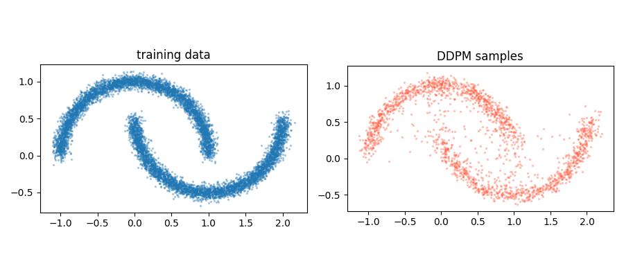

# 第5章 多模态与智能体原理


## 本章导读

第 3 章给出的 Transformer 只定义了对 token 序列的操作，第 4 章说明了这些操作如何从语料中被估计出来，两章的共同前提是"输入是离散 token 序列"。本章处理两个由此产生的问题：其一，当输入不是文本而是图像、甚至需要输出图像时，这套机制要如何改造；其二，当模型不只是回答一个问题，而是要完成一个多步骤任务时，需要在模型之外搭建什么样的结构。

5.1 至 5.5 节按"图像编码—图文对齐—图像生成—多模态理解—原生统一"的顺序展开。这三节中真正需要数学的只有两处：CLIP 的对比目标与扩散模型的变分下界，而这两处恰好可以与统计学教材中的条件 logistic 回归和层次模型直接对应，是本章对统计读者最友好的部分。5.6 至 5.8 节进入智能体，给出规划、记忆、工具、执行四要素与感知—推理—行动—反思的生命周期，讨论图结构为何能在机制上降低幻觉，并比较主流 Agent 框架的抽象层次。智能体的工程细节（函数调用、MCP、Skill 规范）在第 7 章展开，本章只交代原理与选型依据。

与机制主张配套，5.1.5、5.2.6、5.3.7 与 5.7.5 四个小节各给出一个只依赖 numpy/scipy 的最小数值实验，把当节的论断落到可复现的数字上；这些实验验证的是机制本身，而不是指任何真实系统的性能。

## 5.1 图像侧：ViT

Vision Transformer（ViT）的核心主张是：图像不必用卷积处理，把图像切成块、按序列排列，就可以直接送入标准的 Transformer 编码器。

- 论文：*An Image is Worth 16x16 Words: Transformers for Image Recognition at Scale*，arXiv:2010.11929
- 开源：https://github.com/google-research/vision_transformer

### 5.1.1 分词：从像素网格到 token 序列

设输入图像 $x\in\mathbb{R}^{H\times W\times C}$，块大小为 $P$，则块数 $N=HW/P^2$。每个块被展平为向量 $x_p^i\in\mathbb{R}^{P^2C}$，再经线性投影 $E\in\mathbb{R}^{(P^2C)\times D}$ 映射到模型维度 $D$。以 ViT-B/16 处理 $224\times224$ 图像为例：$P=16$，$N=(224/16)^2=196$，$P^2C=16\times16\times3=768$。

与 BERT 的 `[CLS]` 类似，序列前端插入一个可学习的类别 token $x_{\mathrm{class}}$，其输出状态经分类头给出预测；其余 $N$ 个块 token 与之并列：

$$z_0=\big[x_{\mathrm{class}};\;x_p^1E;\;x_p^2E;\;\dots;\;x_p^NE\big]+E_{\mathrm{pos}},\qquad E_{\mathrm{pos}}\in\mathbb{R}^{(N+1)\times D}$$

随后是 $L$ 层标准 Transformer 编码器（多头自注意力 + MLP + LayerNorm + 残差）。ViT-B/16 的配置为 $D=768$、$L=12$、12 个注意力头；ViT-L/16 为 $D=1024$、$L=24$；ViT-H/14 为 $D=1280$、$L=32$。

### 5.1.2 位置编码：空间结构不由架构给出

卷积天然知道"相邻像素相邻"，ViT 把图像展平后丢失了这一结构，位置信息必须显式注入。ViT 使用可学习的 1 维位置嵌入 $E_{\mathrm{pos}}$，论文报告这些嵌入学出后呈现出与二维空间邻近关系一致的结构（相邻块的位置嵌入相似度更高，同行/同列的规律可辨），说明模型从数据中重新发现了空间拓扑。

这带来两个工程后果：

- **分辨率外推需要插值**。训练时 $N=196$，若推理用更大分辨率，位置嵌入数量不匹配，只能做双线性插值；分辨率跨度大时精度下降明显。
- **序列长度随分辨率平方增长**。注意力代价为 $O(N^2)$，图像从 $224$ 提到 $448$，$N$ 变为 4 倍，注意力开销变 16 倍。这是 ViT 类模型在高分辨率场景（医学影像、遥感、病理切片）上必须处理的问题。

后续工作分别给出不同解法：Swin Transformer（arXiv:2103.14030）引入窗口内注意力与层次化下采样，把复杂度降为对图像尺寸的线性关系；DeiT（arXiv:2012.12877）通过强数据增强与蒸馏策略，使 ViT 能在 ImageNet-1k（约 130 万张）上单独训练；MAE（arXiv:2111.06377）用高比例掩码的自编码预训练提高数据效率。

### 5.1.3 归纳偏置的差异及其统计含义

归纳偏置（inductive bias）指模型族本身携带的、不来自数据的假设。CNN 与 ViT 的差别可以完整写成一个假设空间的约束差异。

| 维度 | CNN（如 ResNet） | ViT |
|---|---|---|
| 局部性 | 卷积核只覆盖局部邻域，是硬约束 | 块内由线性投影承担，块间关系无先验 |
| 权值共享 | 同一核在全图共享，参数量与图像尺寸无关 | 无共享；位置关系是习得的 |
| 平移等变性 | 平移输入则特征平移，是架构保证 | 无保证，需从数据习得 |
| 感受野 | 随层数线性增长，浅层只看局部 | 第一层起即为全局 |
| 层次结构 | 通过下采样构建多尺度金字塔 | 原版为单一尺度（Swin 等重新引入） |
| 序列长度 | 与分辨率无关（特征图） | $N=HW/P^2$，注意力 $O(N^2)$ |

用偏差—方差分解的语言说：CNN 对假设空间施加了强约束，牺牲表达能力换取小样本下的稳定性；ViT 放松了约束，假设空间更大、偏差更小，但需要更多数据来控制估计方差。原文与论文的结论一致，在中等规模数据（ImageNet-1k）上训练时，同等算力下的 ViT 落后于 ResNet；在超大规模数据（论文使用 JFT-300M）上预训练后迁移，ViT 反而超过卷积网络，且规模越大优势越明显。这是典型的"模型容量与样本量匹配"问题：放松约束只在样本量足够时才划算。

### 5.1.4 与统计学的对接

第一，**自注意力可视为一种数据依赖的核回归**。单头注意力输出为

$$\mathrm{Attn}(q,K,V)=\sum_{j}\frac{\exp(q^\top k_j/\sqrt{d})}{\sum_{j'}\exp(q^\top k_{j'}/\sqrt{d})}\,v_j$$

这与 Nadaraya–Watson 估计 $\hat m(x)=\sum_j K_h(x,x_j)y_j/\sum_j K_h(x,x_j)$ 形式一致，区别在于核不是预先指定的（如高斯核），而是由数据自身参数化的相似度，且多层复合后不再是单一非参数回归。因此 ViT 可以看作"用学到的核做多层非参数平滑"，其有效带宽由训练数据决定，而非由人工设定，这解释了为何小数据上它更容易过拟合。

第二，**块划分是一次有损的降维与假设**。把 $16\times16$ 区域压成一个向量，等价于假设块内信息可由线性投影充分概括。若研究对象的判别信息小于块尺度（例如病理图像中的细胞核形态、遥感中的小目标），固定块划分会直接丢失信号。实践中应把块大小当作一个可调的超参数，而不是沿用 $16$。

### 5.1.5 块展开的最小数值演示

5.1.1 的切块操作不需要任何深度学习库，用 numpy 的数组重排就能完整复现，适合作为检验自己是否真正理解维度关系的练习。下面的脚本把一张随机图像按不同块大小切开，验证三件事：块数 $N=(H/P)^2$、块维度 $P^2C$，以及一个容易被忽略的事实，$N\cdot P^2=HW$ 恒成立，即切块本身不丢失任何像素，信息的损失发生在后续的线性投影与 softmax 注意力上，而不是切这一步。

```python
# vit_patch_demo.py
import numpy as np

def patchify(x, P):
    """x: (1, H, W, C) -> (N, P*P*C)"""
    H, W, C = x.shape[1], x.shape[2], x.shape[3]
    n_h, n_w = H // P, W // P
    return x.reshape(n_h, P, n_w, P, C).transpose(0, 2, 1, 3, 4).reshape(n_h * n_w, P * P * C)

rng = np.random.default_rng(0)
H = W = 224
C = 3
x = rng.standard_normal((1, H, W, C))
base_cost = (196 + 1) ** 2   # attn matrix elements at P=16

print(f"{'P':>3} {'N':>5} {'patch_dim':>10} {'P*P*C':>7} {'N*P*P':>7}")
for P in [28, 16, 14, 8, 4]:
    p = patchify(x, P)
    N, dim = p.shape
    cost = (N + 1) ** 2
    print(f"{P:>3} {N:>5} {dim:>10} {P*P*C:>7} {N*P*P:>7}  attn_rel_vs_P16={cost/base_cost:.2f}")

Ps = np.array([4, 7, 8, 14, 16, 28])
Ns = (224 // Ps) ** 2
fit = Ns[0] * (Ps[0] / Ps) ** 2
print("measured N    :", Ns.tolist())
print("P^-2 prediction:", fit.astype(int).tolist())
```

实测输出（Python 3.10 / numpy 1.26，写作时运行）：

```text
  P     N  patch_dim   P*P*C   N*P*P
 28    64       2352    2352   50176  attn_rel_vs_P16=0.11
 16   196        768     768   50176  attn_rel_vs_P16=1.00
 14   256        588     588   50176  attn_rel_vs_P16=1.70
  8   784        192     192   50176  attn_rel_vs_P16=15.88
  4  3136         48      48   50176  attn_rel_vs_P16=253.57
measured N    : [3136, 1024, 784, 256, 196, 64]
P^-2 prediction: [3136, 1023, 784, 255, 196, 63]
```

三个读数值得记录。其一，`N*P*P` 列恒为 50176 = $224^2$，说明切块是无损重排；`patch_dim` 列等于 $P^2C$，与 5.1.1 的推导一致。其二，序列长度与 $P$ 严格成平方反比（`P^-2 prediction` 行中 1023、255、63 等非整数值只是浮点截断的痕迹，真值为 1024、256、64）。其三，注意力开销与 $P$ 成四次方反比：$P$ 从 16 减到 4，注意力矩阵元素数放大 253.57 倍，接近 $(16/4)^4=256$，这正是 5.1.2 末尾"$O(N^2)$ 注意力在高分辨率下成为瓶颈"的数值版本，也解释了为什么病理切片与遥感场景的工程方案几乎都围绕"如何少用 token"展开。

## 5.2 图文对齐：CLIP

CLIP（Contrastive Language-Image Pre-training）用对比学习把图像与文本映射到同一个嵌入空间，使语义匹配的图文对在该空间中靠近。

- 论文：*Learning Transferable Visual Models From Natural Language Supervision*，arXiv:2103.00020
- 开源：https://github.com/openai/CLIP
- 训练数据：约 4 亿图文对（WebImageText，WIT）

### 5.2.1 双编码器结构

图像编码器 $f_I$（ResNet-50 或 ViT-L/14）与文本编码器 $f_T$（Transformer）分别把图像 $I$ 与文本 $T$ 映射为 $d$ 维向量，再做 $\ell_2$ 归一化，相似度取余弦（等价于归一化后的内积）。训练目标是对一个 batch 内 $N$ 个图文对，最大化对角线（匹配对）相似度、抑制非对角线：

$$\mathcal{L}=-\frac{1}{2N}\sum_{i=1}^{N}\left[\log\frac{e^{t\,f_I(I_i)^\top f_T(T_i)}}{\sum_{j=1}^{N}e^{t\,f_I(I_i)^\top f_T(T_j)}}+\log\frac{e^{t\,f_T(T_i)^\top f_I(I_i)}}{\sum_{j=1}^{N}e^{t\,f_T(T_i)^\top f_I(I_j)}}\right]$$

其中 $t=\exp(\tau)$ 为可学习的温度参数（论文初始化为 0.07 的倒数），控制分布的锐度。两项分别为"以图像为锚检索文本"与"以文本为锚检索图像"，合起来即对称的 InfoNCE 损失。

### 5.2.2 噪声对比估计与病例对照采样

把上式与统计学对照，对应关系是逐项的。

| 对比学习（InfoNCE / NCE） | 统计学对应物 |
|---|---|
| 匹配对 $(I_i,T_i)$ | 1:N 匹配病例对照研究中的病例 |
| batch 内其余 $N-1$ 个样本 | 便利对照（convenience controls） |
| $\eta_{ij}=t\,f_I(I_i)^\top f_T(T_j)$ | 线性预测子（linear predictor） |
| $\log \frac{e^{\eta_{ii}}}{\sum_j e^{\eta_{ij}}}$ | 条件 logistic 回归的条件对数似然 |
| 温度 $t$ | 尺度（回归系数整体缩放） |
| batch size $N$ | 每个病例匹配的对照数 |

InfoNCE 的正式名称是噪声对比估计（Noise Contrastive Estimation）：不去估计难以计算的配分函数，而是把"真实配对"与"噪声分布采样出的配对"做判别，用分类的对数似然替代生成模型的似然。条件 logistic 回归做的是同一件事，在 1:N 匹配设计中，通过条件化掉个体效应，用"病例为什么是病例"的相对概率构造似然。两条路径在数学上是同一个 softmax 归一化结构的两种命名。

由此得到三条实用判断：

1. **负样本数就是 batch size**。增大 batch 等价于增加每个病例的对照数，条件似然的信息量上升，检索精度提高。这也是 CLIP 使用极大 batch（论文报告的最大配置在数万量级）的统计学理由，而非单纯的工程选择。
2. **该目标不校准概率**。它只识别相似度排序，$\exp(t\cdot\cos)$ 不是后验概率，不能当作置信度使用；需要概率时应另行校准。
3. **负样本是"便利对照"，存在选择偏差**。同 batch 内可能真实存在语义匹配的样本却被当作负例（false negative），这与病例对照研究中对照组不代表源人群的偏倚同构。缓解办法是更大的候选池（跨 batch 队列、动量编码器）或显式剔除高相似负例。

### 5.2.3 零样本分类即后验估计

CLIP 做零样本分类的方式是：为每个类别构造文本描述（如 "a photo of a {label}"），得到类别嵌入 $w_k=f_T(t_k)$，再取

$$P(y=k\mid x)=\frac{\exp\big(t\,f_I(x)^\top w_k\big)}{\sum_{k'=1}^{K}\exp\big(t\,f_I(x)^\top w_{k'}\big)}$$

这个式子可以读作贝叶斯后验的一次近似：分子中的相似度扮演"以类别 $k$ 为条件的似然"角色，分母是归一化常数，类别先验则被隐式地设为均匀。于是"零样本"并非没有参数，而是把类别信息从"在标注数据上训练的分类器权重"换成了"语言端给出的类别描述嵌入"，估计的对象仍是后验 $P(y\mid x)$，只是似然与先验都由预训练给出。

这个读法有直接的实践后果：**提示模板是模型的一部分**。同一类别用不同模板（"a photo of a {}" / "a satellite image of {}" / "a cropped photo of the {}"）会得到不同后验，CLIP 论文用约 80 个模板做集成以提升稳健性，从统计角度看，这是对"先验设定敏感"这一问题的经验性修正，与贝叶斯分析中的先验敏感性检查同类。

### 5.2.4 规模、效果与能力边界

论文报告的主要结果：最好的模型在 ImageNet 上零样本 top-1 达 76.2%，与有监督训练的 ResNet-50 大致相当；论文在 30 余个数据集上做了零样本迁移评测。训练侧，论文报告在 256 张 V100 上训练 ViT-L/14 约需两周（原文素材记为"训练 32 个 epoch"）。

能力边界：

- **细粒度与计数能力弱**。论文自述在细粒度分类（车型、花卉品种）、计数、以及分布外数据（如 MNIST 手写数字）上明显弱于专用模型。后续研究（Yuksekgonul et al., [arXiv:2210.01936](https://arxiv.org/abs/2210.01936)）系统指出视觉—语言模型在组合语义上表现得像"词袋"，会把 "a horse is eating a person" 与 "a person is eating a horse" 判为相似。
- **相似度不等于因果或事实正确**。CLIP 学到的是共现统计，不是语义逻辑；用它做数据筛选或检索时，应视为召回工具而非判定工具。
- **分布偏移与公平性问题**。训练语料来自互联网，长尾类别与地区覆盖不均，评测集上的平均分数会掩盖子群差异，这一点与第 4 章讨论的基准分数统计性质一致。

### 5.2.5 在多模态系统中的位置

CLIP 是后续多个系统的公共组件：Stable Diffusion 用它作文本编码器；LLaVA 用它（ViT-L/14）作视觉编码器；文生图、图文检索、零样本分类的数据清洗流程也大量依赖它。原文素材中列出的项目可作为入口：

| 用途 | 项目 | 地址 |
|---|---|---|
| 图文对比学习模型 | CLIP | github.com/openai/CLIP |
| 扩散模型库 | diffusers | github.com/huggingface/diffusers |
| 文生图 Web 界面 | stable-diffusion-webui | github.com/AUTOMATIC1111/stable-diffusion-webui |
| 语音识别 | whisper | github.com/openai/whisper |
| 多模态聊天框架 | lobe-chat | github.com/lobehub/lobe-chat |
| 本地 LLM Web 界面 | open-webui | github.com/open-webui/open-webui |
| LLM 应用精选清单 | awesome-llm-apps | github.com/Shubhamsaboo/awesome-llm-apps |

最小可用的零样本分类代码：

```python
# pip install transformers torch pillow
import torch
from PIL import Image
from transformers import CLIPModel, CLIPProcessor

model = CLIPModel.from_pretrained("openai/clip-vit-large-patch14")
proc = CLIPProcessor.from_pretrained("openai/clip-vit-large-patch14")

image = Image.open("fig.png")
labels = ["a scatter plot", "a bar chart", "a Kaplan-Meier curve", "a heatmap"]

inputs = proc(text=labels, images=image, return_tensors="pt", padding=True)
with torch.no_grad():
    logits = model(**inputs).logits_per_image          # 1 x K 相似度
    probs = logits.softmax(dim=-1)                     # 注意：仅排序可信，非校准概率

for lab, p in zip(labels, probs[0].tolist()):
    print(f"{lab}: {p:.3f}")
```


### 5.2.6 InfoNCE 与条件 logistic 的等价：一个可控实验

5.2.2 的对应表不必停留在纸面：对比学习的训练目标可以在几分钟内用一个"模拟的匹配设计"复现出来。实验设计如下。每个匹配组（病例）有 $N$ 个候选，特征 $Z_{ij}\sim\mathcal N(0,I_d)$；"真实配对"由带噪声的 softmax$(\eta_{ij}/1.5)$ 抽取生成，以模拟标注噪声。估计方法是直接最小化 InfoNCE 损失，按 5.2.2 的论证，它同时就是该 1:N 匹配设计的条件对数似然的负数，两种命名对应同一个目标函数，因此无需分别实现两遍。考察的量是估计方向与真实参数方向的余弦相似度（尺度不可识别：温度与表示幅度会联合吸收整体缩放，这与回归系数在只含相对风险信息的设计中无法分离尺度的情形一致）。

```python
# infonce_demo.py
import numpy as np
from scipy.optimize import minimize

def unit(v):
    return v / np.linalg.norm(v)

d, M = 64, 100
r0 = np.random.default_rng(5)
theta_star = unit(r0.standard_normal(d))   # scale not identifiable, direction only

def make_data(N, seed):
    r = np.random.default_rng(seed)
    Z = r.standard_normal((M, N, d))       # 1 true-pair candidate + N-1 controls per case
    eta = Z @ theta_star
    eta = eta - eta.max(axis=1, keepdims=True)
    p = np.exp(eta); p /= p.sum(axis=1, keepdims=True)   # noisy label generation
    y = np.array([r.choice(N, p=p[i]) for i in range(M)])
    return Z, y

def infonce_nll(theta, Z, y):
    s = Z @ theta                          # eta_ij = theta^T z_ij
    s = s - s.max(axis=1, keepdims=True)
    # -log softmax: both the InfoNCE loss and the conditional log-likelihood
    # of a 1:N matched design
    return -(s[np.arange(M), y] - np.log(np.exp(s).sum(axis=1))).mean()

def infonce_grad(theta, Z, y):
    s = Z @ theta
    p = np.exp(s - s.max(axis=1, keepdims=True))
    p /= p.sum(axis=1, keepdims=True)
    p[np.arange(M), y] -= 1.0
    return (p[:, :, None] * Z).sum(axis=1).mean(axis=0)

base = [round(infonce_nll(np.zeros(d), *make_data(N, 1)), 4) for N in [4, 16, 64]]
print("loss at theta=0 (chance level log N):", base)

print(f"\n{'N':>4} {'cos(theta_hat, theta*)':>24} {'sd over 5 reps':>16}")
for N in [4, 16, 64]:
    cos = []
    for rep in range(5):
        Z, y = make_data(N, seed=1000 * N + rep)
        res = minimize(infonce_nll, np.zeros(d), args=(Z, y), jac=infonce_grad, method="BFGS")
        cos.append(float(unit(res.x) @ theta_star))
    print(f"{N:>4} {np.mean(cos):>24.4f} {np.std(cos):>16.4f}")
```

输出：

```text
loss at theta=0 (chance level log N): [1.3863, 2.7726, 4.1589]

   N   cos(theta_hat, theta*)   sd over 5 reps
   4                   0.6170           0.0574
  16                   0.7431           0.0363
  64                   0.7596           0.0158
```

三处读数与 5.2.2 的三条实用判断逐条对应。第一，$\theta=0$ 时损失恰为 $\log N$（1.3863、2.7726、4.1589 分别是 $\ln 4$、$\ln 16$、$\ln 64$），即随机猜测的对数损失，这是检查对比学习实现是否正确的第一道 sanity check。第二，对照数 $N$ 从 4 增到 64，方向恢复精度从 0.617 升到 0.760，重复间标准差从 0.057 降到 0.016："负样本数就是 batch size、增加对照数提高条件似然的信息量"在这里表现为估计精度与稳定性的同步改善，也是 CLIP 使用极大 batch 的统计学理由的可运行版本。第三，这个实验里没有出现假阴性问题（对照由构造保证与病例无关），真实图文对则不然，模拟与现实的差距本身就是需要记住的边界。

## 5.3 图像生成：DDPM扩散模型

扩散模型通过"前向加噪、逆向去噪"两步生成图像：训练阶段让网络学会从带噪样本中预测噪声，生成阶段从纯噪声出发逐步去噪。

- DDPM 论文：*Denoising Diffusion Probabilistic Models*，arXiv:2006.11239
- 开源：https://github.com/hojonathanho/diffusion

### 5.3.1 前向过程与闭式形式

前向过程是一个固定的（无参数的）马尔可夫链，逐步把数据 $x_0\sim q(x_0)$ 加噪为近似标准正态：

$$q(x_t\mid x_{t-1})=\mathcal{N}\big(\sqrt{1-\beta_t}\,x_{t-1},\;\beta_t I\big),\qquad \beta_1<\beta_2<\cdots<\beta_T$$

记 $\alpha_t=1-\beta_t$、$\bar\alpha_t=\prod_{s=1}^{t}\alpha_s$，由高斯卷积的封闭性可得

$$q(x_t\mid x_0)=\mathcal{N}\big(\sqrt{\bar\alpha_t}\,x_0,\;(1-\bar\alpha_t)I\big)$$

即 $x_t=\sqrt{\bar\alpha_t}\,x_0+\sqrt{1-\bar\alpha_t}\,\epsilon,\ \epsilon\sim\mathcal{N}(0,I)$。DDPM 取 $T=1000$，$\beta_t$ 从 $10^{-4}$ 线性增长到 $0.02$。这个闭式形式是关键：它使得训练时可以直接采样任意 $t$ 的带噪样本，而不必逐步递推。

### 5.3.2 反向过程、变分下界与简化目标

反向过程参数化为

$$p_\theta(x_{t-1}\mid x_t)=\mathcal{N}\big(\mu_\theta(x_t,t),\;\Sigma_\theta(x_t,t)\big),\qquad p(x_T)=\mathcal{N}(0,I)$$

真实后验 $q(x_{t-1}\mid x_t,x_0)$ 也是高斯（因为联合分布是高斯），因此变分下界（VLB）可写成一系列高斯 KL 之和：

$$\mathcal{L}_{\mathrm{VLB}}=\underbrace{D_{\mathrm{KL}}\big(q(x_T\mid x_0)\,\|\,p(x_T)\big)}_{L_T}+\sum_{t=2}^{T}\underbrace{D_{\mathrm{KL}}\big(q(x_{t-1}\mid x_t,x_0)\,\|\,p_\theta(x_{t-1}\mid x_t)\big)}_{L_{t-1}}-\underbrace{\log p_\theta(x_0\mid x_1)}_{L_0}$$

DDPM 的关键简化有两条：一是固定协方差（$\Sigma_\theta=\sigma_t^2 I$，取 $\beta_t$ 或 $\tilde\beta_t$），二是把均值重参数化为噪声预测形式

$$\mu_\theta(x_t,t)=\frac{1}{\sqrt{\alpha_t}}\Big(x_t-\frac{\beta_t}{\sqrt{1-\bar\alpha_t}}\,\epsilon_\theta(x_t,t)\Big)$$

于是 $L_{t-1}$ 中的 KL 退化为两个均值的平方距离，加权后得到简化目标

$$\mathcal{L}_{\mathrm{simple}}=\mathbb{E}_{t,\,x_0,\,\epsilon}\Big\|\epsilon-\epsilon_\theta\big(\sqrt{\bar\alpha_t}\,x_0+\sqrt{1-\bar\alpha_t}\,\epsilon,\;t\big)\Big\|^2$$

也就是说，训练一个扩散模型在工程上等价于训练一个"给定带噪输入与时间步、预测所加噪声"的回归网络，损失是普通均方误差。原文"等价于简单的 MSE 损失"即指此式。论文在此基础上进一步去掉 $L_{t-1}$ 中的权重项（相当于对 $t$ 均匀采样），得到更好的样本质量；后续工作（*Improved DDPM*，arXiv:2102.09672）用余弦噪声调度与可学习方差再进一步。

### 5.3.3 与得分匹配、去噪自编码、朗之万采样的联系

三条线索在这里汇合，可以用一个等式串起来。在 $q(x_t\mid x_0)=\mathcal{N}(\sqrt{\bar\alpha_t}x_0,(1-\bar\alpha_t)I)$ 下，$\epsilon$-预测与得分函数只差一个已知的时间相关因子：

$$\nabla_{x}\log q_t(x)\;=\;-\frac{\epsilon}{\sqrt{1-\bar\alpha_t}}\quad\text{（在 }x_t=\sqrt{\bar\alpha_t}x_0+\sqrt{1-\bar\alpha_t}\epsilon\text{ 的重参数化下，}\ \mathbb{E}[\epsilon\mid x_t]=-\sqrt{1-\bar\alpha_t}\,\nabla_x\log q_t(x_t)\text{）}$$

因此：

- **去噪得分匹配**（Denoising Score Matching，Vincent 2011；NCSN，arXiv:1907.05600）：扩散模型的训练目标与"估计各噪声水平下数据分布的得分"等价，只是把多噪声尺度显式写成了时间步 $t$。
- **去噪自编码**：预测噪声与重建干净输入是同一件事的两面。由 Tweedie 公式，$\mathbb{E}[x_0\mid x_t]$ 可由 $x_t$ 与得分函数直接写出，故 $\epsilon$-预测器同时也是最优去噪器。这解释了为什么扩散模型可以复用 U-Net 这种图像到图像的结构。
- **朗之万采样**：给定得分函数，用 $\mathrm{d}x=\nabla_x\log p(x)\,\mathrm{d}t+\sqrt{2}\,\mathrm{d}W$ 从分布中采样。DDPM 的 ancestral sampling 正是离散时间的退火朗之万动力学（每个时间步调整步长与噪声水平）。连续时间统一框架见 Song et al., arXiv:2011.13456（Score-Based Generative Modeling through SDEs）。

### 5.3.4 采样加速与潜空间扩散

原始 DDPM 需要 $T=1000$ 步网络前向，生成成本高。主要加速路线：

- **DDIM**（arXiv:2010.02502）：把反向过程改写为非马尔可夫的确定性过程（概率流 ODE 的离散化），可用 20–100 步得到接近质量的样本，且支持语义插值。
- **潜空间扩散**（Latent Diffusion，arXiv:2112.10752）：先用 VAE 把图像压缩到低分辨率潜变量再扩散，Stable Diffusion 即基于此，把训练与推理成本降一个量级。
- **高阶 ODE/SDE 求解器、一致性模型**（arXiv:2303.01469）、**流匹配**（Flow Matching，arXiv:2210.02747）与**整流流**（arXiv:2209.03003）：把生成路径从随机微分方程改为更直的传输路径，进一步压缩步数。

### 5.3.5 统计学视角：层次模型、回归解释与评估

对统计学者，扩散模型可以从三个熟悉的角度读：

1. **它是层次模型的一次变分推断**。$x_0$ 是观测，$x_{1:T}$ 是潜变量，前向链是固定的编码器 $q$，反向链是学习的解码器 $p_\theta$，训练即最大化边际似然的 ELBO。与 VAE 的区别在于：这里的编码器无参数且潜变量与数据同维，ELBO 的每一项都可精确计算，因此优化稳定、不需要重参数化技巧处理不可导的采样。
2. **$\epsilon$-预测就是对条件期望的最小二乘回归**。目标是 $\mathbb{E}[\epsilon\mid x_t,t]$ 的均方误差最优预测；时间步 $t$ 相当于一个已知的"设计变量"。不同 $t$ 上的样本质量不均（噪声大处难、噪声小处易），这正是改进版对 $t$ 加权的动机，可视为对异方差/异质任务做加权最小二乘。
3. **评估指标本身是统计问题**。FID 假设 Inception 特征服从多元高斯，用两个高斯的 Fréchet 距离度量分布差异；样本量不足时 FID 有偏，且不同实现（特征层、样本数）之间不可比。更稳妥的做法是报告样本量、多次评估的分布，并用两样本检验（如 MMD）交叉验证，这与第 4 章对基准分数可复现性的要求一致。

### 5.3.6 用于科研合成数据的边界

统计研究中，扩散模型的用途集中在三类：数据增强（尤其医学影像等稀缺样本场景）、隐私保护的数据发布（配合差分隐私训练）、以及作为难建模高维分布的仿真器。风险同样明确：

- **记忆化**：模型可能复现训练样本（Carlini et al. 等在扩散模型上证实了对训练数据的提取），用于"隐私保护发布"前必须做成员推断检验。
- **分布偏移的累积**：用生成数据训练下游模型会造成模型退化（model collapse，Shumailov et al., arXiv:2307.01850），即多代自训练后分布尾部逐渐消失。
- **下游推断偏差**：合成数据不满足真实数据的依赖结构时，在其上估计的效应量与置信区间覆盖率都会失真。若研究结论依赖合成数据，应报告合成—真实之间的分布距离，并对关键估计量做真实数据上的校准。

代码：

```python
import torch
import torch.nn as nn

device = "cuda" if torch.cuda.is_available() else "cpu"
torch.manual_seed(42)

#  1. 定义一个简单的时间条件化 MLP 
class TimeEmbedding(nn.Module):
    def __init__(self, dim=64):
        super().__init__()
        self.dim = dim
    def forward(self, t):                       # t: (B,) 整数
        half = self.dim // 2
        freqs = torch.exp(-torch.arange(half, device=t.device) * 0.7)
        args = t.float()[:, None] * freqs[None, :]
        return torch.cat([torch.sin(args), torch.cos(args)], dim=-1)  # (B, dim)

class Denoiser(nn.Module):
    def __init__(self, data_dim=2, hidden=128, t_dim=64):
        super().__init__()
        self.t_emb = TimeEmbedding(t_dim)
        self.net = nn.Sequential(
            nn.Linear(data_dim + t_dim, hidden), nn.SiLU(),
            nn.Linear(hidden, hidden), nn.SiLU(),
            nn.Linear(hidden, hidden), nn.SiLU(),
            nn.Linear(hidden, data_dim),
        )
    def forward(self, x, t):
        h = torch.cat([x, self.t_emb(t)], dim=-1)
        return self.net(h)

#  2. 造一个 2D "月亮" 分布作为训练数据 
from sklearn.datasets import make_moons
data, _ = make_moons(n_samples=8000, noise=0.05, random_state=0)
data = torch.tensor(data, dtype=torch.float32).to(device)   # (8000, 2)

#  3. DDPM 训练 
T = 300                          # 玩具问题用小一点的步数
betas = torch.linspace(1e-4, 0.02, T).to(device)   # 线性噪声调度
alphas = 1.0 - betas
alphas_bar = torch.cumprod(alphas, dim=0)

model = Denoiser().to(device)
opt = torch.optim.Adam(model.parameters(), lr=2e-4)

N = data.shape[0]
for step in range(30001):
    idx = torch.randint(0, N, (256,), device=device)
    x0 = data[idx]                                     # 干净样本 (256, 2)
    t = torch.randint(0, T, (256,), device=device)      # 随机时间步
    noise = torch.randn_like(x0)
    # 前向加噪: x_t = sqrt(ab_t) x0 + sqrt(1-ab_t) eps
    ab = alphas_bar[t][:, None]
    x_t = torch.sqrt(ab) * x0 + torch.sqrt(1 - ab) * noise
    # 训练目标：预测加入的噪声
    loss = torch.nn.functional.mse_loss(model(x_t, t), noise)
    opt.zero_grad(); loss.backward(); opt.step()
    if step % 1000 == 0:
        print(f"step {step:5d}  loss = {loss.item():.4f}")

#  4. 采样函数
@torch.no_grad()
def ddpm_sample(model, shape, T=1000, betas=None, device="cuda"):
    alphas = 1.0 - betas
    alphas_bar = torch.cumprod(alphas, dim=0)
    x = torch.randn(shape, device=device)
    for t in reversed(range(T)):
        z = torch.randn(shape, device=device) if t > 0 else torch.zeros(shape, device=device)
        a, ab = alphas[t], alphas_bar[t]
        eps = model(x, torch.full((shape[0],), t, device=device))
        x = (x - (1 - a) / torch.sqrt(1 - ab) * eps) / torch.sqrt(a) + torch.sqrt(betas[t]) * z
    return x

#  5. 采样并可视化 
samples = ddpm_sample(model, shape=(2000, 2), T=T, betas=betas, device=device)

import matplotlib.pyplot as plt
fig, axes = plt.subplots(1, 2, figsize=(9, 4))
axes[0].scatter(data[:, 0].cpu(), data[:, 1].cpu(), s=2, alpha=0.3)
axes[0].set_title("training data")
axes[1].scatter(samples[:, 0].cpu(), samples[:, 1].cpu(), s=2, alpha=0.3, c="tomato")
axes[1].set_title("DDPM samples")
for ax in axes: ax.set_aspect("equal")
plt.tight_layout(); plt.savefig("ddpm_sample.png")
```
输出
```text
step     0  loss = 1.0062
step  1000  loss = 0.3422
step  2000  loss = 0.3755
step  3000  loss = 0.3826
step  4000  loss = 0.3614
step  5000  loss = 0.3659
step  6000  loss = 0.3843
step  7000  loss = 0.3443
step  8000  loss = 0.3725
step  9000  loss = 0.3737
step 10000  loss = 0.3871
step 11000  loss = 0.3481
step 12000  loss = 0.3494
step 13000  loss = 0.3523
step 14000  loss = 0.3795
step 15000  loss = 0.3922
step 16000  loss = 0.3559
step 17000  loss = 0.3320
step 18000  loss = 0.3537
step 19000  loss = 0.2938
step 20000  loss = 0.2876
step 21000  loss = 0.3290
step 22000  loss = 0.3523
step 23000  loss = 0.3469
step 24000  loss = 0.3332
step 25000  loss = 0.3403
step 26000  loss = 0.3492
step 27000  loss = 0.3165
step 28000  loss = 0.3259
step 29000  loss = 0.3789
step 30000  loss = 0.2991

```




生成模型家族的横向比较：

| 家族 | 训练目标 | 采样方式 | 主要优点 | 主要缺点 |
|---|---|---|---|---|
| GAN | 判别器对抗损失 | 单次前向 | 采样快、样本锐利 | 训练不稳定、模式崩溃、无密度 |
| VAE | ELBO（含可学习编码器） | 单次前向 | 有显式潜变量与下界 | 样本偏模糊 |
| 自回归 | 逐元素条件似然 | 顺序逐步 | 似然可精确计算 | 采样慢、难以并行 |
| 扩散 / 得分匹配 | 去噪均方误差（≈ELBO） | 多步迭代 | 训练稳定、覆盖模式全 | 采样步数多（可加速） |
| 流匹配 / 归一化流 | 连续或离散的密度变换 | 常微分方程积分 | 路径直、步数少 | 需设计耦合/路径 |

### 5.3.7 前向加噪的最小数值演示

前向过程没有任何可训练参数，因此"逐步加噪后分布趋于标准正态"这一论断可以直接数值验证，不需要训练任何网络。取一个明显非高斯的数据分布，对称双峰高斯混合（两个成分位于 $\pm2$，标准差 0.2）：它的偏度为 0、超额峰度为 $-1.96$（双峰分布的典型特征）、原点附近的概率质量为 0。按闭式公式 $x_t=\sqrt{\bar\alpha_t}\,x_0+\sqrt{1-\bar\alpha_t}\,\epsilon$ 采样，跟踪各阶矩随 $t$ 的轨迹：

```python
# ddpm_forward_demo.py
import numpy as np
from scipy import stats

rng = np.random.default_rng(0)
T = 1000
betas = np.linspace(1e-4, 0.02, T)
alphas = 1.0 - betas
abar = np.cumprod(alphas)
print(f"abar_1={abar[0]:.6f}  abar_500={abar[499]:.6f}  abar_T={abar[-1]:.2e}")

n = 20000
# symmetric two-component Gaussian mixture (zero skew, negative excess kurtosis)
x0 = np.where(rng.random(n) < 0.5,
              rng.normal(-2.0, 0.2, n),
              rng.normal(2.0, 0.2, n))
print(f"x0: Var={x0.var():.3f} Skew={stats.skew(x0):.3f} ExKurt={stats.kurtosis(x0):.3f} "
      f"P(|x|<0.5)={np.mean(np.abs(x0)<0.5):.4f}")

print(f"\n{'t':>5} {'abar_t':>10} {'Var':>8} {'Skew':>8} {'ExKurt':>8} {'P(|x|<0.5)':>11}")
for t in [0, 100, 300, 500, 700, 900, 999]:
    xt = np.sqrt(abar[t]) * x0 + np.sqrt(1.0 - abar[t]) * rng.standard_normal(n)
    print(f"{t+1:>5} {abar[t]:>10.5f} {xt.var():>8.3f} {stats.skew(xt):>8.3f} "
          f"{stats.kurtosis(xt):>8.3f} {np.mean(np.abs(xt)<0.5):>11.4f}")

print(f"\nN(0,1) reference P(|x|<0.5) = {2*stats.norm.cdf(0.5)-1:.4f}")
xt = np.sqrt(abar[-1]) * x0 + np.sqrt(1.0 - abar[-1]) * rng.standard_normal(n)
ks = stats.kstest(xt, "norm")
print(f"KS statistic vs N(0,1) at t=T: {ks.statistic:.4f} (n={n}, p={ks.pvalue:.3g})")
```

实测输出（写作时运行）：

```text
abar_1=0.999900  abar_500=0.078587  abar_T=4.04e-05
x0: Var=4.038 Skew=-0.013 ExKurt=-1.960 P(|x|<0.5)=0.0000

    t     abar_t      Var     Skew   ExKurt  P(|x|<0.5)
    1    0.99990    4.037   -0.013   -1.960      0.0000
  101    0.89514    3.709   -0.013   -1.849      0.0001
  301    0.39401    2.221   -0.005   -1.023      0.1574
  501    0.07780    1.222   -0.021   -0.104      0.3392
  701    0.00687    1.039   -0.014   -0.016      0.3805
  901    0.00027    1.007   -0.002    0.016      0.3830
 1000    0.00004    0.987    0.001   -0.032      0.3811

N(0,1) reference P(|x|<0.5) = 0.3829
KS statistic vs N(0,1) at t=T: 0.0046 (n=20000, p=0.779)
```

轨迹读法：方差从 4.04 收敛到约 1（权重 $\bar\alpha_t$ 从 0.9999 衰减到 $4\times10^{-5}$，数据成分逐渐让位于噪声成分）；超额峰度从 $-1.96$（双峰的 Platykurtic 特征）单调回升到 0 附近；最能说明"双峰被抹平"的是原点附近的概率质量，$t=1$ 时为 0，$t=501$ 时已达 0.339，$t=901$ 之后与标准正态参考值 0.3829 在抽样误差内不可区分。末行的 KS 检验（统计量 0.0046，$p=0.78$）同样如此，但需要提醒：$p$ 值对样本量敏感，$n=20000$ 下不拒绝不等于分布严格相等，这恰好是 5.3.5 第 3 条"评估指标本身是有限样本统计问题"的现场版本。

还应明确这个实验验证了什么、没验证什么：它验证的只是前向链（固定的、无参数的高斯卷积），即 $q(x_t\mid x_0)$ 的封闭形式与高斯极限；反向过程的质量完全取决于 $\epsilon_\theta$ 回归学得好不好，那部分无法用无参数实验替代。前向链给出的另一个隐含信息是：中途的 $x_t$ 等于"数据加已知方差的高斯噪声"，其得分函数与所加噪声只差一个已知因子（5.3.3 的等式），这是去噪得分匹配能在数值上成立的全部前提。

## 5.4 多模态大模型：LLaVA范式

LLaVA（Large Language and Vision Assistant）确立了"视觉编码器 + 投影层 + LLM"的三段式结构，是目前开源多模态大模型最通用的范式。

- 论文：*Visual Instruction Tuning*，arXiv:2304.08485（改进版 *Improved Baselines with Visual Instruction Tuning*，arXiv:2310.03744）
- 开源：https://github.com/haotian-liu/LLaVA

### 5.4.1 三段式结构

设输入图像 $X_v$、文本指令 $X_t$。三段分别是：

1. **视觉编码器** $g(\cdot)$：通常采用 CLIP 的 ViT-L/14，输入 $336\times336$ 时输出 $576$ 个视觉 token（$(336/14)^2=576$，去掉或保留 CLS 视实现而定）。
2. **投影层** $W$：把视觉特征映射进 LLM 的词嵌入空间，$H_v=W\cdot g(X_v)$。原版为单个线性层，LLaVA-1.5 改为两层 MLP。
3. **语言模型** $f_\phi$：$H_v$ 与文本 token 嵌入拼接为单一序列，按普通自回归方式生成回答。

数据流如下（训练中视觉编码器通常全程冻结，可训练参数集中在投影层与 LLM）：

```text
图像 X_v (336 x 336)
   |
   v
[视觉编码器 g]   CLIP ViT-L/14（训练中冻结）
   |  输出 576 个视觉特征向量，每个为 D_v 维
   v
[投影层 W]       原版为单个线性层，LLaVA-1.5 为两层 MLP
   |  H_v = W * g(X_v)：576 个"视觉词"，每个为 LLM 维度 D_L 的向量
   |
文本指令 X_t --(词嵌入)--+
   v
[语言模型 f_phi]  输入为单一序列 [视觉词 x576 ; 文本 token]
   |  目标函数仍是下一 token 交叉熵（见第 3 章）
   v
文本回答
```

整个模型的目标函数没有任何新东西，仍是第 3 章的下一 token 交叉熵，只是序列前面多了一段图像 token。这种"把图像翻译成词"的做法使多模态能力可以复用已有的语言模型与训练基础设施。

### 5.4.2 两阶段训练

| 阶段 | 目标 | 可训练参数 | 数据（LLaVA-1.5 论文报告） |
|---|---|---|---|
| 一：特征对齐预训练 | 让视觉 token 与词嵌入空间对齐 | 仅投影层（视觉编码器、LLM 均冻结） | 约 55.8 万图文对 |
| 二：视觉指令微调 | 让模型遵循指令完成视觉任务 | 投影层 + LLM（视觉编码器保持冻结） | 约 66.5 万条视觉指令数据 |

阶段一本质上是学一个跨模态的线性/非线性映射，数据规模大但任务简单（看图说话）；阶段二数据量小但任务复杂（对话、推理、OCR、区域描述），其中相当部分由 GPT-4 生成。两阶段划分的统计学理由是：把"分布对齐"与"行为学习"分开估计，避免同时优化两个尺度差异极大的目标，也避免大规模 caption 数据稀释指令跟随能力。

### 5.4.3 投影层的变体与取舍

投影层不是只有线性一种，选择背后是"信息保留"与"序列长度"的权衡：

- **线性 / MLP（LLaVA）**：保留全部视觉 token，信息无损，但序列长（576 token/图），长上下文与多图场景开销大。
- **Q-Former（BLIP-2，arXiv:2301.12597）**：用一组可学习 query 通过交叉注意力把视觉特征压缩为固定数量的 token（如 32/64），显著降低长度，代价是引入信息瓶颈，细粒度任务受损。
- **InstructBLIP（arXiv:2305.06500）**：在 Q-Former 上加入指令感知，根据文本指令选择压缩哪些视觉信息。
- **Perceiver Resampler / 动态分辨率（Qwen-VL 系列，arXiv:2308.12896）**：用可变形的采样器配合位置编码，支持任意分辨率输入与更长的跨模态上下文。

### 5.4.4 数据构造与能力边界

LLaVA 的数据构造思路值得学习：用纯语言模型（GPT-4）把图像的符号化描述（caption、检测框、OCR 结果）转换为多轮对话与推理样本，从而在没有人工标注的情况下得到"指令—回答"对。这条路线成本低、可扩展，缺点是数据质量受限于教师模型，且教师模型的错误会进入学生模型。

能力边界：

- **对象幻觉**（object hallucination）：模型会描述图中不存在的物体。已有专门基准与度量（如 Li et al., arXiv:2305.10355），成因包括视觉 token 与语言先验的冲突、训练数据中的 caption 偏置。
- **分辨率与 OCR**：固定分辨率限制了对小字、密集表格的识别；图表数值读取尤其不可靠，统计场景中不应直接采信模型从图中读出的数值。
- **多图与视频**：拼接多张图像或帧序列会快速耗尽上下文，需要额外的 token 压缩或时序建模。

对统计研究而言，最要紧的是给"读图取数"立一条核查纪律：LLaVA 类模型从图表中读出的数值（坐标、轴刻度、表格单元格）应视同 OCR 输出，而不是测量结果。一种可行的流程是让模型先把图中的数值与轴标签转录为结构化文本，再用原始数据或绘图脚本反查关键数值；两个来源不一致时以原始数据为准。若图来自扫描文献、原始数据无从获得，至少用两套措辞不同的提示词独立转录并比对，不一致处交人工复核。这道核查的成本远低于把错误数值带进下游分析之后被审稿人或复现者发现的代价。

### 5.4.5 主流视觉—语言模型架构对比

| 模型 | 视觉编码器 | 连接模块 | 语言模型 | 训练阶段 | 主要特点 |
|---|---|---|---|---|---|
| LLaVA-1.5 | CLIP ViT-L/14-336 | 两层 MLP | Vicuna / Llama 系列 | 两阶段 | 结构最简、复现成本低 |
| BLIP-2 | ViT | Q-Former + 线性 | OPT / Flan-T5 | 两阶段 | token 数固定，推理省 |
| InstructBLIP | ViT | 指令感知 Q-Former | Flan-T5 / Vicuna | 两阶段 | 按指令抽取视觉信息 |
| Qwen-VL 系列 | ViT（动态分辨率） | Resampler + 位置编码 | Qwen | 多阶段 | 中文强、支持长跨模态上下文 |
| GPT-4o 类原生模型 | 不公开的端到端编码器 | 无独立投影层 | 统一主干 | 端到端 | 任意模态进出（见 5.5） |

最小推理代码：

```python
# pip install transformers torch pillow
import torch
from PIL import Image
from transformers import AutoProcessor, LlavaForConditionalGeneration

ckpt = "llava-hf/llava-1.5-7b-hf"
processor = AutoProcessor.from_pretrained(ckpt)
model = LlavaForConditionalGeneration.from_pretrained(ckpt, torch_dtype=torch.float16, device_map="auto")

prompt = "USER: <image>\nDescribe this statistical figure. List axis labels and any numbers you can see.\nASSISTANT:"
image = Image.open("fig.png")
inputs = processor(prompt, images=image, return_tensors="pt").to(model.device)
out = model.generate(**inputs, max_new_tokens=256, do_sample=False)
print(processor.decode(out[0], skip_special_tokens=True))
```

## 5.5 原生多模态

### 5.5.1 从拼接式到原生式

5.4 的范式属于"拼接式"（compositional）：各模态有独立编码器，只在输入 LLM 之前做一次投影。它的优点是可以直接复用最强的开源 LLM 与视觉编码器，缺点是模态间的交互只发生在 LLM 的浅层拼接处，且视觉编码器必须与语言端分别预训练。

**原生多模态**（natively multimodal / omni）指从训练之初就把多模态数据放进同一个主干，所有模态共享参数、共享目标函数，输入端与输出端都不限定为文本。GPT-4o 是这一路线的代表（原文素材：GPT-4o 实现原生多模态，非拼接式）；原文素材还指出 Qwen-VL 系列支持百万 token 量级的跨模态上下文，可作为长上下文路线的参照。

原生化的收益与代价都很清楚：收益是消除模态接口处的信息损失、支持文本/图像/音频的任意组合输入输出、跨模态知识共享；代价是训练数据配比与算力需求的上升、以及评测与安全对齐的复杂度上升。

### 5.5.2 离散 token 路线

把图像量化为离散 token，与文本共用词表与自回归目标。技术底座是 VQ-VAE（arXiv:1711.00937）及其后继：图像经编码器得到特征图，每个位置在 codebook 中查找最近邻，替换为整数索引；生成时先自回归产出索引序列，再经解码器还原图像。Chameleon（arXiv:2405.09818）是这一路线的代表，用统一的 early-fusion 架构做图文混合生成，论文报告需要 QK-Norm 等手段来稳定训练。

优点：目标函数与语言模型完全一致，可无损复用全部自回归基础设施，天然支持任意模态交织输出。缺点：量化是有损的（重建质量受 codebook 规模限制），词表膨胀使嵌入层参数与采样开销增大，训练对超参数更敏感。

### 5.5.3 连续 token 路线

保留视觉特征的连续向量，直接拼入统一 Transformer 的输入序列（去掉独立投影层，或把投影吸收进第一层）。信息保留更完整，且不引入量化误差；挑战在于分辨率—序列长度的平方关系、不同模态特征的尺度与分布差异（需要模态特定的归一化或 MoE 化参数）、以及输出端的解码器设计。

### 5.5.4 混合路线：自回归 + 扩散头

第三条路线是"输入侧连续、输出侧扩散"：文本仍按自回归生成，图像用一个扩散（或流匹配）头在同一主干之上生成。Transfusion（arXiv:2408.11039）即为一例，它在同一模型中同时优化下一 token 的交叉熵与图像扩散的去噪损失。这条路兼顾了文本的似然训练效率与图像的连续生成质量，代价是目标函数为两项加权和，权重与训练稳定性需要额外调。

| 路线 | 图像表示 | 输出方式 | 优点 | 缺点 |
|---|---|---|---|---|
| 拼接式（LLaVA） | 连续 patch 特征 + 投影 | 文本为主 | 复用现成 LLM、成本低 | 模态交互浅、只出不进 |
| 原生离散（Chameleon 类） | codebook 索引 | 自回归生成索引 | 目标统一、任意模态交织 | 量化损失、词表膨胀 |
| 原生连续 | 连续向量 | 需额外解码头 | 信息无损 | 序列长、尺度对齐难 |
| 混合（Transfusion 类） | 连续向量 | 扩散/流匹配头 | 图文都高质量 | 双目标训练复杂 |

### 5.5.5 开源生态与应用入口

原文素材列出的多模态与垂直应用项目可作为实践入口（见表 5.2.5 节的项目表）。对统计研究者，优先级较高的三个用途是：批量读取论文中的图表（配合 6.11 节的图表解读模板）、把扫描版教材或手写推导转为结构化文本（OCR 后须人工复核）、以及用 Whisper 转录组会与访谈录音再做文本分析。

### 5.5.6 尚未解决的问题

- **跨模态幻觉的度量**：文本幻觉已有若干自动化指标，图像端（物体存在性、属性绑定、计数）的自动度量仍不可靠。
- **模态竞争与负迁移**：增加模态不一定提升单模态能力，数据配比与容量分配缺乏可解释的原则。
- **长视频与高分辨率**：上下文长度与算力的双重约束尚未根本解决。
- **安全对齐的模态不一致**：同一条有害指令在图像通道上的过滤强度与文本通道不同，是实际部署中的薄弱点。

## 5.6 智能体核心架构

智能体（Agent）指以 LLM 为决策核心、能在环境中多轮推进以完成目标的系统。原文给出的概括是：智能体的本质是"感知→规划→行动→观察"的闭环，让 LLM 从对话者变成执行者。

### 5.6.1 形式化：把 Agent 写成部分可观察的决策问题

可以用 POMDP 的语言给出定义。环境状态 $s\in\mathcal{S}$ 不可直接观测，智能体每步看到观测 $o_t\in\mathcal{O}$（工具返回、检索结果、屏幕截图等），根据历史 $h_t=(o_1,a_1,\dots,o_t)$ 选择动作 $a_t\in\mathcal{A}$（调用工具、写文件、回答问题、终止）。LLM 在此充当参数化策略 $\pi_\theta(a_t\mid h_t, \mathrm{prompt})$，而系统提示、工具描述与记忆共同构成策略的"参数"中可被运行时修改的那一部分。

这个视角立刻解释了两件实践中的事：其一，提示词不是输入而是策略的一部分，改提示等于改策略（见 6.1 节关于"干预与观测"的讨论）；其二，错误会沿轨迹累积，若单步正确率为 $1-\epsilon$，长度为 $T$ 的轨迹成功率上界约为 $(1-\epsilon)^T$，$T=20$、$\epsilon=0.05$ 时已降至约 36%。

### 5.6.2 四要素

| 要素 | 要解决的问题 | 常见实现 | 主要失效模式 |
|---|---|---|---|
| 规划（Planning） | 把目标分解为可执行的子目标与顺序 | 任务分解、层次规划、树搜索、自我评估 | 分解错误导致全盘偏离；过度规划浪费步数 |
| 记忆（Memory） | 跨步骤、跨会话保留必要信息 | 上下文窗口、摘要、向量库、结构化存储、图 | 有损压缩丢关键事实；检索错内容；上下文污染 |
| 工具（Tools） | 补足模型不擅长的精确计算与实时信息 | 函数调用、检索、代码执行、计算器、API | 参数格式错误；工具返回异常未处理 |
| 执行（Execution） | 可靠地落地动作并处理异常 | 沙箱、重试、超时、人工确认、终止条件 | 死循环；越权操作；成本失控 |

四要素不是并列关系：规划决定调用什么工具，工具返回写入记忆，记忆影响下一步规划，执行层负责兜底。多数 Agent 项目的工程量集中在记忆与执行，而非规划。

```text
用户目标
   |
   v
感知: 外部信息 -> 观测 o_t
   |
   v
推理(规划): 基于历史 h_t 分解子目标、选择动作 a_t <----------+
   |                                                         |
   v                                                         |
行动: 调用工具（检索 / 代码执行 / API 调用）                  |
   |                    |                                    |
   |                    v                                    |
   |          [工具层: schema 校验、重试、超时]                |
   |                    |                                    |
   v                    v                                    |
观察与反思: 工具返回写回上下文，成为 o_{t+1};                 |
   |          失败时生成反思，注入下一轮提示                  |
   |                                                         |
   +--> 未达目标: 进入下一轮循环 ---------------------------->+
   |
   +--> 达成目标或触发终止条件: 输出结果

（记忆贯穿全程: 上下文窗口[工作记忆] / 本轮摘要[短期记忆] /
  向量库与结构化存储[长期记忆]；读取发生在感知与推理，
  写入发生在观察与反思。执行层在每一步兜底：沙箱隔离、
  步数与预算上限、高危动作人工确认。）
```

### 5.6.3 生命周期：感知、推理、行动、观察与反思

一次运行按四阶段循环：

1. **感知（Perception）**：把外部信息（用户输入、文件、网页、上一轮工具返回）构造成可进入上下文的观测。这一步常被低估，观测的格式决定了后续推理能用到什么。
2. **推理（Reasoning）**：基于当前上下文做规划与动作选择，通常以思维链形式显式写出。
3. **行动（Action）**：调用工具或产生输出。
4. **观察与反思（Observation & Reflection）**：把工具返回写回上下文，必要时生成对失败的反思并注入下一轮（Reflexion，arXiv:2303.11366）。

ReAct（Reasoning + Acting，arXiv:2210.03629；开源实现 https://github.com/ysymyth/ReAct ）是这一循环的标准实现：让模型交替生成 Thought（当前该做什么）、Action（调用什么工具、参数是什么）、Observation（工具返回什么），直到给出答案。相比纯思维链，ReAct 的机制优势在于模型可以先取得外部真实信息再作答，从来源上减少凭记忆编造（详见 6.5 节）。

一个具体例子：

```
Thought: 需要 t 分布 0.975 分位数，自由度 48
Action:  python: scipy.stats.t.ppf(0.975, 48)
Observation: 2.010634758
Thought: 代入置信区间公式，还需要样本均值与标准误
Action:  python: read_csv("data.csv") 后计算
...
```

### 5.6.4 记忆的分层与有损压缩

记忆系统的核心约束是上下文窗口有限。常见分层为：工作记忆（当前上下文）、短期记忆（本轮任务的中间结果、摘要）、长期记忆（跨会话的向量库或结构化存储）。从信息论角度，摘要与向量检索都是有损压缩：摘要会丢掉细节，向量检索会把原始文本换成粗粒度的语义坐标。压缩损失在单轮问答中不致命，在多轮推断中会累积为"策略偏离目标"。

工程上三条缓解措施：保留原文与摘要的双轨存储（需要细节时可回溯）、对关键事实（数值、路径、变量名）用结构化字段而非自然语言保存、以及定期把执行轨迹压缩为可检索的经验条目。MemGPT（arXiv:2310.08560）提出的"虚拟上下文管理"把这一问题类比为操作系统的内存换页，是这一方向的代表工作。

### 5.6.5 失败模式、成本与评估

| 失败模式 | 表现 | 缓解 |
|---|---|---|
| 错误累积 | 单步小错在后续步骤放大 | 关键步骤外部验证（代码执行、检索） |
| 上下文污染 | 无用的历史挤占窗口，或错误信息被反复引用 | 轨迹裁剪、显式标注失效信息 |
| 死循环 | 反复调用同一工具而无进展 | 步数上限、重复动作检测 |
| 工具误用 | 参数格式错、权限不足、超时 | 结构化参数校验（schema）、重试与降级 |
| 成本失控 | 单次任务消耗大量 token | 预算上限、缓存、分层模型（弱模型做路由） |
| 不可复现 | 同输入不同结果 | 固定模型版本与温度、记录轨迹、快照工具 |

评估上应报告成功率、平均步数、平均成本与失败原因分布，并且报告多次运行的分布而不是单次成绩，这与第 4 章对基准分数的要求一致。Agent 系统的方差来源比普通问答更多（模型随机性、工具状态、网络与时间），单次数值几乎没有信息量。

报告成功率时，区间估计比点估计更能暴露证据的薄弱程度。$n$ 次独立运行成功 $k$ 次，比例估计的抽样标准误约为 $\sqrt{\hat p(1-\hat p)/n}$；两个真实成功率分别为 0.7 与 0.8 的设置，在 $n=100$ 时标准误都在 0.04 上下，单次实验几乎无法可靠排序。Wilson 区间或精确二项区间均可使用，关键是把 $n$ 与区间一并写进报告，而不是只写"成功率为 78%"。对成本与步数这类重尾量，直接报均值容易被个别失控运行拉动，同时报告中位数与 90% 分位数更稳妥。

## 5.7 图增强Agent

图增强（graph-enhanced）指把知识图谱或结构化关系引入 Agent 的检索、记忆与规划环节。代表性的工程实现是微软的 GraphRAG（arXiv:2404.16130，https://github.com/microsoft/graphrag ）。

### 5.7.1 纯向量检索的不足

标准 RAG 把文档切成块、各自嵌入、按相似度召回 Top-k。这个做法有三个结构性缺陷：块之间没有关系，无法回答需要多跳的问题（"A 的导师的学生中谁获得了某奖"）；全局性问题（"这批文献的主要分歧是什么"）无法通过任何单个块回答；检索到的块与答案之间的支撑关系是隐式的，无法审计。

图结构针对的正是这三点：实体与关系被显式抽出后，多跳问题变成图上的路径遍历；社区检测与子图摘要提供全局视角；回答所依据的边与节点可以列出，形成可核查的证据链。

### 5.7.2 图结构为何能降低幻觉：一个可分解的视角

把一次生成的答案 $A$ 依赖于上下文证据 $E$。令 $F$ 为回答该问题所需的真实事实集合，则"答案无据"的概率可粗略分解为三项：

$$P(\text{幻觉})\;\approx\;\underbrace{P(E\ \text{未覆盖}\ F)}_{\text{检索召回不足}}\;+\;\underbrace{P(E\ \text{覆盖但模型未采用})}_{\text{证据利用失败}}\;+\;\underbrace{P(\text{模型在生成中编造})}_{\text{生成侧编造}}$$

图检索主要作用于第一项：把"按相似度找块"换成"按实体—关系找路径与社区摘要"，覆盖率（recall）显著提高，尤其是跨文档、多跳的事实。同时结构化证据在提示中以（主体—关系—客体）三元组的形式呈现，比散文片段更容易被模型引用，间接降低第二项。第三项基本不受图结构影响，它由解码策略与模型校准决定（见 6.10 节）。

对统计学者，这个分解的价值在于**它给出可估计的量**：抽取一批问题，人工标注所需事实，即可估计检索召回率 $r$ 与证据利用率 $u$，进而把幻觉率写成 $1-ru$ 加上生成侧的基线编造率。三个分量分别对应不同的改进手段（加图/加索引、改提示、改解码），因此可以在投入之前先测出瓶颈在哪一项，而不是笼统地"加强检索"。

代价也要计入：图构建本身有错误率。错误的边比缺失的边更危险，缺失只是召回不足，错误则会生成看起来有据、实则虚构的答案。因此图的精确率（precision）需要与召回率一起报告，二者可用 F1 或期望效用折中。

### 5.7.3 图在规划与记忆中的作用

除检索外，图还有两类用法：

- **规划**：把任务表示为依赖图（子任务为节点，先后关系为边），用拓扑序决定执行批次，失败时只重跑受影响的子图。这对长流程科研任务（取数—清洗—建模—作图—成文）比线性计划更稳健。
- **记忆**：把执行轨迹建成（任务—动作—结果）三元组图，下次遇到相似任务时按图检索经验，而不是重放整段轨迹。这个思路与 Reflexion 的"文字反思"互补：前者是结构化的、可检索的，后者是非结构化的、易写入的。

### 5.7.4 检索范式对比与局限

| 范式 | 表示 | 强项 | 弱项 | 适用问题 |
|---|---|---|---|---|
| 关键词（BM25） | 稀疏词项 | 精确匹配、可解释 | 无法处理同义与语义 | 精确术语、公式、变量名 |
| 向量检索 | 稠密嵌入 | 语义相近、跨语言 | 无关系、多跳弱 | 单跳语义查找 |
| 图检索 | 实体—关系三元组 | 多跳、全局结构、可审计 | 构建成本高、错误级联 | 多跳、需要证据链 |
| 混合 | 上述组合 + 重排 | 召回与精确兼顾 | 系统复杂、调参多 | 生产环境默认选择 |

局限需如实列出：图谱构建（抽取、实体对齐、去重）本身的成本与错误率；动态语料的更新与版本管理；领域知识图谱在多数科研方向并不存在，需要自建；图查询本身需要额外的工具接口与提示设计。轻量替代方案（LightRAG，arXiv:2410.05779）尝试在降低构建与更新成本的同时保留图的多跳能力，可作为起步选择。

### 5.7.5 检索增强收益的最小数值模拟

5.7.2 的分解可以做成一个可控实验，把"检索到底贡献了什么"拆成可观测的量。模拟设定：$E=240$ 个实体（可设想为变量、方法或数据集条目），每个实体带一个真值；实体按"语义族"组织，族内成员的嵌入高度相关，用于模拟同义实体之间的混淆。系统有两个回答通道：闭卷通道模拟参数化记忆，记得数值但带 $\mathcal N(0,10^2)$ 噪声；检索通道按嵌入近邻取 top-1 chunk，生成端采用复制式策略（检索到哪条就抄哪条）。判错标准为预测与真值之差超过 5（宽容评分，模拟"部分正确"）。查询与 chunk 的嵌入各自带编码噪声，因此检索本身是可错的。

```python
# rag_demo.py
import numpy as np

rng = np.random.default_rng(7)
E, D, F = 240, 64, 4          # entities, embedding dim, family size (confusable)
n_fam = E // F

def unit(v):
    return v / np.linalg.norm(v)

centers = np.array([unit(rng.standard_normal(D)) for _ in range(n_fam)])
ent_emb = np.zeros((E, D))
for f in range(n_fam):
    for m in range(F):
        u = unit(rng.standard_normal(D))
        ent_emb[f * F + m] = unit(0.9 * centers[f] + np.sqrt(1 - 0.9 ** 2) * u)

values = rng.integers(1, 51, E).astype(float)   # ground-truth fact value per entity

S_C, S_Q = 0.1, 0.1            # chunk encoding noise / query encoding noise
chunk_emb = np.array([unit(ent_emb[e] + S_C * rng.standard_normal(D)) for e in range(E)])

def closed_book(e):
    """parametric memory: recalls the value with Gaussian noise"""
    return values[e] + rng.normal(0, 10)

n_q = 4000
err_cb = err_rag = hits = 0
for _ in range(n_q):
    e = int(rng.integers(E))
    q = unit(ent_emb[e] + S_Q * rng.standard_normal(D))
    # closed-book answer
    err_cb += abs(closed_book(e) - values[e]) > 5
    # retrieval: top-1 nearest chunk, copy-style generation
    hit = int(np.argmax(chunk_emb @ q))
    hits += hit == e
    err_rag += abs(values[hit] - values[e]) > 5

print(f"closed-book error rate:        {err_cb / n_q:.3f}")
print(f"retrieval top-1 hit rate:      {hits / n_q:.3f}")
print(f"retrieval-augmented error rate: {err_rag / n_q:.3f}")
```

实测输出（写作时运行）：

```text
closed-book error rate:        0.604
retrieval top-1 hit rate:      0.753
retrieval-augmented error rate: 0.192
```

三个输出量与 5.7.2 的分解逐项对应：闭卷错误率 0.604 是生成侧的基线（此处由记忆噪声决定，对应分解第三项的模拟替身）；top-1 命中率 0.753 是检索覆盖率 $r$ 的代理；检索增强错误率 0.192 接近 $1-r$（复制式生成下证据利用率 $u\approx 1$，检索命中即正确）。另一个对照同样重要：约四分之一的查询检索到了错误实体，而复制式生成把检索错误原样传播进答案，检索增强不是"更可信"的同义词，它把错误来源从"记错"换成了"取错"，总错误率是否下降取决于两条通道的相对可靠性。这为 5.7.2 末段"错误的边比缺失的边更危险"提供了一个最小版本：在这里，错误的 chunk 同样比缺失的 chunk 更危险，因为系统对复制来的内容没有怀疑机制。

## 5.8 主流Agent框架

### 5.8.1 框架谱系

原文给出的主流框架与其定位如下（星标数为原稿统计时点数据，实际值随时间变化）：

| 框架 | 核心定位 | 地址 | 星标（原稿时点） |
|---|---|---|---|
| LangChain | 应用开发框架（组件库：Chain / Memory / Tool） | https://github.com/langchain-ai/langchain | 78K+ |
| AutoGPT | 开箱即用的自主智能体 | https://github.com/Significant-Gravitas/AutoGPT | 166K+ |
| MetaGPT | 多智能体协作（软件公司流程模拟） | https://github.com/geekan/MetaGPT | 43K+ |
| LangGraph | 复杂流程图编排（状态机 / 循环 / 持久化） | https://github.com/langchain-ai/langgraph | 18K+ |
| CrewAI | 多角色协作（角色 + 任务编排） | https://github.com/crewAIInc/crewAI | 12K+ |
| AutoGen | 微软人机协同（多智能体对话） | https://github.com/microsoft/autogen | 29K+ |

抽象层次上可以分为三档：

| 层次 | 框架 | 状态管理 | 人工介入 | 上手成本 | 适用 |
|---|---|---|---|---|---|
| 组件库 | LangChain | 需自行组织 | 自行实现 | 中 | 需要精细控制的定制应用 |
| 流程编排 | LangGraph | 显式状态图、可持久化 | 原生支持中断与恢复 | 中高 | 长流程、需人工审核的关键任务 |
| 多智能体 | AutoGen、CrewAI、MetaGPT | 对话式或角色式 | 可插入人类代理 | 低中 | 角色分工明确的协作流程 |
| 成品智能体 | AutoGPT | 内部循环 | 弱 | 低 | 演示与探索性自动化 |

### 5.8.2 技术栈分层与 MCP

原文给出的分层结构照录如下：

```
[底层] LLM API：GPT-4o/Claude/DeepSeek/Qwen
[中层] 编排框架：LangChain提供Chain/Memory/Tool组件
[协议] MCP（Model Context Protocol）：标准化外部工具接入
[上层] 成品Agent：AutoGPT基于ReAct构建"思考-行动-观察"闭环
```

MCP（Model Context Protocol）由 Anthropic 于 2024 年底提出，2025 年起迅速成为连接 LLM 与外部工具的开放标准，用于统一接入 Zotero、Jupyter、Lean 等外部系统，正在成为 Agent 开发的通用接口。这一层的意义在于把"每个应用各写一套工具适配"变成"工具实现一次、多个客户端可用"，与统计软件中标准化的数据接口（如 ODBC）作用类似。函数调用规范、MCP 服务器开发与 Skill 目录结构详见第 7 章。

### 5.8.3 面向科研的选型与可复现性

科研场景的选型原则与其他场景不同：可复现性优先于能力上限。

| 场景 | 首选 | 理由 |
|---|---|---|
| 一次性文献检索与整理 | LangChain + 检索工具 | 组件齐全、改动灵活 |
| 需要人工审核的多步分析流程 | LangGraph | 状态可持久化、可在关键节点中断 |
| 多角色评审式写作 | AutoGen / CrewAI | 角色协商天然支持"唱反调" |
| 固定 SOP 的批量产出 | MetaGPT | 把流程编码进角色，减少随机性 |
| 探索性自动化（不介意失败） | AutoGPT | 自主循环，适合摸索任务边界 |

无论选哪个框架，都应做三件事：固定模型版本与温度并记录在案；开启轨迹追踪（可观测性工具如 LangSmith、Langfuse、Arize Phoenix 提供调用链记录）；把工具版本与外部数据源快照一并存档。

## 本章小结

- ViT 把图像切成 $N=HW/P^2$ 个块并线性投影为 token，位置信息由可学习的位置嵌入注入；它与 CNN 的差别是假设空间约束的差别，卷积的局部性与平移等变性是硬约束，ViT 需要更多数据才能习得同样的性质。
- CLIP 的对称 InfoNCE 损失即噪声对比估计，在数学上与 1:N 匹配病例对照研究的条件 logistic 回归同构；负样本数等于 batch size，温度是尺度参数，该目标只识别排序而不校准概率。
- CLIP 的零样本分类是后验 $P(y\mid x)$ 的一次 softmax 近似，类别先验由文本模板隐式给出，因此模板工程具有先验敏感性分析的性质。
- DDPM 的前向链是固定的高斯马尔可夫链，存在闭式 $q(x_t\mid x_0)=\mathcal{N}(\sqrt{\bar\alpha_t}x_0,(1-\bar\alpha_t)I)$；反向均值重参数化后，训练目标退化为预测噪声的均方误差。
- 扩散模型与去噪得分匹配、去噪自编码、朗之万采样是同一理论的三种表述，$\epsilon$-预测等价于对条件期望的最小二乘回归；FID 等指标本身是有限样本的分布距离估计，需报告样本量。
- LLaVA 范式为"视觉编码器 + 投影层 + LLM"三段式，训练分特征对齐与指令微调两个阶段；投影层的选择是信息保留与序列长度的权衡。
- 原生多模态在离散 token、连续 token 与混合三条路线之间分化；跨模态幻觉度量、模态竞争与长视频上下文仍是开放问题。
- 智能体的四要素是规划、记忆、工具、执行，运行循环为感知—推理—行动—观察（反思）；错误沿轨迹以 $(1-\epsilon)^T$ 累积，因此关键步骤必须由外部工具验证。
- 图增强通过提高证据覆盖率与提供可审计的证据链降低幻觉，其收益可用召回率与精确率分解估计，但图构建错误会引入比缺失更危险的伪证据。
- 本章的四个数值演示（块展开的维度关系、InfoNCE 的方向恢复、前向加噪的矩收敛、检索模拟的错误率对比）验证的是机制本身而非真实系统的性能；代码只依赖 numpy/scipy，可在普通笔记本上复现，实测输出已随文给出。

## 延伸资源

- ViT 原始论文与代码：arXiv:2010.11929，https://github.com/google-research/vision_transformer
- CLIP 原始论文与代码：arXiv:2103.00020，https://github.com/openai/CLIP
- open_clip（CLIP 的开源复现与训练库）：https://github.com/mlfoundations/open_clip
- DDPM 原始论文与代码：arXiv:2006.11239，https://github.com/hojonathanho/diffusion
- Improved DDPM（余弦调度与可学习方差）：arXiv:2102.09672
- DDIM（加速采样）：arXiv:2010.02502
- Latent Diffusion（Stable Diffusion 的方法基础）：arXiv:2112.10752
- 噪声得分网络 NCSN（Song & Ermon，得分匹配的早期工作）：arXiv:1907.05600
- 得分匹配的连续时间统一框架：arXiv:2011.13456
- LLaVA 与改进版：arXiv:2304.08485、arXiv:2310.03744，https://github.com/haotian-liu/LLaVA
- BLIP-2（Q-Former）与 InstructBLIP：arXiv:2301.12597、arXiv:2305.06500
- Flamingo（少样本多模态学习的早期代表工作）：arXiv:2204.14198
- Qwen-VL：arXiv:2308.12896
- Chameleon（原生离散 token 多模态）：arXiv:2405.09818
- Transfusion（自回归 + 扩散混合）：arXiv:2408.11039
- ReAct：arXiv:2210.03629，https://github.com/ysymyth/ReAct
- Reflexion（反思机制）：arXiv:2303.11366
- MemGPT（虚拟上下文管理）：arXiv:2310.08560
- GraphRAG（微软图增强检索）：arXiv:2404.16130，https://github.com/microsoft/graphrag
- LightRAG（轻量图检索）：arXiv:2410.05779
- LLM 智能体综述：arXiv:2308.11432；Lilian Weng 的 *LLM Powered Autonomous Agents*（https://lilianweng.github.io/posts/2023-06-23-agent/ ）
- HuggingFace 扩散模型库 diffusers：https://github.com/huggingface/diffusers
- MCP 官方站点与规范：https://modelcontextprotocol.io
- 视觉语言模型的行为分析（词袋现象）：arXiv:2210.15003
- 合成数据训练导致的模型退化：arXiv:2307.01850
