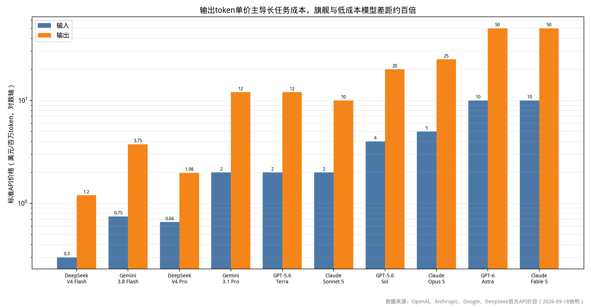
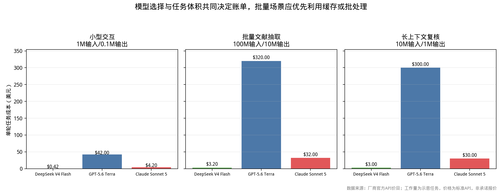

# 第19章 算力、成本与工程条件


## 本章导读

算力对统计研究者而言不是一个"越快越好"的技术指标，而是一组约束条件下的资源分配问题。给定一个固定金额，研究者要决定的是：用它调用多少次商业模型 API，或者租多少小时的云 GPU，或者买一台什么配置的机器；而在拿到算力之后，还要决定把算力切成多少份、每份跑多大规模。这两个决策在结构上分别对应统计学中的成本函数与二阶段抽样中的最优分配，本章把它们写成可以计算的式子，而不是停留在经验建议层面。

本章的线索是"从计价到预算"。第 19.1 至 19.8 节给出计价口径与价格事实：API 按 token 计价、云 GPU 按机时计价、自购硬件按资产折旧计价，三者不可直接比较，必须先换算到共同单位。第 19.9 至 19.11 节处理"多大的模型需要多大的卡"这一具体问题，给出推理与微调的显存估算式，并按预算分档给出配置单。第 19.12 节与 19.23 节是本章的方法论核心：把能耗与时间折算为每实验成本，并在总预算固定时求解实验次数与单次规模的分配，同时讨论 GPU 计时的随机性、多次运行的方差、以及抢占式实例造成的非随机缺失。第 19.13 至 19.17 节与第 19.24 至 19.27 节给出实施路径、软件工具链和两个云平台的完整操作手册。

与前后章的关系：第 8 章给出跑在这些机器上的自动化工作流；第 16 章给出评估实验的方差来源、样本量与多重比较，本章给出同一批实验在成本侧的约束条件。阅读本章需要的基础只有算术与少量最优化，所有代码可在无 GPU 的机器上执行。

关于价格的三点说明。第一，本章所有价格均为原稿整理数据或某一时点的公开报价快照，云实例与显卡的市场价格波动剧烈，**实际支出以服务商实时报价为准**。第二，凡原稿标注为"预估"或无法核验的数字，本章保留原值并标注"需核实"，不做平滑或修正。第三，原稿中不同小节存在口径不一致（例如同一平台的 4090 时价在两处给出不同区间），本章保留两处原始数值并说明差异来源，不强行统一。

## 19.1 API调用费用

### 19.1.1 计价口径

API 的标价单位与研究的记账单位并不一致。厂商按每百万 token 标价，研究者的账本单位是"完成一个任务花多少钱"。二者之间隔着五个折扣或加价因子，忽略任何一个都会让预算估计偏离一倍以上。

| 口径 | 含义 | 常见幅度 | 对预算的影响 |
|---|---|---|---|
| 输入单价 $p_i$ | prompt 侧每百万 token 价格 | 基准 | 长 prompt、RAG 检索拼接的任务以输入为主 |
| 输出单价 $p_o$ | 生成侧每百万 token 价格 | 通常为输入的 3—5 倍 | 长回答、推理链、代码生成以输出为主 |
| 缓存写入 | 首次写入可复用前缀的价格 | 常为输入的 1.1—1.25 倍 | 多轮对话、固定系统提示词场景额外计一次 |
| 缓存命中 | 命中已有前缀的输入价格 | 可低至输入的 1%—10% | 重复调用同一长文档时显著降低输入成本 |
| 批处理（Batch） | 异步大批量提交 | 输入与输出均五折 | 离线批量标注、批量摘要的首选 |
| 峰谷价 | 非高峰时段折扣 | 低谷价为标准价的一半 | 可延迟的任务安排在低谷窗口 |
| 上下文阈值 | 超过某一长度后单价跳档 | 例：200K 以内与以上两档 | 超长上下文任务的边际成本非线性 |

DeepSeek 官方文档对峰谷口径的定义为：非高峰时段价格是高峰时段的一半，高峰时段为工作日 UTC 01:00—04:00 与 06:00—10:00[^2]。Anthropic 文档对批处理的定义为：Batch API 允许异步处理大量请求，输入与输出 token 均享五折[^1]。两条规则都是确定性的，可以直接写进排程脚本。

### 19.1.2 单任务成本公式

令一次调用的输入 token 数为 $I$、输出为 $O$、其中命中缓存的输入为 $C$，则标准调用的成本为

$$
\mathrm{Cost}= C\,p_i^{\mathrm{cache}}+(I-C)\,p_i+O\,p_o ,
$$

单位为"单价 × 百万 token"，即上式各项需除以 $10^6$。若该任务进入批处理队列，再乘 $0.5$；若落在低谷时段，按厂商定义替换单价。把一次研究任务（可能包含多轮调用、工具调用参数、检索结果拼接）的 token 流累加后代入上式，才得到"每完成一个任务"的成本。厂商按模型实际消耗的输入与输出 token 计费，而非按请求次数计费[^2]；工具参数同样计入 token[^1]。



*图 19-1：按 2026 年 9 月 18 日官方标准 API 高峰口径，输出 token 价格决定长任务账单。数据来源：OpenAI、Anthropic、Google、DeepSeek 官方 API 价目。*

**表 19-1：2026 年 9 月 18 日官方 API 标准价快照（美元/百万 token）**

| 模型 | 输入（标准/缓存或峰谷口径） | 输出 | 主要适用提示 | 证据与限制 |
|---|---:|---:|---|---|
| DeepSeek V4 Flash | 高峰 0.30；低谷 0.15；缓存命中高峰 0.006 | 高峰 1.20；低谷 0.60 | 高频草稿、抽取、代码 | 1M 上下文；工作日 UTC 高峰；低谷为标准价一半[^2] |
| DeepSeek V4 Pro | 高峰 0.66；低谷 0.33；缓存命中高峰 0.044 | 高峰 1.98；低谷 0.99 | 中文推理、复杂代码 | 1M 上下文；最大输出 384K；高峰定义同上[^2] |
| Gemini 3.8 Flash | 0.75；批处理/Flex 为 0.375 | 3.75；批处理/Flex 为 1.875 | 批量推理、多模态 | 官方快照价；促销与调价须查当前页[^11] |
| Gemini 3.1 Pro | ≤200K 输入 2；>200K 输入 4 | ≤200K 输出 12；>200K 输出 18 | 长上下文复杂任务 | 价格阈值以官方页为准[^11] |
| Claude Sonnet 5 | 2；5 分钟缓存写 2.50、命中 0.20 | 10 | 常规研究编程与流程 | 批处理五折；工具参数也计入 token[^1] |
| Claude Opus 5 | 5；缓存写 6.25、命中 0.50 | 25 | 高难度代理/复杂推理 | 批处理五折；长上下文按标准价[^1] |
| Claude Fable 5 | 10；缓存写 12.50、命中 0.25 | 50 | 旗舰推理 | 批处理五折；Fast 等模式另计[^1] |

注：表中数值仅为本次快照，不代表长期报价；"百万 token"与"每完成一个任务"不可直接互换。美元与人民币的换算还需计入汇率与支付通道成本，本章不给出固定汇率。

人民币口径的完整对照表（原稿整理数据）见 19.18，两表口径与时点不同，差异来源已在相应小节说明。

### 19.1.3 单位换算的陷阱

三个常被忽略的细节。第一，token 不等于字：中文文本在不同分词器下的 token/字 比例不同，长文档任务的输入 token 数必须由分词器实测，不能按字数估算。第二，输出 token 才是长任务的成本主体：由于 $p_o$ 通常是 $p_i$ 的 3—5 倍，一个"输入 2 万 token、输出 4 千 token"的抽取任务与一个"输入 2 千 token、输出 4 千 token"的摘要任务，成本可以差一个量级。第三，同一任务的成本在不同模型间不可比：便宜的模型可能需要更多轮次才能收敛到同样的答案，按"每完成一个合格任务"比较才是公平口径。

```python
# api_cost.py：把 token 流折算为单任务成本，并比较批处理/峰谷折扣
# 单位：美元 / 每百万 token
def call_cost(I, O, C=0, p_i=0.30, p_o=1.20, p_cache=0.006,
              batch=False, offpeak=False, offpeak_ratio=0.5):
    """C: 命中缓存的输入 token 数；I 需 >= C"""
    assert I >= C, "缓存命中的 token 数不能超过总输入"
    if offpeak:                      # 低谷价按厂商定义为标准价的一半
        p_i, p_o, p_cache = p_i * offpeak_ratio, p_o * offpeak_ratio, p_cache * offpeak_ratio
    cost = (C * p_cache + (I - C) * p_i + O * p_o) / 1e6
    if batch:                        # Batch API 输入输出均五折
        cost *= 0.5
    return cost

# 例：批量抽取任务，固定系统提示 8K token 全部命中缓存，单条正文 2K 输入，输出 300 token
per_call = call_cost(I=2000, O=300, C=0, p_i=0.30, p_o=1.20, batch=True)
print(f"单条批处理成本: ${per_call:.6f}")          # 约 3.3e-4 美元
print(f"十万条总成本:   ${per_call * 1e5:.2f}")

# 对比：同一任务走标准同步接口、且输出膨胀到 1500 token（例如要求给出推理过程）
per_call_sync = call_cost(I=2000, O=1500, C=0, p_i=0.30, p_o=1.20)
print(f"单条同步+长输出: ${per_call_sync:.6f}")    # 输出侧主导成本
print(f"放大倍数: {per_call_sync / per_call:.1f}x")
```
输出：
```text
单条批处理成本: $0.000480
十万条总成本:   $48.00
单条同步+长输出: $0.002400
放大倍数: 5.0x
```

### 19.1.4 统计视角：API 支出是一个右偏随机变量

单次调用成本可以精确计算，但一项研究的 API 总支出不行。原因有三：任务数量在开题时未知；每个任务的 token 数服从右偏分布（少数任务消耗掉大部分 token）；厂商调价与汇率波动。经验处理方法是把总支出写成复合和

$$
S=\sum_{j=1}^{N}\mathrm{Cost}_j,\qquad N\sim\text{随机},\ \ \mathrm{Cost}_j\ \text{右偏},
$$

此时 $S$ 的期望 $E[S]=E[N]\cdot E[\mathrm{Cost}]$ 可用于立项，但预算应当按分位数设定而非按均值设定。实践做法：先跑 100—500 条样本任务，记录每条的 $I_j,O_j$，用 bootstrap 重抽样估计 $S$ 的 95% 分位数，再按该分位数申请经费。均值口径的预算在右偏情形下会被系统性突破，这与用均值估计重尾损失会低估风险是同一个问题。

## 19.2 免费与低价资源

免费层的价值不在于省钱，而在于把"想法是否成立"的判断提前到零成本阶段完成。原稿整理的免费与低价资源如下（**以下为原稿整理数据，实际以服务商实时报价为准**）。

| 资源 | 获取方式 | 限制 | 官网 |
|---|---|---|---|
| DeepSeek 网页版 | 直接使用 | 免费，无明确次数限制 | chat.deepseek.com |
| 智谱 GLM-4-Flash | 注册 API | 完全免费 | open.bigmodel.cn |
| Kimi | 注册 | 每日免费额度充足 | kimi.moonshot.cn |
| 通义千问网页版 | 直接使用 | 免费 | tongyi.aliyun.com |
| Colab Free | Google 账号 | T4 GPU，12 小时/会话 | colab.research.google.com |
| Kaggle Notebooks | 注册 | 每周 30 小时 GPU（P100/T4） | kaggle.com |
| 百度飞桨 AI Studio | 注册 | 免费 V100 算力 | aistudio.baidu.com |

### 19.2.1 订阅制会员不是训练资源

原稿明确指出：会员订阅属于消费者产品，与训练资源是两回事；国内与海外的订阅、支付、数据处理条款变化快，不提供未经逐项核验的会员价。消费者订阅、团队套餐、学生优惠、免费层、区域税、API 额度、模型访问与数据处理条款都会实时变化。采购时的留存要求为：当天截图、服务条款、发票信息、数据处理说明。

对长期科研项目，按量付费的 API 通常比会员聊天界面更适合审计与批量任务：它可以把每一笔调用对应到具体的实验记录，而聊天界面做不到；代价是缺少聊天界面自带的文件解析与代码执行便利。

### 19.2.2 统计视角：免费层引入的截断与选择

免费层并非没有成本，只是成本不体现在账单上，而体现在三个方面。第一，**额度限制造成实验规模的截断**：当免费额度只允许跑 30 小时，研究者会倾向于把实验压缩到 30 小时内完成，于是样本量、epoch 数、重复次数被系统性压低，结论的方差被抬高。第二，**免费资源不保证可用**：随机排队与中断使实验完成的概率小于 1，且中断概率与时段、负载相关，这构成 19.23 节讨论的非随机缺失。第三，**条款变化的不可复现性**：免费层的模型版本与配额可能在没有通知的情况下变更，若论文的方法部分依赖某一免费层的行为，一年后的复现检查会失败。

因此，免费资源的正确用法是原型验证与流程连通性测试；进入正式实验与论文级结果后，应迁移到可审计、可开票、可锁定版本的付费通道。

## 19.3 GPU硬件购买：消费级

### 19.3.1 显存优先原则

对统计研究者而言，一张卡的可用性几乎完全由显存容量决定，算力只影响快慢。原因是：显存不足会导致任务根本无法启动（OOM），而算力不足只导致等待更久；且绝大多数博士生级别的微调任务（QLoRA/LoRA）对算力的要求远低于对显存的要求。因此选型的第一问是"目标模型加激活能否装进显存"，第二问才是"跑多久"。

**表 19-2：消费级 GPU 参数对比（价格与原稿功耗为原稿整理数据，带宽为厂商公开规格，以官网为准）**

| 型号 | 显存 | 显存带宽 | 整卡功耗 | 原稿参考价 | 主要适用场景 |
|---|---|---|---|---|---|
| RTX 4060 | 8GB GDDR6 | 272 GB/s | 115W | ￥3,000 | 7B 以下量化推理；1—3B 微调 |
| RTX 4070 Ti | 12GB GDDR6X | 504 GB/s | 285W | ￥5,500 | 13B 量化推理；7B QLoRA |
| RTX 4090 | 24GB GDDR6X | 1008 GB/s | 450W | ￥16,000 | 32B 量化推理；13B LoRA；70B QLoRA |
| RTX 5090 | 32GB GDDR7 | 1792 GB/s | 450W（原稿值，与部分公开规格不一致，需核实） | ￥25,000（原稿标注为预估） | 更大显存容量的单机实验 |
| RTX A6000 | 48GB GDDR6（ECC） | 768 GB/s | 300W | ￥35,000 | 70B 量化推理；单卡大批量 |

### 19.3.2 接口、互连与主板通道数

四个常被忽略的工程约束。

第一，**PCIe 通道数与插槽分配**。消费级桌面平台由 CPU 直接提供的通道数有限（AMD AM5 桌面平台为 24 条 PCIe 5.0，其中 16 条通常分配给第一个显卡槽；Intel 第 12—14 代酷睿为 16 条 PCIe 5.0 加 4 条 PCIe 4.0，具体分配以主板厂商规格表为准）。插第二张卡时，多数消费级主板会把通道拆成 x8+x8，甚至第二条槽经由芯片组转接。对数据并行训练，x8 在 PCIe 4.0 下通常可接受，在 PCIe 3.0 下会成为瓶颈。

第二，**NVLink 在 40 系与 50 系消费卡上不可用**。NVIDIA 自 Ada/Blackwell 消费级产品线起未提供 NVLink 桥接，多卡只能走 PCIe；Ampere 架构的 RTX A6000 支持 NVLink 桥接（桥接器型号与供货需核实）。这意味着双 4090 的卡间通信受限于 PCIe 带宽，张量并行效率低于专业卡，通常应优先采用数据并行或把两卡当作两台独立机器跑不同配置。

第三，**供电接口与瞬时功耗**。高功耗卡存在毫秒级瞬时功耗尖峰，电源选型应按 ATX 3.0 规范并留余量，单卡 4090 建议不低于 850W，双卡建议不低于 1600W 或采用双电源方案。

第四，**散热与机箱风道**。450W 级别的整卡功耗在密闭机箱内会导致显存与供电模块温度升高进而降频，双卡方案建议采用开放式机架或 360mm 以上冷排，并把机器放在有独立排风的房间。

### 19.3.3 二手设备的风险与检查项

二手卡可以把预算压缩一半以上，但引入三类风险：显存与供电模块的老化（矿卡长期满载运行的典型损伤）、保修缺失、以及型号欺诈（修改 VBIOS 伪装型号）。可执行的检查清单包括：用 `nvidia-smi -q` 读取功耗上限与温度阈值是否被改写；连续运行 CUDA 压力测试 30 分钟以上观察是否出现降频、报错或 ECC/不可纠正错误计数增长；核对 PCB 与散热器上的丝印型号。二手整机的电源与硬盘同样属于耗材，建议按"购入即更换"计入预算。

## 19.4 GPU硬件购买：专业级

专业卡相对消费卡的三项实质差异是：更大的显存、更高的显存带宽、以及卡间高速互连与 ECC 显存。对研究而言，决定性差别往往落在互连上——全参数微调与多卡并行训练的性能高度依赖卡间带宽。

**表 19-3：专业级 GPU 购买价与云租价（原稿整理数据，实际以实时报价为准）**

| 显卡 | 显存 | 显存带宽（厂商公开规格） | 购买价格 | 云租价格 | 适用场景 |
|---|---|---|---|---|---|
| A100 40G | 40GB HBM2 | 1555 GB/s | ￥85,000+ | ￥12—18/小时 | 全参微调 7B—13B |
| A100 80G | 80GB HBM2e | 2039 GB/s | ￥120,000+ | ￥18—25/小时 | 70B LoRA 微调；30B 全参微调 |
| H100 80G | 80GB HBM3 | 3350 GB/s | ￥250,000+ | ￥50—80/小时 | 大模型预训练；RLHF |
| H200 141G | 141GB HBM3e | 4800 GB/s | ￥400,000+ | ￥100+/小时 | 前沿模型训练 |

原稿数据来源为公开的 GPU 选型横评文章。购买价与云租价的并列本身就说明了一件事：对 A100 及以上型号，个人自购在绝大多数博士生项目里不经济，自购的收益只有"随时可用"这一项，而其代价是承担全部技术折旧。原稿亦提示，2026 年新一代产品（B200/GB200 级别）已经发布，老卡贬值速度快。

### 19.4.1 国产加速卡：公开事实陈述

国内市场上另有若干国产加速卡产品线在公开销售与部署，本节仅陈述公开事实，不对其性能、生态或性价比作评价。

| 厂商与产品线 | 公开事实 | 配套软件栈 | 备注 |
|---|---|---|---|
| 华为昇腾（Ascend）系列 | 国内多家云平台与智算中心有上架供应；型号迭代持续 | CANN，配合 MindSpore 与 PyTorch 适配层 | 具体规格、价格与供货需核实 |
| 寒武纪思元（MLU）系列 | 寒武纪公开产品线，含板卡与训推一体整机形态 | NeuWare 软件栈 | 具体规格、价格与供货需核实 |
| 其他国产加速卡厂商 | 多家厂商提供加速卡产品，型号与规格更新频繁 | 各家自有软件栈 | 需核实 |

工程层面的客观事实是：上述平台的编程模型与 CUDA 生态不完全相同，模型迁移通常涉及算子替换、精度策略调整与训练脚本改写，工作量取决于目标模型所用算子的覆盖程度。选型时应当把迁移成本显式计入项目工时，而不是假设"换卡即跑"。此外，涉及跨境数据传输、模型权重出境与采购合规的项目，应事先查阅所在单位与主管部门的规定。

## 19.5 自建工作站完整成本

### 19.5.1 成本构成

自建工作站的成本不是整机报价，而是"采购价 + 使用期内的运行成本 − 残值"。原稿给出的 RTX 4090 整机组件清单见 19.19，此处按成本性质重新分解。

**表 19-4：RTX 4090 工作站三年持有成本构成（原稿整理口径）**

| 成本项 | 金额 | 说明 |
|---|---|---|
| 一次性硬件投入 | ￥31,500 | 组件明细见 19.19 |
| 三年电费 | ￥5,000 | 整机约 600W，每天运行 6 小时，电价 ￥0.6/度 |
| 场地、空调与网络 | 需核实 | 实验室机位、排风、网络端口 |
| 维护与易损件更换 | 需核实 | 风扇、电源、硬盘 |
| 残值（负成本） | 需核实 | 三年后二手处置回收 |
| **合计（含电费，不含后三项）** | **￥36,500** | 原稿口径 |

需要注意，原稿的三年电费是在"每天 6 小时"这一特定利用率下计算的固定值，严格来说电费应随实际机时线性增长。下表沿用原稿固定电费口径给出每小时摊销成本，属于近似。

**表 19-5：利用率对每小时摊销成本的影响（￥36,500 ÷ 三年总机时）**

| 每日使用时长 | 三年总机时 | 每小时摊销成本 |
|---:|---:|---:|
| 2 小时 | 2,190 | ￥16.7 |
| 4 小时 | 4,380 | ￥8.3 |
| 6 小时 | 6,570 | ￥5.6 |
| 8 小时 | 8,760 | ￥4.2 |
| 12 小时 | 13,140 | ￥2.8 |
| 24 小时 | 26,280 | ￥1.4 |

### 19.5.2 自购与云租的盈亏平衡

设采购价 $P$、每小时运行成本（电费与维护）$e$、云租小时价 $r$、年使用机时 $h$、持有年限 $T$。忽略残值与资金时间价值，自购与云租的成本分别为 $P+ehT$ 与 $rhT$，令二者相等得到盈亏平衡机时

$$
h^{\star}=\frac{P}{(r-e)\,T}.
$$

代入原稿数字（$P=31{,}500$，$e=0.6\,\text{kW}\times 0.6\,\text{元/度}=0.36$ 元/小时，$T=3$）：

**表 19-6：不同云租价下的盈亏平衡年机时与日均时长（$P=￥31{,}500$，$e=￥0.36$/时，$T=3$ 年）**

| 云租价 $r$ | 平衡年机时 $h^\star$ | 折合每日 | 说明 |
|---:|---:|---:|---|
| ￥3/时 | 3,977 小时 | 10.9 小时 | 云租便宜时自购难以回本 |
| ￥4/时 | 2,885 小时 | 7.9 小时 | 原稿给出的云租 4090 区间为 ￥1.8—5/时 |
| ￥5/时 | 2,263 小时 | 6.2 小时 | 偏高价位下自购门槛下降 |
| ￥5.2/时（+30%） | 2,170 小时 | 5.9 小时 | 云租涨价 30% 后的门槛 |
| ￥2.8/时（−30%） | 4,303 小时 | 11.8 小时 | 云租降价 30% 后的门槛 |

按此式重算，在三年周期内自购回本所需的日均使用时长约为 6—11 小时，随云租价在区间内变动。原稿给出的判断是"每天使用超过 4 小时自购才更划算"，但原稿自身的数字（6 小时/天下每小时成本 ￥5.6，高于云租区间 ￥3—5）与这一判断并不一致。本章保留原稿判断与数字，同时给出上式，读者可代入自己拿到的实时报价重新计算。差异的来源包括：是否计入残值、是否计入维护、是否把"随时可用"与"无需排队"折算为效用。

```python
# breakeven.py：自购 vs 云租的盈亏平衡机时，含残值与敏感性
def breakeven_hours(P, r, e=0.36, T=3, salvage_rate=0.0):
    """P: 采购价；r: 云租每小时价；e: 自购每小时运行成本；T: 持有年限
       salvage_rate: 期末残值占采购价的比例"""
    net_cost = P * (1 - salvage_rate)          # 扣除残值后的净投入
    return net_cost / ((r - e) * T)

P, e, T = 31500, 0.36, 3
for r in (3, 4, 5, 5.2, 2.8):
    h = breakeven_hours(P, r, e, T)
    print(f"云租 ￥{r:>4}/时 -> 平衡年机时 {h:7.0f} 小时，折合每日 {h/365:5.1f} 小时")

# 敏感性：残值率每提高 10 个百分点，平衡机时下降同等比例
for sr in (0.0, 0.2, 0.4):
    h = breakeven_hours(P, 4.0, e, T, salvage_rate=sr)
    print(f"残值率 {sr:.0%} -> 平衡年机时 {h:.0f} 小时（每日 {h/365:.1f} 小时）")
```
输出：
```text
云租 ￥   3/时 -> 平衡年机时    3977 小时，折合每日  10.9 小时
云租 ￥   4/时 -> 平衡年机时    2885 小时，折合每日   7.9 小时
云租 ￥   5/时 -> 平衡年机时    2263 小时，折合每日   6.2 小时
云租 ￥ 5.2/时 -> 平衡年机时    2169 小时，折合每日   5.9 小时
云租 ￥ 2.8/时 -> 平衡年机时    4303 小时，折合每日  11.8 小时
残值率 0% -> 平衡年机时 2885 小时（每日 7.9 小时）
残值率 20% -> 平衡年机时 2308 小时（每日 6.3 小时）
残值率 40% -> 平衡年机时 1731 小时（每日 4.7 小时）
```


上式给出的是交点的解析形式。对统计背景的读者，更直观的做法是把两条成本曲线都写出来：自购成本 $P+ehT$ 是截距为 $P$、斜率为 $eT$ 的直线，云租成本 $rhT$ 是过原点、斜率为 $rT$ 的直线，年机时 $h$ 是唯一的自变量。交点左侧云租更省，右侧自购更省。数值上可以在机时网格上求两条曲线之差，并与解析解互相校验；若二者不一致，多半是网格上限没有覆盖交点（例如 $r$ 接近 $e$ 时解析解趋于无穷大，任何有限网格都找不到交点），这本身就是一个有价值的诊断信号。下面的脚本同时演示云租价、采购价、残值率各自变动 30% 时交点的移动范围。

```python
# breakeven_curves.py：自购与云租两条成本曲线的交点与敏感性
# 参数沿用 19.5.2 的原稿口径：P=31500, e=0.36 元/时, T=3 年
import numpy as np

P, e, T = 31_500.0, 0.36, 3.0
h = np.linspace(0, 4500, 4501)          # 年机时网格（上限须覆盖最大交点）

for r in (3.0, 4.0, 5.0):
    own = P + e * h * T
    rent = r * h * T
    cross = h[np.argmin(np.abs(own - rent))]
    print(f"r=￥{r:.0f}/时: 交点年机时 {cross:6.0f} 小时（每日 {cross/365:4.1f} 小时），"
          f"交点处两条曲线成本 {P + e*cross*T:8.0f} 元")
    # 数值解与解析解 h* = P/((r-e)T) 对照
    analytic = P / ((r - e) * T)
    print(f"            解析解 {analytic:6.0f} 小时，网格解与解析解之差 {abs(cross-analytic):.2f} 小时")

# 敏感性：r=4 时云租价、采购价、残值率各变动 ±30%，交点如何移动
r = 4.0
def crossing(P_, r_, e_, salvage=0.0):
    return P_ * (1 - salvage) / ((r_ - e_) * T)

base = crossing(P, r, e)
print("\n敏感性（r=4，基准平衡机时 %.0f 小时/年）:" % base)
for name, lo, hi in [("云租价 r ±30%", crossing(P, r*0.7, e), crossing(P, r*1.3, e)),
                     ("采购价 P ±30%",  crossing(P*0.7, r, e), crossing(P*1.3, r, e)),
                     ("残值率 0/40%",   crossing(P, r, e, 0.0), crossing(P, r, e, 0.4))]:
    print(f"  {name}: 平衡机时 [{lo:6.0f}, {hi:6.0f}] 小时/年")
```

实测输出（Python 3.10，numpy 1.26.4；参数为原稿口径的示意值）：

```text
r=￥3/时: 交点年机时   3977 小时（每日 10.9 小时），交点处两条曲线成本    35795 元
            解析解   3977 小时，网格解与解析解之差 0.27 小时
r=￥4/时: 交点年机时   2885 小时（每日  7.9 小时），交点处两条曲线成本    34616 元
            解析解   2885 小时，网格解与解析解之差 0.38 小时
r=￥5/时: 交点年机时   2263 小时（每日  6.2 小时），交点处两条曲线成本    33944 元
            解析解   2263 小时，网格解与解析解之差 0.07 小时

敏感性（r=4，基准平衡机时 2885 小时/年）:
  云租价 r ±30%: 平衡机时 [  4303,   2169] 小时/年
  采购价 P ±30%: 平衡机时 [  2019,   3750] 小时/年
  残值率 0/40%: 平衡机时 [  2885,   1731] 小时/年
```

输出有两点值得注意。第一，云租价从 3 元涨到 5 元，平衡机时从每天 10.9 小时降到 6.2 小时，变动幅度大于采购价同比例变动的影响——决策对云租价的弹性高于对采购价的弹性，这与 19.17.3 的弹性计算 $-r/(r-e)$ 一致。第二，残值率从 0 提到 40% 相当于把净投入压掉四成，其影响量级与采购价下调 30% 相当；二手处置价因此不是可以忽略的装饰性参数，而是自购决策的输入变量之一。

## 19.6 云GPU租用：国内平台

国内平台的差异主要体现在计费粒度、停机后是否收费、发票与报销、以及学生优惠，其次才是单价。

**表 19-7：国内云 GPU 平台机制对比（价格为原稿整理数据的区间值，实际以实时报价为准）**

| 平台 | 计费粒度 | 停机后费用 | RTX 4090 价格 | A100 价格 | 优惠与特点 |
|---|---|---|---|---|---|
| 智星云 | 按小时/包月 | 包月为固定费用 | ￥1.32/时 | A100 80G ￥26/时；包月 ￥1,600/月 | 物理独享；学生 4 折 |
| AutoDL | 按秒 | 关机后仅收磁盘费 ￥0.01/时 | ￥1.8—2.9/时（另一处原稿给出学生价 ￥1.61/时） | A100 80G ￥15—30/时 | 按秒计费；社区镜像丰富 |
| 恒源云 | 按小时 | — | ￥1.45/时 | — | 学生折扣；代金券 |
| 阿里云 | 按小时/包年包月 | 按量实例停止后仅收磁盘费 | ￥4—6/时（EGS 口径） | A100 80G ￥18—40/时 | 大厂稳定；发票齐全；需排队 |
| 腾讯云 | 按小时/月租 | — | ￥3—5/时 | A100 40G ￥10—15/时；80G ￥20—25/时 | 渲染优化；月租 A100 80G 约 ￥13,500—15,841 |

三点机制层面的说明。第一，**按秒计费对短任务意义重大**：调试型任务常在 10 分钟内结束，按小时计费的平台会向上取整到一小时，按秒计费的平台只收实际时长。第二，**停机后的磁盘费远低于 GPU 费**，因此"关机但保留实例"是保存环境的正确做法，而"释放实例"会连同系统盘数据一起删除。第三，**发票与报销需求会显著改变平台选择**：高校财务通常要求增值税发票与对公转账，此时大厂平台的溢价可以视为报销流程的成本。

同一批平台的完整横评价格表见 19.20。

## 19.7 云GPU租用：国际平台

国际平台的优势在卡型齐全与全球区域覆盖，代价是支付、发票、汇率与数据合规成本的上升。

**表 19-8：国际云 GPU 平台机制对比（价格为原稿整理数据，实际以实时报价为准）**

| 平台 | A100 80G | H100 80G | 机制特点 |
|---|---|---|---|
| AWS | $1.60—2.00/时 | $4.70—6.98/时 | 区域覆盖最广；定价结构复杂，需按实例族与区域分别查询 |
| GCP | $1.40—1.80/时 | $4.50—6.00/时 | 按秒计费；与工具链集成较好 |
| Lambda Labs | $1.10/时 | $3.50/时 | 面向开发者；预配置环境 |
| RunPod | $0.85/时 | $2.99/时 | 社区云形态；社区实例价格最低；按秒计费 |
| CoreWeave | $1.50/时 | $2.70/时 | 企业级稳定性 |
| Vast.ai | $0.60—1.00/时 | $2.00—3.00/时 | 去中心化供给；价格最低但波动大 |

选择国际平台时需要额外计入四类成本：跨境支付的手续费与汇率损失、数据传输出境的合规审查、缺乏国内发票带来的报销障碍、以及社区云（RunPod、Vast.ai）实例被宿主随时回收的中断风险。最后一项在统计上不是可以忽略的小概率事件，19.23 节会说明它如何转化为选择偏倚。

## 19.8 免费GPU资源

免费 GPU 的定位是"跑通流程"，不是"跑完实验"。原稿整理的免费资源如下。

**表 19-9：免费 GPU 资源（原稿整理数据，实际以平台当前规则为准）**

| 平台 | 提供资源 | 时长限制 | 获取方式 |
|---|---|---|---|
| Colab Free | T4 16GB | 12 小时/会话，不保证可用 | colab.research.google.com |
| Kaggle | P100/T4 | 每周 30 小时 | kaggle.com/notebooks |
| 百度 AI Studio | V100 32GB | 每日免费算力点 | aistudio.baidu.com |
| Colab Pro | A100 40GB | ￥70/月，更长会话 | colab.research.google.com/signup |

免费资源的工程约束有三条。第一，**会话时长上限**决定了任务必须能被切分成可续跑的小段，因此 checkpoint 频率应当按"最坏情况下 30 分钟丢失一次进度"来设定。第二，**资源不保证可用**：Colab Free 在资源紧张时可能分配到 CPU 实例或断开连接，实验计划不能依赖"一定能拿到 GPU"这一前提。第三，**环境不可固化**：免费平台的镜像由平台方维护，版本可能变化，因此依赖环境的实验必须把 `pip freeze` 输出与 `nvidia-smi` 版本信息一并存档，否则复现检查无法通过。

## 19.9 模型推理硬件需求

### 19.9.1 权重视：每参数占多少字节

推理显存的第一项是模型权重，它等于参数量乘以每参数字节数。精度决定了这个字节数。

| 精度/量化方式 | 每参数字节数 | 说明 |
|---|---:|---|
| FP32 | 4 | 训练主权重；推理一般不用 |
| BF16 / FP16 | 2 | 推理与混合精度训练的常用口径 |
| INT8 | 1 | 权重量化，需校准或训练后量化 |
| Q4_K_M / NF4 等 4-bit | 约 0.55—0.6 | 含分组 scale 与元数据开销，不同实现略有差异 |

### 19.9.2 KV Cache：与上下文长度线性相关

自回归解码需要缓存每一层的 Key 与 Value。对采用分组查询注意力（Grouped-Query Attention, GQA）的模型，每个 token 的 KV Cache 占用为

$$
\mathrm{KV_{token}}=2\cdot L\cdot H_{kv}\cdot d_h\cdot b_{kv},
$$

其中 $L$ 为层数、$H_{kv}$ 为 KV 头数、$d_h$ 为每个注意力头的维度、$b_{kv}$ 为 KV 的每个元素字节数。批量大小 $B$ 与序列长度 $S$ 下总占用为 $\mathrm{KV_{token}}\cdot S\cdot B$。

| 模型 | $L$ | $H_{kv}$ | $d_h$ | BF16 下每 token KV | 8K 上下文单条的 KV |
|---|---:|---:|---:|---:|---:|
| Llama-3-8B | 32 | 8 | 128 | 131,072 B = 0.125 MiB | 约 1.0 GiB |
| Qwen2.5-7B | 28 | 4 | 128 | 57,344 B ≈ 0.055 MiB | 约 0.44 GiB |

采用多头潜在注意力（Multi-head Latent Attention, MLA）的架构把 KV 压缩为低秩潜变量，每 token 的 KV 占用显著低于同等规模的 GQA 模型；具体系数需按目标模型的配置文件计算，本节不给出统一数值。

### 19.9.3 合成估算式与余量

把上述两项加上框架开销与显存碎片，得到推理显存的粗略估算式

$$
\mathrm{VRAM_{infer}}\ \approx\ N\,b_w\times 1.2\ +\ \mathrm{KV_{token}}\cdot S\cdot B ,
$$

其中系数 $1.2$ 用于覆盖 CUDA 上下文、cuBLAS 工作区、中间激活与分配器碎片。**这是量级估算而非精确值**：实际占用还受推理框架（vLLM 的 PagedAttention、llama.cpp 的 KV 缓存布局等）与并行策略影响，偏差可达正负 20%。工程上的建议是在估算值之上再留 20%—40% 余量。

```python
# vram_estimate.py：推理显存的量级估算（非精确值）
GB = 1024 ** 3

def infer_vram(params_b, bytes_per_param=2.0, seq_len=8192, batch=1,
               kv_bytes_per_token=131072, overhead=1.2):
    """params_b: 参数量（十亿）；kv_bytes_per_token: 每 token 的 KV 字节数"""
    weights = params_b * 1e9 * bytes_per_param * overhead
    kv = kv_bytes_per_token * seq_len * batch
    return weights / GB, kv / GB, (weights + kv) / GB

for name, p, b, kvpt in [("7B BF16", 7, 2.0, 57344),
                         ("8B BF16", 8, 2.0, 131072),
                         ("14B BF16", 14, 2.0, 131072),
                         ("32B Q4_K_M", 32, 0.55, 131072),
                         ("70B Q4_K_M", 70, 0.55, 131072)]:
    w, k, t = infer_vram(p, b, kv_bytes_per_token=kvpt)
    print(f"{name:>12}: 权重 {w:6.2f} GB + KV {k:5.2f} GB = {t:6.2f} GB")

# 同一模型拉长上下文：KV 项线性增长，权重项不变
for s in (2048, 8192, 32768, 131072):
    _, k, t = infer_vram(8, 2.0, seq_len=s)
    print(f"8B @ seq={s:>6}: KV {k:5.2f} GB, 合计 {t:6.2f} GB")
```
输出：
```text
7B BF16: 权重  15.65 GB + KV  0.44 GB =  16.08 GB
     8B BF16: 权重  17.88 GB + KV  1.00 GB =  18.88 GB
    14B BF16: 权重  31.29 GB + KV  1.00 GB =  32.29 GB
  32B Q4_K_M: 权重  19.67 GB + KV  1.00 GB =  20.67 GB
  70B Q4_K_M: 权重  43.03 GB + KV  1.00 GB =  44.03 GB
8B @ seq=  2048: KV  0.25 GB, 合计  18.13 GB
8B @ seq=  8192: KV  1.00 GB, 合计  18.88 GB
8B @ seq= 32768: KV  4.00 GB, 合计  21.88 GB
8B @ seq=131072: KV 16.00 GB, 合计  33.88 GB
```


估算结果可以直接对照 19.21 的原稿总表：7B 在 FP16 下需要 14—16GB、Q4_K_M 下 4—6GB；70B 在 FP16 下 140GB 以上、Q4_K_M 下 35—42GB。量级一致说明该式的可用性；个别行的差异来自激活与框架开销的口径不同。PyTorch 官方 FAQ 对显存占用构成、显存碎片与 OOM 排查有专门说明（见章末延伸资源），可作为该估算式遇到偏差时的官方对照来源。

### 19.9.4 带宽决定速度，显存决定能否启动

权重显存决定任务能不能跑，显存带宽决定解码多快。自回归解码每生成一个 token 都要把全部权重从显存读一遍，因此解码速度的上界近似为"显存带宽 ÷ 每 token 需读取的权重量（量化后）"。这解释了为什么 48GB 但带宽 768 GB/s 的 RTX A6000 在纯解码任务上未必快于 24GB 但带宽 1008 GB/s 的 RTX 4090；也解释了为什么批量推理（batch 增大）能显著提高吞吐——一次权重读取服务多个序列。

## 19.10 模型微调硬件需求

### 19.10.1 三种训练方式的显存构成

微调与推理的差别在于：除权重外还要保存梯度、优化器状态与训练期激活。以 AdamW 混合精度全参数微调为例，每个参数的显存构成为

| 组成部分 | 字节/参数 | 说明 |
|---|---:|---|
| BF16 模型权重 | 2 | 前向与反向使用的计算权重 |
| BF16 梯度 | 2 | 反向传播产出 |
| FP32 主权重 | 4 | 混合精度训练下用于参数更新的高精度副本 |
| Adam 一阶动量 $m$ | 4 | 与参数同形 |
| Adam 二阶动量 $v$ | 4 | 与参数同形 |
| **合计** | **16** | 不含激活与通信缓冲 |

即全参数微调的显存量级估计为

$$
\mathrm{VRAM_{full}}\ \approx\ 16\,N\ +\ \mathrm{Act}(B,S,L,h)\ +\ \mathrm{Comm},
$$

其中 $\mathrm{Act}$ 与批大小、序列长度、层数、隐藏维度相关。按此式，7B 模型的权重与优化器状态合计约 112GB，必须多卡并行（原稿给出 4×A100 40G 的配置）；13B 约 208GB；70B 约 1.1TB。这些数字解释了为什么"全参数微调 7B"与"QLoRA 微调 70B"在硬件需求上完全不是一个量级。

参数高效微调把可训练参数限制在适配器上，从而省掉绝大部分优化器状态：

| 训练方式 | 基座权重字节/参数 | 主要额外项 | 7B 模型量级估算 |
|---|---:|---|---|
| 全参微调（AdamW 混合精度） | 16（含梯度与优化器） | 激活、通信 | 约 112GB |
| 全参微调 + 8-bit 优化器 | 约 10 | 激活、通信 | 约 70GB |
| LoRA（基座 BF16 冻结） | 2 | 激活、适配器参数与优化器状态（通常不足 1GB） | 14—24GB |
| QLoRA（基座 4-bit 冻结） | 约 0.55 | 激活、量化常数、适配器 | 8—12GB |

激活项的处理有两条常用手段：**梯度检查点**（gradient checkpointing）不保存全部中间激活，在反向时重算，把激活显存从与层数成正比降为只保存分段边界，代价是额外的一次前向重算（通常增加 20%—40% 计算时间；该方法的原文献为 arXiv:1604.06174）；**序列截断与动态批大小**直接压低 $\mathrm{Act}$ 中与 $S$、$B$ 成正比的因子。此外，FlashAttention 类实现通过分块计算避免物化完整的注意力矩阵，把注意力部分从 $O(S^2)$ 显存降为 $O(S)$。

原稿援引的两条官方说明值得保留。Hugging Face 文档称，4-bit 量化配合 PEFT 可在单张 48GB GPU 上训练 65B 模型，同时强调批大小、上下文长度、量化方式与激活状态都会改变实际需求[^3]。Unsloth 官方给出的是**绝对最小显存参考值**，并注明"有时需要更多显存，取决于模型"[^4]，具体数值见 19.21。两者的共同提示是：官方表格是下限而非容量保证，工程配置应留出余量。

```python
# finetune_vram.py：微调显存的量级估算（非精确值）
GB = 1024 ** 3

def full_ft_vram(params_b, opt_bits=32, master_fp32=True):
    """16 字节/参数 = bf16 权重 2 + bf16 梯度 2 + fp32 主权重 4 + m 4 + v 4
       opt_bits=8 时把两个动量项降为 8-bit"""
    per = 2 + 2 + (4 if master_fp32 else 0)
    per += (4 + 4) if opt_bits == 32 else (1 + 1)
    return params_b * 1e9 * per / GB

def lora_vram(params_b, base_bytes=2.0, adapter_ratio=0.01, activation_gb=4.0):
    base = params_b * 1e9 * base_bytes / GB
    # 适配器参数+其 AdamW 状态：可训练参数按 16 字节计，反向还需基座梯度（此处按冻结处理）
    adapter = params_b * 1e9 * adapter_ratio * 16 / GB
    return base + adapter + activation_gb

for p in (7, 13, 32, 70):
    print(f"{p:>3}B 全参(AdamW fp32 动量): {full_ft_vram(p):7.1f} GB | "
          f"8-bit 优化器: {full_ft_vram(p, opt_bits=8):7.1f} GB")

for p, b in ((7, 0.55), (7, 2.0), (13, 0.55), (32, 0.55), (70, 0.55)):
    print(f"{p:>3}B 基座 {b} 字节/参数 -> LoRA/QLoRA 估算 {lora_vram(p, b):6.1f} GB "
          f"（含 {4.0} GB 激活假设）")
```
输出：
```text
7B 全参(AdamW fp32 动量):   104.3 GB | 8-bit 优化器:    65.2 GB
 13B 全参(AdamW fp32 动量):   193.7 GB | 8-bit 优化器:   121.1 GB
 32B 全参(AdamW fp32 动量):   476.8 GB | 8-bit 优化器:   298.0 GB
 70B 全参(AdamW fp32 动量):  1043.1 GB | 8-bit 优化器:   651.9 GB
  7B 基座 0.55 字节/参数 -> LoRA/QLoRA 估算    8.6 GB （含 4.0 GB 激活假设）
  7B 基座 2.0 字节/参数 -> LoRA/QLoRA 估算   18.1 GB （含 4.0 GB 激活假设）
 13B 基座 0.55 字节/参数 -> LoRA/QLoRA 估算   12.6 GB （含 4.0 GB 激活假设）
 32B 基座 0.55 字节/参数 -> LoRA/QLoRA 估算   25.2 GB （含 4.0 GB 激活假设）
 70B 基座 0.55 字节/参数 -> LoRA/QLoRA 估算   50.3 GB （含 4.0 GB 激活假设）
```

16 字节/参数这一合计本身也需要核对：把它拆成权重、梯度与优化器状态三个分项，各自独立计算再相加，可以暴露"合计口径抄错"一类的笔误。激活项则不能用每参数常数近似，因为它与参数量无关，而与层数、隐藏维度、序列长度与批大小相关。一种常见的逐层估计式（出自 Korthikanti et al.，arXiv:2205.05198）是：混合精度下每层每 token 的激活约为 $h\,(34+5aS/h)$ 字节，其中 $h$ 为隐藏维度、$a$ 为注意力头数、$S$ 为序列长度。下面的脚本把静态项与激活项分别算出，并对照"开启梯度检查点后激活大幅缩水"的效果。

```python
# vram_audit.py：混合精度训练显存的分项核对（量级估算，非精确值）
# 分项：BF16 权重 + BF16 梯度 + FP32 主权重 + Adam 两个动量 + 激活
# 激活项采用 Korthikanti et al. (arXiv:2205.05198) 的逐层估计式：
#   每层每 token 激活 ≈ h*(34 + 5*a*S/h) 字节（BF16，含注意力矩阵项）
GB = 1024 ** 3

def train_vram_breakdown(params_b, layers, hidden, heads,
                         seq_len=2048, batch=1,
                         grad_checkpointing=False):
    per_param = 2 + 2 + 4 + 4 + 4           # bf16 权重+梯度, fp32 主权重, m, v
    static = params_b * 1e9 * per_param / GB
    if grad_checkpointing:
        # 只保存各层分段边界输入：L * B * S * h * 2 字节
        act = layers * batch * seq_len * hidden * 2 / GB
        act_label = "仅层边界输入（检查点）"
    else:
        per_token = hidden * (34 + 5 * heads * seq_len / hidden)
        act = layers * batch * seq_len * per_token / GB
        act_label = "全量激活（无检查点）"
    return static, act, act_label

# 7B 级模型典型形状：L=32, h=4096, 注意力头 a=32
for ckpt in (False, True):
    static, act, label = train_vram_breakdown(7, 32, 4096, 32,
                                              seq_len=2048, batch=1,
                                              grad_checkpointing=ckpt)
    print(f"7B 全参微调 @S=2048,B=1 [{label}]: "
          f"权重+梯度+优化器 {static:6.1f} GiB + 激活 {act:5.1f} GiB = {static+act:6.1f} GiB")

# 与 19.10.1 的 16 字节/参数静态项对照：静态项不含激活
print(f"16 字节/参数静态项核对: 7e9*16/GB = {7e9*16/GB:.1f} GiB（约 112 GB 十进制）")
```

实测输出（Python 3.10，numpy 未用到，纯算术）：

```text
7B 全参微调 @S=2048,B=1 [全量激活（无检查点）]: 权重+梯度+优化器  104.3 GiB + 激活  28.5 GiB =  132.8 GiB
7B 全参微调 @S=2048,B=1 [仅层边界输入（检查点）]: 权重+梯度+优化器  104.3 GiB + 激活   0.5 GiB =  104.8 GiB
16 字节/参数静态项核对: 7e9*16/GB = 104.3 GiB（约 112 GB 十进制）
```

三行输出的含义。第一行说明 7B 全参微调在单卡上放不下不是"优化器状态"单方面造成的：2048 上下文、批量 1 的全量激活就有近 30 GiB，与静态项相加约 133 GiB，超出 24GB 消费卡四倍以上。第二行说明梯度检查点把激活项压到约 0.5 GiB（只保存 32 层的分段边界输入），代价是 19.10.1 正文所说的额外一次前向重算；此时静态项 104.3 GiB 仍是主体，这正是"全参微调的门槛由优化器状态决定"的分项证据。第三行确认 16 字节/参数的合计与分项之和一致（7B 时约 104 GiB，即十进制口径的约 112 GB），可与 19.21.2 表中"7B 全参微调 80GB+"一行对照：表中的工程可行值更低，靠的是 ZeRO 把优化器状态分片到多卡（arXiv:1910.02054）、8-bit 优化器与更短序列的组合，与本估算并不矛盾。

### 19.10.1.1 分项核对作为一般方法

上面的做法可以推广为一条一般规则：凡是引用别处给出的显存数字，先把它拆成权重、梯度、优化器状态、激活四个分项，检查每个分项的口径（精度、字节数、是否分片）与自己任务的设定一致，再把可比的分项相加。口径不一致的表——例如一张按 FP32 计算权重、另一张按 4-bit 计算权重——直接相加或横比都会产生成倍误差。这与审查别人论文中的方差分解时先核对各项定义是同一种习惯。

### 19.10.2 时间维度：训练周期的三层估算

原稿强调，微调周期必须在**数据、实验、系统**三个层面分别估算，不能只算一次训练的时间。数据阶段包括收集、去重、标注、审核、模板设计与质量评测；LoRA 小任务可以从数十到数百条高质量样本开始，复杂风格或推理任务可能需要数千到数万条样本，这不是通用下限。系统阶段包括环境搭建、数据加载、消融实验、失败恢复、监控与最终评测。

原稿给出的经验判断是：一个典型的"2—8B 模型、数万条短指令样本、单张 80GB GPU、QLoRA"校内项目，周期常为数天到数周，而不是"几小时完成"；若目标是方法性研究，数据清洗与评测通常比一次训练更耗时。这一判断与统计研究的实际结构一致：训练只是估计步骤，数据构造与评测设计才决定估计量是否有意义。

## 19.11 个人工作站配置方案

以下三档按采购预算分层，组件价格为原稿已给出的价格或标注"需核实"的补充项。**所有价格以实际采购时的市场价为准**，此处的作用是给出分配比例与选型逻辑，而不是报价单。

### 19.11.1 档位一：约 ￥2 万（显存优先，单卡）

| 组件 | 型号规格 | 参考价格 | 备注 |
|---|---|---:|---|
| GPU | RTX 4090 24GB | ￥16,000（原稿） | 整机预算的一半以上给显卡；二手可进一步压价，但需按 19.3.3 检查 |
| CPU | AMD Ryzen 7 7700X / Intel i5-14600KF | ￥1,800（需核实） | 8 核以上足够；训练瓶颈不在 CPU，数据预处理才是 |
| 主板 | B650M / B760M | ￥900（需核实） | 单槽 x16 即可，无需多槽扩展 |
| 内存 | 32GB DDR5-6000 | ￥900（需核实） | 数据预处理与分词吃内存，不建议低于 32GB |
| 存储 | 1TB NVMe SSD | ￥600（需核实） | 模型权重与数据集；可后续加机械盘 |
| 电源 | 850W 80+ Gold，ATX 3.0 | ￥700（需核实） | 需覆盖瞬时功耗尖峰，不可按标称功耗选 |
| 散热 | 240mm 一体式水冷 | ￥500（需核实） | 450W 级整卡要求机箱有前后风道 |
| 机箱 | 中塔，前置进风 | ￥400（需核实） | 风道优先于外观 |
| **合计** | | **约 ￥21,800** | 压缩 CPU 与主板可接近 ￥2 万 |

PCIe 通道：单卡 x16，消费级平台足够。NVLink：不支持（Ada 消费级无 NVLink）。可运行：32B 量化推理、13B LoRA、70B QLoRA。

### 19.11.2 档位二：约 ￥5 万（双卡数据并行）

| 组件 | 型号规格 | 参考价格 | 备注 |
|---|---|---:|---|
| GPU | RTX 4090 24GB × 2 | ￥32,000（原稿单价 ×2） | 双卡无 NVLink，卡间走 PCIe；优先数据并行或分跑不同配置 |
| CPU | AMD Ryzen 9 7950X / Intel i9-14900K | ￥4,500（原稿） | 高核心数用于数据加载与多进程预处理 |
| 主板 | X670E / Z790 | ￥3,000（原稿） | 双槽通常拆分为 x8+x8，需确认第二条槽是否直连 CPU |
| 内存 | 64GB DDR5-6000 | ￥2,500（原稿） | 双卡训练时主机内存压力翻倍 |
| 存储 | 2TB NVMe SSD + 4TB HDD | ￥2,000（原稿） | 数据集与 checkpoint 分离存放 |
| 电源 | 1600W 80+ Platinum | ￥3,500（需核实） | 双卡瞬时功耗叠加，或采用双电源方案 |
| 散热 | 360mm 水冷 + 机箱风扇 | ￥1,200（原稿） | 双卡热量集中，建议开放式机架或独立排风 |
| 机箱 | 全塔 | ￥800（原稿） | 需确认能容纳两张三槽卡 |
| **合计** | | **约 ￥49,500** | 与原稿给出的双卡区间 ￥45,000—50,000 一致 |

PCIe 通道：消费级平台双卡多为 x8+x8。NVLink：不支持。可运行：32B LoRA、13B 全参微调（需并行策略）、更大批量训练。

### 19.11.3 档位三：约 ￥10 万（48GB 级双卡，团队共享）

| 组件 | 型号规格 | 参考价格 | 备注 |
|---|---|---:|---|
| GPU | RTX A6000 48GB × 2 | ￥70,000（原稿单价 ￥35,000 ×2） | ECC 显存；Ampere 架构支持 NVLink 桥接（桥接器型号与供货需核实） |
| CPU | AMD Threadripper PRO 7965WX / 7975WX | ￥8,000（需核实） | 高通道数平台，避免多卡 PCIe 瓶颈 |
| 主板 | WRX90 级别工作站主板 | ￥6,000（需核实） | 线程撕裂者 PRO 平台提供大量 PCIe 5.0 通道（以厂商规格表为准） |
| 内存 | 128GB DDR5 ECC | ￥6,000（需核实） | ECC 内存适合长期连续训练 |
| 存储 | 4TB NVMe SSD | ￥3,000（需核实） | 大模型 checkpoint 占用大 |
| 电源 | 1600W 冗余 / 双电源 | ￥2,500（需核实） | 长期满载建议冗余供电 |
| 散热 | 360mm 水冷 ×2 或分体水冷 | ￥2,000（需核实） | 长时间满载需稳定散热余量 |
| 机箱/机架 | 全塔或 4U 机架 | ￥1,500（需核实） | 机架便于实验室集中放置与排风 |
| **合计** | | **约 ￥99,000** | 若改用 A100 80G 单卡，整机将超过 ￥15 万（见 19.22） |

PCIe 通道：工作站平台可保持 x16+x16。NVLink：A6000 支持桥接，但双卡桥接带来的收益取决于并行策略，需实测。可运行：70B QLoRA 单卡、30B 级全参微调。

### 19.11.4 分档之外的两条补充

原稿给出的另两条选型经验在此保留：一是统一内存设备（Apple 平台）在特定场景下被低估，192GB 统一内存可完整加载 70B 量化模型，整机功耗约 150W，静音，适合放置在实验室长期运行，代价是训练速度较慢，更适合推理与轻量微调（详见 19.22 的设备表）；二是技术迭代速度使得高端卡的持有风险上升，2026 年新一代产品已发布，老卡贬值快，这也是 19.5 中把残值作为敏感性参数的原因。

## 19.12 能耗与时间成本

### 19.12.1 能耗事实

原稿整理的能耗数据如下（**以下为原稿整理数据，实际以当地电价与实测功耗为准**）。月电费按 30 天 × 8 小时 × 0.6 元/度 的口径计算。

| 设备 | 满载功耗 | 每天跑 8 小时的月电费 | 年电费 |
|---|---:|---:|---:|
| RTX 4090 工作站 | 约 600W（整机） | ￥86 | ￥1,032 |
| 双卡 4090 | 约 1,100W | ￥158 | ￥1,896 |
| A100 80G 工作站 | 约 1,200W | ￥173 | ￥2,074 |
| Mac mini M4 | 30W | ￥4.3 | ￥52 |
| Mac Studio M4 Ultra | 150W | ￥21.6 | ￥259 |

### 19.12.2 时间成本事实

| 任务 | RTX 4090 | A100 80G | 8×A100 |
|---|---|---|---|
| 7B QLoRA 微调（1 万样本） | 6—12 小时 | 4—6 小时 | 30 分钟 |
| 7B 全参微调（1 万样本） | 显存不足，不可行 | 24—48 小时 | 3—6 小时 |
| 70B QLoRA 微调 | 24—48 小时（需优化） | 12—24 小时 | 2—4 小时 |
| GPT-4 规模预训练 | 不可行 | 不可行 | 数月（千卡级） |

两个表格可以合成一个研究计划中最常用的量：**每完成一次实验的成本**。以 RTX 4090 工作站为例，7B QLoRA 微调耗时 6—12 小时，整机功耗 600W，单次实验电费为

$$
0.6\,\text{kW}\times 9\,\text{h}\times 0.6\,\text{元/度}\approx 3.2\ \text{元},
$$

而同一次实验在云上按 ￥1.8—2.9/时 租用 RTX 4090 的成本约为 16—35 元。电费在云租价面前几乎可以忽略，这说明**自建工作站的成本主体是折旧与闲置，不是电**。由此得到一条直接推论：决定自购是否划算的关键变量是利用率，而不是电价。

### 19.12.3 预算模型：实验次数与单次规模的分配

这是本节的核心。设总预算为 $B$，单次实验的规模参数为 $s$（可理解为训练样本数、评测集规模或训练时长），单次成本为

$$
c(s)=c_0+\kappa s,
$$

其中 $c_0$ 为固定开销（环境搭建、镜像拉取、数据上传、模型下载），$\kappa$ 为单位规模的边际成本。预算约束给出可完成的独立重复次数 $n=B/c(s)$。

把第 $j$ 次运行的测量值分解为

$$
Y_j=\theta+u_j+\bar e_j,\qquad u_j\sim(0,\tau^2),\qquad \mathrm{Var}(\bar e_j)=\frac{A}{s},
$$

其中 $u_j$ 是运行间波动（随机种子、数据顺序、核函数的非确定性归约、硬件状态），它的方差**不随单次规模下降**；$\bar e_j$ 是运行内波动（有限评测集带来的抽样误差），其方差随规模 $s$ 按 $1/s$ 衰减。这一分解与二阶段抽样中"初级单元间方差 + 单元内方差"的结构相同，$s$ 对应次级样本量 $m$。

$n$ 次平均的方差为

$$
V(s)=\mathrm{Var}(\bar Y)=\frac{\tau^2}{n}+\frac{A}{n s}
=\frac{c_0+\kappa s}{B}\Bigl(\tau^2+\frac{A}{s}\Bigr)
=\frac{1}{B}\Bigl[c_0\tau^2+\kappa A+\frac{c_0 A}{s}+\kappa\tau^2 s\Bigr].
$$

对 $s$ 求导并令其为零：

$$
-\frac{c_0 A}{s^2}+\kappa\tau^2=0
\quad\Longrightarrow\quad
s^{\star}=\sqrt{\frac{c_0\,A}{\kappa\,\tau^2}},
\qquad n^{\star}=\frac{B}{c_0+\kappa s^{\star}}.
$$

代回得到最小方差的闭式表达

$$
V_{\min}=\frac{1}{B}\Bigl(\sqrt{c_0}\,\tau+\sqrt{\kappa A}\Bigr)^{2},
\qquad \text{即}\quad \mathrm{SE}_{\min}=\frac{\sqrt{c_0}\,\tau+\sqrt{\kappa A}}{\sqrt{B}}.
$$

这一结果有四层含义。

第一，**形式与 Cochran《Sampling Techniques》中二阶段抽样的最优子样本量 $m_{\mathrm{opt}}=\sqrt{S^2_{\text{within}}\,c_1/(S^2_{\text{between}}\,c_2)}$ 同构**：固定开销 $c_0$ 对应初级单元成本 $c_1$，边际成本 $\kappa$ 对应次级单元成本 $c_2$，运行间方差 $\tau^2$ 对应初级单元间方差，评测噪声 $A$ 对应单元内方差。算力预算的分配问题就是换了一层皮的抽样设计问题。

第二，**最优单次规模随运行间方差 $\tau$ 增大而减小**。当训练本身不稳定（$\tau$ 大）时，把预算切成更多次小规模重复更划算；当评测集噪声占主导（$A$ 大）时，应该把预算投向更大的单次规模（更大的评测集或更长的训练）。这条规则可以直接用于实验设计：先做几次预实验估计 $\tau$ 与 $A$，再决定后续预算的切法。

第三，**标准误随预算按 $B^{-1/2}$ 下降**。把预算翻倍只能把标准误降到原来的 $1/\sqrt{2}\approx 0.707$；精度提高一倍需要四倍预算。这与常规统计中样本量与标准误的平方根关系完全一致，也说明"再多跑几次"对精度改善的边际收益递减很快。

第四，**固定开销 $c_0$ 越大，越应减少实验次数、扩大单次规模**。环境搭建、数据上传这类一次性成本无法通过增加重复次数摊薄，因此应尽可能把每一次开机后的机时用满。

```python
# budget_allocation.py：固定预算下实验次数与单次规模的分配
import numpy as np

def optimal_scale(c0, kappa, tau2, A):
    """返回最优单次规模 s*、对应重复次数与最小标准误系数"""
    s = np.sqrt(c0 * A / (kappa * tau2))
    return s

def se_of(s, B, c0, kappa, tau2, A):
    n = B / (c0 + kappa * s)
    return np.sqrt(tau2 / n + A / (n * s))

B, c0, kappa = 3000.0, 60.0, 0.35     # 预算 3000 元；固定开销 60 元；每单位规模 0.35 元
for tau2, A, label in [(0.04, 4.0, "训练稳定、评测噪声大"),
                       (0.25, 4.0, "训练不稳定、评测噪声大"),
                       (0.25, 0.5, "训练不稳定、评测噪声小")]:
    s_star = optimal_scale(c0, kappa, tau2, A)
    n_star = B / (c0 + kappa * s_star)
    print(f"{label}: s*={s_star:8.1f}, n*={n_star:5.1f}, "
          f"SE={se_of(s_star, B, c0, kappa, tau2, A):.4f}")

# 验证：在 s* 附近网格搜索，数值解应与解析解一致
tau2, A = 0.25, 4.0
grid = np.linspace(1, 400, 4000)
best = min(grid, key=lambda s: se_of(s, B, c0, kappa, tau2, A))
print(f"解析解 s*={optimal_scale(c0, kappa, tau2, A):.2f}，"
      f"网格搜索 s*={best:.2f}")

# 预算翻倍对标准误的影响
for Bv in (1500, 3000, 6000, 12000):
    s = optimal_scale(c0, kappa, tau2, A)
    print(f"预算 {Bv:>6}: SE={se_of(s, Bv, c0, kappa, tau2, A):.4f}"
          f"（相对 1500 时为 {se_of(s,Bv,c0,kappa,tau2,A)/se_of(s,1500,c0,kappa,tau2,A):.3f}）")
```
输出：
```text
训练稳定、评测噪声大: s*=   130.9, n*= 28.3, SE=0.0499
训练不稳定、评测噪声大: s*=    52.4, n*= 38.3, SE=0.0923
训练不稳定、评测噪声小: s*=    18.5, n*= 45.1, SE=0.0783
解析解 s*=52.37，网格搜索 s*=52.38
预算   1500: SE=0.1306（相对 1500 时为 1.000）
预算   3000: SE=0.0923（相对 1500 时为 0.707）
预算   6000: SE=0.0653（相对 1500 时为 0.500）
预算  12000: SE=0.0462（相对 1500 时为 0.354）
```


### 19.12.4 机时的随机性与预算的分位数设定

上式的 $c(s)$ 假设机时是确定的，实测并非如此。同一个脚本在同一平台重复运行，壁钟时间存在可观波动，来源包括共享存储的 I/O 竞争、同机其他租户的干扰、温度触发的降频、以及 GPU 上非确定性核函数（原子加归约顺序不固定）带来的迭代耗时差异。更麻烦的是，云平台的计费按壁钟时间而非 CPU/GPU 有效工作时间，因此等待 I/O 的时间同样计费。

把单次机时视作随机变量 $T_j$，均值 $\mu$、标准差 $\sigma$，$n$ 次运行的总机时为 $\sum_j T_j$，其均值 $n\mu$、标准差 $\sqrt{n}\,\sigma$。预算应按上分位数设定：

$$
B_{0.95}=n\hat\mu+z_{0.95}\sqrt{n}\,\hat\sigma,
$$

这与金融中用风险价值（Value at Risk）设定风险敞口是同一思路。实践建议是在预实验阶段记录每次运行的壁钟时间（精确到秒），累积 20—30 个观测后估计 $\hat\mu$ 与 $\hat\sigma$，再按上式申请经费；均值口径的预算在机时波动较大时会被突破。

```python
# runtime_budget.py：用机时的经验分布设定预算分位数，并做 bootstrap
import numpy as np

rng = np.random.default_rng(20260924)
# 示例：预实验记录的 25 次 7B QLoRA 微调壁钟时间（小时）
times = np.array([8.2, 7.6, 9.1, 8.8, 7.9, 10.3, 8.1, 8.5, 7.7, 9.4, 8.0, 8.9,
                  11.2, 7.8, 8.3, 9.0, 8.6, 7.5, 8.4, 12.1, 8.7, 9.2, 8.1, 7.9, 8.8])

mu, sd = times.mean(), times.std(ddof=1)
hourly, n = 2.4, 15                      # 云租单价（元/时）与计划运行次数
print(f"单次机时: 均值 {mu:.2f} h, 标准差 {sd:.2f} h, 变异系数 {sd/mu:.3f}")

mean_budget = n * mu * hourly
quant_budget = (n * mu + 1.645 * np.sqrt(n) * sd) * hourly
print(f"均值口径预算: {mean_budget:.0f} 元；95% 分位口径预算: {quant_budget:.0f} 元")

# bootstrap：对 n 次运行的总机时做重抽样，直接取 95% 分位数
boot = rng.choice(times, size=(20000, n), replace=True).sum(axis=1) * hourly
print(f"bootstrap 95% 分位预算: {np.quantile(boot, 0.95):.0f} 元；"
      f"中位数: {np.median(boot):.0f} 元")
```
输出：
```text
单次机时: 均值 8.72 h, 标准差 1.10 h, 变异系数 0.126
均值口径预算: 314 元；95% 分位口径预算: 331 元
bootstrap 95% 分位预算: 332 元；中位数: 313 元
```

## 19.13 三阶段实操路径

本节为简要版，给出路径骨架与各阶段的预算区间判断，**详细版（含各阶段的具体任务清单、平台组合与费用细目）见 19.24**。

三阶段的划分依据是"不确定性递减"：在想法尚未验证时不应投入硬件，在实验尚未成型时不应投入固定资产。

1. **验证期（预算 ￥0—200）**：用免费或极低价资源完成两件事——判断想法是否成立，跑通端到端流程。工具为免费网页版与低价 API、Colab Free、Kaggle、百度 AI Studio（清单见 19.2 与 19.8）。
2. **实验期（预算 ￥200—2,000）**：云租 GPU 做系统实验，不自购硬件。核心动作是 QLoRA 微调 7B—14B，按秒计费平台的单次实验成本可控在几十元量级（平台与操作见 19.15、19.16、19.27）。
3. **深化期（预算 ￥15,000—50,000）**：方向确认有价值后再自购主力工作站，或团队共享。选型按 19.11 的三档配置单执行，盈亏平衡按 19.5 的公式核算。

阶段之间的跳转条件是"上一阶段的主要不确定性已被消除"，而不是"经费已经用完"。

## 19.14 核心软件工具链

本节为简要版，给出工具链的分层与选型原则，**完整工具表、官网地址与一行上手命令见 19.25**。

工具链按功能分为四层：

| 层次 | 作用 | 代表工具 |
|---|---|---|
| 本地推理运行时 | 在本机加载并运行开源模型 | Ollama、LM Studio、vLLM |
| 训练与微调框架 | 执行 LoRA/QLoRA/全参微调 | LLaMA-Factory、Unsloth、HuggingFace Transformers |
| 服务与接口 | 把模型暴露为可调用服务 | vLLM、Open WebUI |
| 实验记录 | 记录超参、指标与产出 | TensorBoard、Weights & Biases（后者非开源） |

选型原则有三条。第一，**先运行时后框架**：先用 Ollama 一类的一键运行时确认模型能在目标硬件上加载，再投入微调框架，避免在环境问题上消耗预算。第二，**显存优化优先于换硬件**：Unsloth 一类实现可以在同一张卡上跑更大的模型，其成本远低于升级显卡。第三，**全部工具均为免费或开源**，工具链本身不构成预算项，构成预算项的是运行它们的机时。

一行命令启动本地推理：

```bash
# 安装 Ollama 并运行一个 7B 模型（以官方文档为准）
curl -fsSL https://ollama.com/install.sh | sh
ollama run deepseek-r1:7b        # 8GB 显存可运行
ollama run qwen2.5:32b           # 需要约 24GB 显存
```

## 19.15 云GPU平台使用完整案例：AutoDL

AutoDL 是学生与个人研究者最常用的入门平台：按秒计费、界面为中文、社区镜像预装 PyTorch、支持无卡模式调试。以下流程按"本地已写好 `train.py`，需要在云 GPU 上运行"的完整场景展开。

### 19.15.1 注册、充值与认证

1. 访问 `https://www.autodl.com`，使用手机号验证码注册。
2. 完成实名认证（上传身份证正反面照片，通常在数分钟内通过）。未完成实名认证无法购买 GPU 实例。
3. 控制台 → 充值 → 微信或支付宝扫码。首次充值 ￥50—100 即可覆盖 RTX 4090 约 30—60 小时的机时。
4. 学生认证：控制台 → 个人中心 → 学生认证 → 上传学生证 → 审核通过后 GPU 享受折扣（原稿给出 4 折）。

### 19.15.2 创建实例

1. **计费方式**：选择按量计费，开机才收费、关机停止计费。长期使用可考虑包日、包周、包月。
2. **地区**：原稿推荐西北企业区（价格最低）或华东 1 区（延迟最低）。
3. **GPU 型号**：按任务选择——微调 7B（QLoRA）选 RTX 4090（24GB）；微调 13B（LoRA）选 A100 40G 或 2×RTX 4090；微调 70B（QLoRA）选 A100 80G 单卡。
4. **镜像**（关键步骤）：社区镜像中搜索 PyTorch 2.1.0 / Python 3.10 / CUDA 11.8 的组合。选对镜像可省去自行安装 CUDA 与 cuDNN 的一到两小时。
5. 点击创建，等待约 30 秒实例开机。创建成功后控制台给出 SSH 登录指令（形如 `ssh -p 12345 root@region-x.autodl.com`）、登录密码，以及 JupyterLab 入口。

### 19.15.3 上传代码与数据

四种方式按数据量选择：小于 100MB 用 JupyterLab 界面直接上传；100MB—2GB 用 SCP；2GB—500GB 用平台网盘中转；代码本身优先用 Git 拉取。

```bash
# 方式一：SCP 上传（本地终端执行；-P 大写指定端口，-r 递归整个目录）
scp -r -P 12345 my_project/ root@region-x.autodl.com:/root/autodl-tmp/
```

```bash
# 方式二：Git 拉取代码（在实例的 JupyterLab 终端执行）
cd /root/autodl-tmp/
git clone https://github.com/用户名/仓库.git

# 国内访问 GitHub 可先开启学术加速
source /etc/network_turbo
git clone https://github.com/xxx/xxx.git
unset http_proxy && unset https_proxy    # 用后关闭
```

网盘中转方式：控制台 → AutoDL 网盘 → 上传大数据集，随后在实例内执行挂载脚本。

```bash
bash /root/autodl-tmp/autodl-nfs/autodl-mount.sh   # 挂载后数据出现在 /root/autodl-nfs/
```

JupyterLab 上传方式：控制台打开 JupyterLab，在左侧文件树进入 `/root/autodl-tmp/`（数据盘，关机不丢失），点击上传按钮拖拽文件。

### 19.15.4 环境配置与验证

```bash
# 检查 GPU 是否被正确识别
nvidia-smi                                    # 应显示 RTX 4090 与 24576MiB 显存
# 检查 PyTorch 能否调用 CUDA
python -c "import torch; print(torch.cuda.is_available())"   # 应输出 True

# 安装项目依赖；国内可换源加速
cd /root/autodl-tmp/my_project/
pip install -r requirements.txt
pip install -r requirements.txt -i https://pypi.tuna.tsinghua.edu.cn/simple
```

### 19.15.5 运行训练与监控

```bash
cd /root/autodl-tmp/my_project/
# 测试阶段前台运行
python train.py --epochs 10 --batch_size 32
# 正式训练：后台运行并记录日志，避免 SSH 断开导致进程终止
nohup python train.py --epochs 10 --batch_size 32 > train.log 2>&1 &
tail -f train.log                # 跟踪日志
watch -n 1 nvidia-smi            # 新开终端监控 GPU 利用率
```

JupyterLab 方式：进入项目目录，打开或新建 notebook，在 cell 中执行 `!python train.py --epochs 10`，Shift+Enter 运行。

```bash
# TensorBoard 监控训练曲线
tensorboard --logdir=/root/autodl-tmp/runs --port=6006
# 平台自动端口映射：控制台 → 自定义服务 → 打开 6006 端口对应的公网链接
```

### 19.15.6 下载结果与停止计费

```bash
# 方式一：SCP 下载到本地
scp -P 12345 root@region-x.autodl.com:/root/autodl-tmp/output/model.pth ./local_output/
# 方式二：JupyterLab 文件树右键 Download
# 方式三：压缩后经网盘中转
cd /root/autodl-tmp/ && tar -czf results.tar.gz output/
```

停止计费：控制台 → 我的实例 → 关机。关机后 GPU 计算费停止，仅收磁盘费（原稿给出 ￥0.01/时）。**不要选择"销毁"**，销毁会连同系统盘数据一起删除。

### 19.15.7 费用估算

| 项目 | 时长 | 费用 |
|---|---|---:|
| RTX 4090 实例租用（学生价 ￥1.61/时） | 8 小时训练 | ￥12.88 |
| 磁盘费（关机后） | 24 小时 | ￥0.24 |
| 数据传输（SCP / JupyterLab） | — | 免费 |
| **总计** | 一天完成 | **约 ￥13** |

作为对照，同样的训练任务若在本地进行，需要一张原稿价 ￥16,000 的 RTX 4090。云上单次任务的现金支出为十余元量级，这正是实验期应优先租用的理由。

## 19.16 云GPU平台使用完整案例：阿里云

阿里云 GPU 云服务器的定位是企业级与需报销场景：实例稳定、发票齐全、有服务等级保障，单价高于社区云平台数倍。

### 19.16.1 开通与创建实例

1. 访问 `https://www.aliyun.com/product/egs`，登录并完成实名认证。
2. 控制台 → 云服务器 ECS → 创建实例。
3. 配置选择：计费模式（测试期按量付费，长期包年包月）；地域（华北 2 北京或华东 2 上海）；实例规格按用途分档——轻量推理 gn6i（T4 16G，￥14.82/时）、中等训练 gn7i（A10 24G，￥12.71/时）、大模型训练 gn7e（A100 80G，￥34.74/时）；镜像选 Ubuntu 22.04 并**勾选"自动安装 GPU 驱动和 CUDA"**（未勾选需手动安装驱动）；系统盘 100GB ESSD，数据盘按需；带宽按使用流量计费（￥0.8/GB）；设置 root 密码。
4. 确认订单后创建实例，等待 2—5 分钟。

原稿给出的参考价格：gn7e（A100 80G）￥34.74/小时；gn7i（A10 24G）￥12.71/小时；gn6i（T4 16G）￥14.82/小时。

### 19.16.2 远程连接

三种方式：Workbench 浏览器连接（无需安装软件，6 小时无操作自动断开）、SSH 命令行连接、阿里云桌面客户端。

```bash
# 本地终端执行
ssh root@实例公网IP
```

### 19.16.3 验证 GPU 环境

```bash
nvidia-smi        # 正常输出示例：A100-SXM4-80GB, Driver Version: 550.54
nvcc -V           # 正常输出示例：CUDA 12.9

# 若未勾选自动安装驱动，在 Ubuntu 上手动安装
sudo apt update
sudo apt install nvidia-driver-550 -y
sudo reboot
```

### 19.16.4 安装 Python 环境与依赖

```bash
# 安装 Miniconda
wget https://repo.anaconda.com/miniconda/Miniconda3-latest-Linux-x86_64.sh
bash Miniconda3-latest-Linux-x86_64.sh
source ~/.bashrc

# 创建虚拟环境并安装 PyTorch（CUDA 12.1 版本）
conda create -n myenv python=3.10 -y
conda activate myenv
pip install torch torchvision torchaudio --index-url https://download.pytorch.org/whl/cu121

# 验证
python -c "import torch; print(torch.cuda.get_device_name(0))"   # 输出 NVIDIA A100-SXM4-80GB
```

### 19.16.5 上传代码与数据

```bash
# 方式一：SCP 上传（本地终端执行）
scp -i your-key.pem -r my_project/ root@实例公网IP:/root/
# 或使用密码方式
scp -r my_project/ root@实例公网IP:/root/
```

```bash
# 方式二：OSS 对象存储中转，适合 TB 级数据
wget https://gosspublic.alicdn.com/ossutil/ossutil64
chmod 755 ossutil64
./ossutil64 config                                        # 配置 AccessKey
./ossutil64 cp -r my_dataset/ oss://your-bucket/dataset/  # 上传
./ossutil64 cp -r oss://your-bucket/dataset/ /root/dataset/   # 在 GPU 实例内下载
```

Workbench 界面亦支持直接文件传输（顶部"文件" → 上传文件）。

### 19.16.6 运行训练与监控

```bash
cd /root/my_project/
nohup python train.py > train.log 2>&1 &    # 后台运行，避免断连导致进程终止
tail -f train.log                            # 跟踪日志
nvidia-smi -l 1                              # 每秒刷新 GPU 状态
htop                                         # 监控系统资源
```

### 19.16.7 释放资源

- **停止实例**：ECS 控制台 → 实例 → 停止。按量付费实例停止后 GPU 费停止，仅收磁盘费，数据保留。
- **释放实例**：控制台 → 实例 → 释放设置 → 确认释放。释放后数据全部丢失，必须先完成下载。

### 19.16.8 费用估算

| 项目 | 时长 | 费用 |
|---|---|---:|
| A100 80G 实例（按量，￥34.74/时） | 8 小时训练 | ￥277.92 |
| ESSD 云盘 100GB | 30 天 | ￥30 |
| 公网流量 10GB | — | ￥8 |
| **总计** | 一天完成 | **约 ￥316** |

与 AutoDL 对比：同一任务在 AutoDL 上按 A100 ￥15—20/时 计算，8 小时约 ￥120—160。阿里云价格约为其两倍，换来的是发票与企业级服务等级保障。是否值得取决于经费来源能否接受社区平台的票据。

## 19.17 常见问题与成本控制

### 19.17.1 五类常见操作失误

| 常见错误 | 原因 | 解决方案 |
|---|---|---|
| 忘记关机，产生数百元计划外费用 | 按量计费实例关机才停止计费 | 训练结束立即在控制台关机；设置预算告警 |
| 数据放在系统盘，关机或释放后丢失 | 系统盘与数据盘分离 | 数据统一放 `/root/autodl-tmp/`（AutoDL）或单独挂载数据盘（阿里云） |
| 镜像选错，自行安装 CUDA 耗时数小时 | 未使用社区预装镜像 | 创建实例时选社区镜像并搜索 PyTorch + CUDA 版本组合 |
| SCP 上传速度极慢 | 走国际线路或未加速 | AutoDL 执行 `source /etc/network_turbo`；阿里云改用内网 OSS 中转 |
| 断网后训练进程被杀 | 前台运行且 SSH 断开 | 使用 `nohup ... &` 或 `tmux` 保持后台运行 |

后两项值得额外说明。上传慢的问题本质是数据先绕行境外再回国，属于网络路径问题而非带宽问题；改用平台内网的对象存储中转通常能解决。进程被杀的问题则与 19.12.4 的机时随机性叠加：一次中断不仅损失已开机时，还可能丢失尚未 checkpoint 的训练进度，因此 checkpoint 频率应按"最坏情况下损失不超过总机时的 10%"设定。

### 19.17.2 平台侧的省钱策略

| 平台 | 策略 | 机制 |
|---|---|---|
| AutoDL | 无卡模式开机 | 纯 CPU 环境调试代码，原稿给出 ￥0.1/时，跑通流程后再换 GPU |
| AutoDL | 凌晨时段租用 | 部分平台低谷时段价格更低 |
| AutoDL | 训练完立即关机 | 关机后仅收磁盘费 |
| 阿里云 | 抢占式实例 | 价格约为按量付费的五分之一（原稿给出 ￥0.05—0.1/时），但可能被回收 |
| 阿里云 | 包年包月 | 确定长期使用后转包月，原稿给出约七折 |
| 阿里云 | 冷地域选择 | 张家口、呼和浩特等地域比北京便宜 20%—30% |

无卡模式的思路值得单独强调：调试阶段的绝大多数时间花在修 bug 上，而这些时间如果用 GPU 计费就是纯浪费。先在无卡环境把代码跑通，再切换到 GPU，是收益率最高的单项省钱措施。

### 19.17.3 成本不确定性：30% 敏感性分析

成本参数（API 单价、云租时价、利用率、中断率、残值率）都在变动，决策结论应当经过敏感性检验而不是单点计算。标准化的做法是三步。

**第一步，把决策写成不等式。** 以"自购 vs 云租"为例，决策规则是 $h>h^\star$ 时自购，其中 $h^\star=P/((r-e)T)$（见 19.5）。以"API vs 本地微调"为例，决策规则是年调用量 $Q>Q^\star$ 时自建，其中 $Q^\star=F/(p-v)$，$F$ 为自建的年固定成本，$p$ 为 API 单价，$v$ 为自建的每单位边际成本。

**第二步，计算弹性。** 对 $Q^\star=F/(p-v)$，有

$$
\frac{\partial \log Q^\star}{\partial \log p}=-\frac{p}{p-v}.
$$

当 $v\ll p$ 时弹性约为 $-1$：API 单价上涨 30%，盈亏平衡调用量降至原来的 $1/1.3\approx 76.9\%$，即下降 23.1%，自建方案变得更有吸引力；单价下降 30% 时，平衡量升至 $1/0.7\approx 1.43$ 倍。当 $v$ 接近 $p$（自建的边际成本与 API 单价接近）时，弹性绝对值急剧放大，此时决策对单价极度敏感，任何单点计算都不可靠。

对自购盈亏平衡机时 $h^\star=P/((r-e)T)$，弹性为 $-r/(r-e)$。取 $r=4$、$e=0.36$，弹性为 $-1.10$：云租价上涨 30% 使平衡日均机时从 7.9 小时降到 5.9 小时，下降 25%；下降 30% 则升到 11.8 小时。

**第三步，判断是否改变结论。** 只有当参数变动使不等式两侧的大小关系翻转时，决策才需要改变。因此敏感性分析的正确输出不是"成本变化了多少"，而是"决策翻转的参数阈值"。例如：当前日均使用 6 小时，按 $r=4$ 需要 7.9 小时才自购，结论是租用；若云租价上涨到 5.2 元，门槛降至 5.9 小时，结论翻转为自购。把这个阈值写进立项文档，比给出单一结论更有用。

```python
# sensitivity.py：蒙特卡洛敏感性分析——把不确定参数设为分布，输出决策翻转概率
import numpy as np

rng = np.random.default_rng(19)
N = 200_000

# 参数的不确定性设定（均为示意，需用实测数据替换）
P      = rng.normal(31_500, 2_000, N)        # 采购价
r      = rng.uniform(3.0, 5.0, N)            # 云租小时价
e      = rng.normal(0.36, 0.05, N)           # 每小时电费与维护
T      = 3.0                                 # 持有年限
h_daily= rng.uniform(4, 10, N)               # 日均使用机时
h_year = h_daily * 365

own  = P + e * h_year * T                    # 自购总成本
rent = r * h_year * T                        # 云租总成本
p_own_cheaper = np.mean(own < rent)
print(f"自购更省的概率: {p_own_cheaper:.1%}")

# 决策翻转的阈值：找出使 own == rent 的云租价
r_star = P / (h_year * T) + e
print(f"盈亏平衡云租价: 中位数 {np.median(r_star):.2f} 元/时，"
      f"5% 分位 {np.quantile(r_star, 0.05):.2f}，95% 分位 {np.quantile(r_star, 0.95):.2f}")

# API 单价 ±30% 对盈亏平衡调用量的影响（单位统一为元与百万 token）
F, p0, v = 20_000, 2.10, 0.15      # 年固定成本、API 单价、自建单位边际成本
base = F / (p0 - v)
for delta in (-0.3, 0.0, 0.3):
    p = p0 * (1 + delta)
    q = F / (p - v)
    print(f"API 单价 ￥{p:.2f}/百万 token（{delta:+.0%}）-> 平衡调用量 {q:,.0f} 百万 token"
          f"（相对基准 {q/base:.1%}），弹性 {-p/(p-v):.2f}")
```
输出：
```text
自购更省的概率: 32.6%
盈亏平衡云租价: 中位数 4.47 元/时，5% 分位 3.26，95% 分位 7.09
API 单价 ￥1.47/百万 token（-30%）-> 平衡调用量 15,152 百万 token（相对基准 147.7%），弹性 -1.11
API 单价 ￥2.10/百万 token（+0%）-> 平衡调用量 10,256 百万 token（相对基准 100.0%），弹性 -1.08
API 单价 ￥2.73/百万 token（+30%）-> 平衡调用量 7,752 百万 token（相对基准 75.6%），弹性 -1.06
```

## 19.18 国内外主流大模型API调用费用（2025-2026实测）

本节汇总原稿整理的两份价格数据。**以下为原稿整理数据，实际以服务商实时报价为准**；两份表的币种、时点与口径不同，并列保留以反映价格调查的实际结果，不做强行统一。

### 19.18.1 完整 API 价格对比表（人民币口径，每百万 tokens）

| 模型 | 服务商 | 输入价格 | 输出价格 | 上下文窗口 | 备注 |
|---|---|---|---:|---:|---|
| DeepSeek-V3 | 深度求索 | ￥1.68（$0.24） | ￥6.30（$0.90） | 128K | 缓存命中输入仅 ￥0.56；本表输入与输出单价均为最低档 |
| DeepSeek-R1-0528 | 深度求索 | ￥3.50（$0.50） | ￥15.05（$2.15） | 128K | 推理模型；缓存命中 ￥1.0 |
| Qwen-Max | 阿里云 | ￥2.00（$0.28） | ￥8.40（$1.20） | 128K | 国产闭源模型之一 |
| Qwen-Plus | 阿里云 | ￥0.80 | ￥3.00 | 128K | 日常任务 |
| GPT-4o | OpenAI | ￥18（$2.50） | ￥72（$10.00） | 128K | 生态成熟，价格较高 |
| Claude 3.5 Sonnet | Anthropic | ￥21.6（$3.00） | ￥108（$15.00） | 200K | 长文本处理 |
| GLM-4-Flash | 智谱 AI | 免费 | 免费 | 128K | 免费，对学术用途友好 |
| Kimi | 月之暗面 | 免费（有限额） | 免费 | 200K+ | 每日免费额度充足 |
| Doubao-Lite | 字节跳动 | ￥0.30 | ￥0.60 | 128K | 单价低，适合大批量 |

原稿数据来源：DeepSeek 官方 API 文档（`https://api-docs.deepseek.com/quick_start/pricing`）；OpenRouter 实时价格追踪（`https://openrouter.ai/models/openai/gpt-4o`）；PricePerToken 多模型比价（`https://pricepertoken.com`）。免费资源清单见 19.2；美元口径的官方标准价快照见 19.1 表 19-1。

### 19.18.2 美元口径与人民币口径的差异

两份表的差异来源有四类：取值时点不同（市场调价频繁）、计费口径不同（标准价、峰谷价、批处理价、缓存价取哪个）、汇率取值不同、以及是否含税与通道费。以输出单价为例，同一模型在两份表中的相对位置通常一致，但绝对值不可互相换算。研究者在立项文档中引用价格时，必须写明三件事：取值日期、计费口径、以及是否含税。

### 19.18.3 典型工作量的成本



*图 19-2：三种示意工作量的单轮成本差异由模型、输入/输出配比与折扣共同决定。数据来源：厂商官方 API 价目；价格为标准 API、非承诺报价。*

图中传达的事实是：同一工作量在不同模型上的成本差异主要来自输出单价与输出长度，而不是输入规模。因此降低 API 支出的最有效手段通常是**压缩输出**（限制回答长度、用结构化输出代替自然语言、抽取而非生成），其次才是换更便宜的模型。

### 19.18.4 统计学团队的选型建议

按任务分层选型：日常文献问答与代码生成使用免费网页版与免费额度（零成本）；需要 API 集成时优先选输入与输出单价均处于最低档的模型；只有在需要最强推理或最长上下文时才使用高价位模型。分层选型的依据是任务的边际价值——对"查一次就能确认"的事实性问题，高价模型的额外准确率不值其价差；对"错了会导致整条分析链返工"的推理任务，价差可以忽略。

## 19.19 GPU硬件购买：消费级vs专业级完整成本

本节完整保留原稿的硬件价格调查数据。**以下为原稿整理数据，实际以市场实时报价为准。**

### 19.19.1 消费级 GPU（原稿 2025—2026 年市场价）

| 显卡 | 显存 | 参考价格 | 适用场景 | 功耗 |
|---|---|---:|---|---:|
| RTX 4060 | 8GB | ￥3,000 | 推理 7B 以下，微调 1—3B | 115W |
| RTX 4070 Ti | 12GB | ￥5,500 | 推理 13B，QLoRA 微调 7B | 285W |
| RTX 4090 | 24GB | ￥16,000 | QLoRA 微调 70B，LoRA 微调 13B，推理 32B | 450W |
| RTX 5090 | 32GB | ￥25,000（预估） | 更大显存，微调更大模型 | 450W |
| RTX A6000 | 48GB | ￥35,000 | 推理 70B 全精度 | 300W |

### 19.19.2 专业级 GPU（购买价与云租价并列）

| 显卡 | 显存 | 购买价格 | 云租价格 | 适用场景 |
|---|---|---:|---|---|
| A100 40G | 40GB | ￥85,000+ | ￥12—18/小时 | 全参微调 7B—13B |
| A100 80G | 80GB | ￥120,000+ | ￥18—25/小时 | LoRA 微调 70B，全参微调 30B |
| H100 80G | 80GB | ￥250,000+ | ￥50—80/小时 | 大模型预训练，RLHF |
| H200 141G | 141GB | ￥400,000+ | ￥100+/小时 | 前沿模型训练 |

原稿数据来源为公开的 GPU 选型横评文章（`https://blog.csdn.net/2401_82982413/article/details/160881867`）。购买价与云租价的数量级差异说明：专业卡的合理获取方式是租用。

### 19.19.3 自建工作站完整成本清单（以 RTX 4090 为例）

| 组件 | 型号规格 | 参考价格 |
|---|---|---:|
| GPU | RTX 4090 24GB | ￥16,000 |
| CPU | AMD Ryzen 9 7950X / Intel i9-14900K | ￥4,500 |
| 主板 | X670E / Z790 | ￥3,000 |
| 内存 | 64GB DDR5-6000 | ￥2,500 |
| 存储 | 2TB NVMe SSD + 4TB HDD | ￥2,000 |
| 电源 | 1000W 80+ Platinum | ￥1,500 |
| 散热 | 360mm 水冷 | ￥1,200 |
| 机箱 | 全塔 | ￥800 |
| **整机合计** | | **￥31,500** |

### 19.19.4 三年持有成本核算（原稿口径）

- 电费：RTX 4090 满载 450W，每天运行 6 小时，三年电费约 ￥5,000（按 ￥0.6/度）。
- 三年总持有成本：￥31,500 + ￥5,000 = **￥36,500**。
- 折算每小时成本：36,500 ÷ (365 × 3 × 6) ≈ **￥5.5/小时**。
- 原稿给出的判断：对比云租 RTX 4090（￥3—5/小时），每天使用超过 4 小时自购才更划算。

原稿的第四项结论与其自身的第三项数字存在张力：在每天 6 小时的口径下自购每小时成本为 ￥5.5，高于云租区间上限。这一不一致已在 19.5.2 中按盈亏平衡公式重算并给出修正路径（是否计入残值、维护与"随时可用"的效用，会显著改变结论）。此处保留原稿判断，供读者对照。

## 19.20 云GPU租用：国内外平台完整对比

### 19.20.1 国内云 GPU 平台（原稿 2026 年价格）

| 平台 | RTX 4090 | A100 40G | A100 80G | H100 | 特点 |
|---|---:|---:|---:|---:|---|
| 智星云 | ￥1.32/时 | — | ￥26/时 | — | 物理独享；学生 4 折；包月 ￥1,600/月（A100 80G） |
| AutoDL | ￥1.8—2.9/时 | — | ￥25—30/时 | — | 按秒计费；关机仅收磁盘费 ￥0.01/时 |
| 恒源云 | ￥1.45/时 | — | — | — | 学生折扣；代金券 |
| 阿里云 | — | ￥15—20/时 | ￥18—25/时 | — | 大厂稳定；发票齐全；需排队 1—3 天 |
| 腾讯云 | ￥3—5/时 | ￥10—15/时 | ￥20—25/时 | — | 渲染优化；月租 A100 80G 约 ￥13,500—15,841 |

原稿数据来源：公开的云 GPU 横评文章（`https://blog.csdn.net/2503_92990636/article/details/160374734`）与 AutoDL、智星云官网。**实际价格以平台实时报价为准。**

### 19.20.2 国际云 GPU 平台

| 平台 | A100 80G | H100 80G | 特点 |
|---|---:|---:|---|
| AWS | $1.60—2.00/时 | $4.70—6.98/时 | 全球覆盖最广；定价复杂 |
| GCP | $1.40—1.80/时 | $4.50—6.00/时 | 按秒计费；工具集成好 |
| Lambda Labs | $1.10/时 | $3.50/时 | 开发者友好；预配置环境 |
| RunPod | $0.85/时 | $2.99/时 | 社区云最低价；按秒计费 |
| CoreWeave | $1.50/时 | $2.70/时 | 企业级稳定 |
| Vast.ai | $0.60—1.00/时 | $2.00—3.00/时 | 去中心化；价格最低但波动大 |

原稿数据来源：Thunder Compute 云 GPU 对比（`https://www.thundercompute.com/blog/gpu-cloud-comparison`）。

### 19.20.3 数据口径提示

三张表之间的价格不可直接横比，原因包括：是否含税、是否含存储与网络费、是否要求包月承诺、实例是否独享、以及是否含技术支持。国际平台还需计入汇率与跨境支付成本。免费 GPU 资源的完整清单见 19.8，此处不重复。

## 19.21 不同模型规模的硬件需求总表

### 19.21.1 模型推理（本地部署运行）

| 模型规模 | 量化方式 | 最低显存 | 推荐配置 | 可运行设备 | 速度参考 |
|---|---|---|---|---|---|
| 1—3B | FP16 | 6—8GB | RTX 4060 / 16GB 内存 Mac | 集显/轻薄本 | 40+ tokens/s |
| 7—8B | FP16 | 14—16GB | RTX 4070 Ti / 32GB 内存 Mac | 消费级 GPU | 30—50 tokens/s |
| 7B | Q4_K_M | 4—6GB | RTX 4060 / 16GB 内存 Mac | 中端设备 | 35+ tokens/s |
| 13—14B | FP16 | 26—28GB | RTX 4090 / 64GB 内存 Mac | 高端消费级 | 20—30 tokens/s |
| 14B | Q4_K_M | 8—10GB | RTX 4070 / 32GB 内存 Mac | 主流设备 | 25+ tokens/s |
| 32—34B | FP16 | 64GB+ | 2×A100 / 128GB 内存 Mac | 专业级 | 10—15 tokens/s |
| 32B | Q4_K_M | 18—22GB | RTX 4090 / 48GB 内存 Mac | 旗舰消费级 | 15—20 tokens/s |
| 70B | FP16 | 140GB+ | 2×A100 80G / 192GB Mac Studio | 专业级/工作站 | 5—8 tokens/s |
| 70B | Q4_K_M | 35—42GB | A100 80G 单卡 / 64GB 内存 Mac | 专业级 | 8—12 tokens/s |
| 671B | Q4_K_M | 400GB+ | 多卡集群 | 数据中心级 | 极慢 |

原稿数据来源：Ollama 系统要求（`https://ollama.com`）；LocalAI Master VRAM 指南（`https://localaimaster.com`）；Hostinger Ollama 指南（`https://www.hostinger.com`）。表中数值可与 19.9 的估算式互相校验：纯权重项 $N b_w$ 给出 7B FP16 为 14GB、70B Q4_K_M 为约 38.5GB，恰好落在表中对应行的范围内；两行给出的区间上界则由 KV Cache、激活与框架开销贡献。

### 19.21.2 模型微调与训练

| 模型规模 | 训练方式 | 显存需求 | 推荐硬件 | 云租成本（预计） | 训练周期 |
|---|---|---|---|---|---|
| 7B | QLoRA | 8—12GB | RTX 4090 单卡 | ￥50 以内（云租 12 小时） | 6—12 小时 |
| 7B | LoRA | 16—24GB | RTX 4090 / A100 40G 单卡 | ￥200—500 | 12—24 小时 |
| 7B | 全参微调 | 80GB+ | 4×A100 40G | 约 $3,000（云租） | 5—7 天 |
| 13B | QLoRA | 12—16GB | RTX 4090 | ￥100 以内 | 12—24 小时 |
| 13B | LoRA | 24—48GB | A100 40G 单卡 / 2×4090 | ￥500—1,000 | 1—2 天 |
| 32B | QLoRA | 24—32GB | RTX 4090（Unsloth 优化）/ A100 40G | ￥300—600 | 2—3 天 |
| 70B | QLoRA | 35—48GB | A100 80G 单卡 / Mac Studio 192GB | 约 $500—1,000 | 3—5 天 |
| 70B | LoRA | 96GB+ | 8×A100 整机 / 4×A100 80G | 约 ￥25,000/月 | 1—2 周 |
| 671B | 全参预训练 | 5000GB+ | 千卡 H100 集群 | 约 $5,000,000+ | 数月 |

表内 7B 全参微调的 80GB+ 与 19.10 的 16 字节/参数估算（约 112GB）并不矛盾：后者是权重加优化器状态的理论量级，前者是在梯度检查点、ZeRO 分片、序列截断等手段下的工程可行值。这类差异正是"官方表格是下限而非保证"的具体体现。

### 19.21.3 官方给出的最小显存参考值

原稿援引的两条官方说明如下。

Hugging Face 文档说明：QLoRA 把模型量化到 4-bit 后用 LoRA 训练，可以在单张 48GB GPU 上微调 65B 参数模型；同时强调批大小、上下文、量化方式与激活状态都会改变需求[^3]。

Unsloth 官方给出的绝对最小显存参考（QLoRA / LoRA，单位 GB）[^4]：

| 模型 | QLoRA（4-bit） | LoRA（16-bit） |
|---|---:|---:|
| 3B | 3.5 | 8 |
| 7B | 5 | 19 |
| 8B | 6 | 22 |
| 14B | 8.5 | 33 |
| 27B | 22 | 64 |
| 32B | 26 | 76 |
| 70B | 41 | 164 |

Unsloth 官方同时注明：QLoRA 使用 4-bit、LoRA 使用 16-bit，有时需要更多显存，取决于模型，这些数字是绝对最小值[^4]。

### 19.21.4 显存优化的现实收益

原稿记录的技巧是：Unsloth 可将 QLoRA 显存占用降低约 70%，官方实测 RTX 4060（8GB）可微调 Gemma-2-9B，RTX 4090（24GB）可微调 Llama-3-70B（QLoRA 4-bit）。项目地址：`https://github.com/unslothai/unsloth`。

对统计研究者的含义是：显存优化工具的收益等价于一次硬件升级，而成本为零。在决定加钱换卡之前，应先确认目标模型在当前硬件上经过优化后是否仍然放不下。

这句话用 19.10.1 的分项模型可以说得更精确。四个分项的可压缩性并不相同：激活项可以被梯度检查点压缩近一个量级；优化器状态项可以被 8-bit 优化器或 ZeRO 分片压缩或摊薄；基座权重项只受量化影响（QLoRA 把它压到约 0.55 字节/参数）；而适配器参数及其优化器状态在参数高效微调下本就只占很小比例。因此"显存优化等价于硬件升级"应理解为"等价于升级到一张显存更大、带宽相近的卡"——分项模型同时提示了哪些优化手段不会改变解码速度的带宽上界（19.9.4），哪些会（量化降低了每 token 需读取的字节数，反而提速）。

## 19.22 个人工作站配置方案（按预算分层）

本节保留原稿按预算分层的四套方案与统一内存设备表。**价格为原稿整理数据，实际以市场实时报价为准**；19.11 给出的三档组件级配置单与本节互为补充，选型时对照阅读。

### 19.22.1 入门级：￥5,000—10,000（只做推理与学习）

**配置方案 A：二手工作站**

- CPU：Intel i7-12700F（二手）
- GPU：RTX 3060 12GB（二手 ￥1,800）
- 内存：32GB DDR4
- 存储：1TB NVMe
- **整机：约 ￥6,500**
- 可完成：推理 13B 量化模型；QLoRA 微调 3—7B

**配置方案 B：Mac mini M4**

- Apple M4 芯片，16GB 统一内存
- **￥5,999 起**
- 可完成：推理 14B 以下模型（MLX 框架）
- 优势：功耗仅 30W，静音，电费极低

### 19.22.2 主流级：￥15,000—40,000（可做系统微调实验）

**配置方案 A：单卡 RTX 4090 工作站**

- 组件与价格见 19.19.3：**￥31,500**
- 可完成：QLoRA 微调 70B；LoRA 微调 13B；全参微调 7B
- 定位：统计学博士生主力机器

**配置方案 B：双卡 RTX 4090**

- 双 4090 + 1000W 电源 + 扩展主板
- **￥45,000—50,000**
- 可完成：LoRA 微调 32B；全参微调 13B；更大批量训练

注：原稿此处标注电源为 1000W，与 19.11.2 中按双卡瞬时功耗推荐的 1600W 不一致。双卡满载的持续功耗接近 900W，叠加瞬时尖峰后 1000W 电源的余量偏小；建议按厂商推荐功率并留 30% 以上余量选型。

### 19.22.3 专业级：￥100,000—300,000（科研团队共享）

**配置方案：A100 80G 工作站**

- CPU：AMD Threadripper PRO 7975WX
- GPU：A100 80GB × 1—2 张
- 内存：128GB ECC DDR5
- 存储：8TB NVMe RAID
- **整机：￥150,000—250,000**
- 可完成：全参微调 30—70B 模型；RLHF 实验

### 19.22.4 Mac 统一内存方案

| 设备 | 统一内存 | 价格 | 可运行最大模型 | 适用 |
|---|---:|---:|---|---|
| Mac mini M4 | 16GB | ￥5,999 | 14B（Q4） | 入门学习 |
| Mac mini M4 Pro | 24GB | ￥10,999 | 14B 全精度 | 轻量研究 |
| Mac mini M4 Pro | 64GB | ￥25,999 | 32B（Q4） | 中型实验 |
| Mac Studio M4 Max | 128GB | ￥55,999 | 70B（Q4，较慢） | 严肃研究 |
| Mac Studio M4 Ultra | 192GB | ￥85,999+ | 70B 流畅运行 | 团队主力 |

原稿数据来源：Apple 官网（`https://www.apple.com/mac-mini/`）；公开的 Mac 端大模型评测文章（`https://blog.starmorph.com`）。

原稿给出的判断：Mac 统一内存的独特优势在于 M4 Ultra 的 192GB 统一内存可完整加载 70B 模型，整机功耗约 150W（对比 NVIDIA 方案 500W 以上），静音无风扇噪音，适合实验室长期运行；代价是训练速度较慢，更适合推理与轻量微调。这一判断与 19.12.1 的能耗表一致（Mac Studio M4 Ultra 年电费 ￥259，A100 工作站年电费 ￥2,074）。

## 19.23 能耗与时间成本核算

本节在 19.12 的事实表与预算模型基础上，把能耗与时间推进到"每完成一次实验的成本"，并讨论三个统计问题：多次运行的方差如何报告、抢占式中断如何造成非随机缺失、硬件异质性如何作为区组因子处理。原稿的能耗表与时间成本表见 19.12.1 与 19.12.2，此处不重复。

### 19.23.1 每实验成本换算

把能耗与时间合成单一指标后，不同硬件的可比性才成立。下表按 7B QLoRA 微调（1 万样本）折算，云租价取原稿区间的中位，电费按 ￥0.6/度计算。

| 硬件 | 单次耗时 | 单次电费 | 单次云租等价成本 | 一年可完成次数（按每天 8 小时） |
|---|---:|---:|---:|---:|
| RTX 4090（自购） | 6—12 小时 | 约 ￥3.2 | 约 ￥26（按 ￥2.4/时 × 9 小时） | 约 240—480 次 |
| A100 80G（云租） | 4—6 小时 | 含在租价内 | 约 ￥115（按 ￥23/时 × 5 小时） | 受预算约束 |
| 8×A100（云租） | 30 分钟 | 含在租价内 | 需按整机时价计算（需核实） | 受预算约束 |

自购行的电费（约 ￥3.2）相对云租等价成本（约 ￥26）几乎可以忽略，再次印证 19.12.2 的结论：**自购的成本主体是折旧与闲置**。因此一个反直觉但正确的推论是：提高自购机器性价比的手段是提高利用率，而不是选购低功耗硬件——把功耗从 600W 降到 300W 每年只省约 500 元，而利用率从每天 4 小时提到 8 小时能把每小时摊销成本从 ￥8.3 降到 ￥4.2。

### 19.23.2 多次运行的方差与结果报告

深度学习实验的随机性来源包括：参数初始化、数据顺序、dropout、以及 GPU 上非确定性核函数的归约顺序。同一份代码用不同种子重复运行，指标会波动；波动幅度随任务与模型而异，但不为零。由此得到两条报告规范。

第一，**报告的应当是分布而非最优点**。设第 $j$ 次运行得到指标 $Y_j$，$n$ 次独立重复后应报告

$$
\bar Y \pm t_{n-1,\,0.975}\,\frac{s}{\sqrt n},\qquad s^2=\frac{1}{n-1}\sum_{j}(Y_j-\bar Y)^2.
$$

当 $n=3$ 时 $t_{2,0.975}=4.303$，置信区间远宽于直觉；这意味着三次重复只能给出量级判断，不足以支撑"方法 A 优于方法 B"的结论。

第二，**"跑多次取最好"是选择性报告**。从 $n$ 次运行中选择最大值 $\max_j Y_j$ 作为汇报值，其期望满足 $E[\max_j Y_j]>\theta$，偏差随 $n$ 增大而增大。这与多重比较中的选择性推断是同一个问题（参见第 16 章），处理方式也相同：预先登记重复次数与汇总规则，而不是事后挑选。

```python
# report_runs.py：多次运行的方差报告与"取最大值"偏差的量化
import numpy as np

rng = np.random.default_rng(2026)
theta, tau = 0.72, 0.03          # 真实指标与运行间标准差（示意）

def simulate(n, reps=20000):
    Y = rng.normal(theta, tau, size=(reps, n))
    mean = Y.mean(axis=1)
    se   = Y.std(axis=1, ddof=1) / np.sqrt(n)
    ci_half = 4.303 * se if n == 3 else 1.96 * se
    return mean.mean(), (mean - ci_half < theta).mean(), Y.max(axis=1).mean()

for n in (3, 5, 10, 20):
    m, cov, mx = simulate(n)
    print(f"n={n:>2}: 均值 {m:.4f}（真值 {theta}），区间覆盖率约 {cov:.2f}，"
          f"取最大值的平均报告值 {mx:.4f}（偏差 +{mx-theta:.4f}）")
```
输出：
```text
n= 3: 均值 0.7200（真值 0.72），区间覆盖率约 0.97，取最大值的平均报告值 0.7454（偏差 +0.0254）
n= 5: 均值 0.7201（真值 0.72），区间覆盖率约 0.94，取最大值的平均报告值 0.7550（偏差 +0.0350）
n=10: 均值 0.7201（真值 0.72），区间覆盖率约 0.96，取最大值的平均报告值 0.7662（偏差 +0.0462）
n=20: 均值 0.7200（真值 0.72），区间覆盖率约 0.97，取最大值的平均报告值 0.7760（偏差 +0.0560）
```

### 19.23.3 抢占式中断造成的非随机缺失

抢占式实例以极低价格（原稿给出阿里云约为按量付费的五分之一）提供算力，代价是平台可在资源紧张时回收实例。这在统计上不是一个可以忽略的小概率事件，而是一个**与运行特征相关的缺失机制**。

记 $R_j\in\{0,1\}$ 为第 $j$ 次运行是否完成。回收由平台的资源需求触发，长时间占用同一实例的暴露窗口更大，因此 $P(R_j=1)$ 随运行壁钟时间 $t_j$ 下降。若分析只纳入 $R_j=1$ 的运行，估计的是

$$
E[Y\mid R=1]\ \neq\ E[Y],
$$

当运行时间与结果相关时（例如训练更久的配置效果更好，或更大的批量既更慢又更准），缺失为**非随机缺失**（missing not at random, MNAR），估计量有偏，而且增加样本量不能消除该偏倚——这是 MNAR 与 MAR 的根本区别。

三类应对手段。

**设计层面（优先）**：把长任务切分为等长的可恢复片段，配合高频 checkpoint，使单次暴露窗口缩短；随机化任务的执行顺序与时段，让中断风险在各配置间均衡；采用区组设计，使每个处理条件都跨越不同的时段与实例。

**记录层面**：把 $R_j$、$t_j$、实例 ID、中断原因写入实验日志，作为分析变量保存。没有这些字段，事后无法检验缺失机制，也无法做加权校正。

**分析层面**：若中断概率可从日志估计 $\hat\pi_j=P(R_j=1\mid t_j,\text{时段})$，可用逆概率加权估计量

$$
\hat\theta_{\mathrm{IPW}}=\frac{\sum_j R_j\,\hat\pi_j^{-1}\,Y_j}{\sum_j R_j\,\hat\pi_j^{-1}},
$$

其一致性依赖 $\hat\pi_j$ 的正确设定。由于 MNAR 下 $\pi$ 不可识别，实践中应同时报告未加权估计与 IPW 估计，并把二者差异作为偏倚的敏感性区间，而不是只报告一个数字。

```python
# ipw_correction.py：抢占式中断下的逆概率加权与敏感性区间
import numpy as np

rng = np.random.default_rng(7)
N = 5000
t = rng.uniform(1, 12, N)                     # 运行壁钟时间（小时）
Y = 0.6 + 0.02 * t + rng.normal(0, 0.05, N)   # 结果与时长的真实关系：跑得久略好
pi = np.clip(1.05 - 0.05 * t, 0.15, 1.0)      # 完成概率随时长下降
R = (rng.random(N) < pi).astype(int)

naive = Y[R == 1].mean()                      # 只分析完成的运行
ipw_num = (R * Y / pi).sum(); ipw_den = (R / pi).sum()
ipw = ipw_num / ipw_den
truth = Y.mean()

print(f"全体真值 {truth:.4f} | 仅完成样本 {naive:.4f} | IPW 校正 {ipw:.4f}")
print(f"朴素估计偏倚 {naive - truth:+.4f}；IPW 估计偏倚 {ipw - truth:+.4f}")
print(f"建议报告的敏感性区间：[{min(naive, ipw):.4f}, {max(naive, ipw):.4f}]")
```
输出：
```text
全体真值 0.7292 | 仅完成样本 0.7147 | IPW 校正 0.7288
朴素估计偏倚 -0.0144；IPW 估计偏倚 -0.0004
建议报告的敏感性区间：[0.7147, 0.7288]
```

选择偏倚不只影响结果指标，同样影响成本估算。一个常见的做法是：只统计"跑完的任务"花了多少机时，用完成样本的平均时长乘单价做预算。这个估计量有两重向下偏倚：其一，完成概率随时长下降，完成样本的时长分布系统性短于全体任务（与幸存者偏差同构）；其二，预算若按"一个任务一次尝试"计算，就漏掉了被回收任务必须重来的那部分机时。在不做检查点的极端情形下，时长为 $t$、单次完成概率为 $\pi(t)$ 的任务，期望耗机为几何重试下的 $t/\pi(t)$；做了间隔为 $\delta$ 的高频检查点后，每次失败只损失自上次检查点以来的进度，期望耗机近似降为 $t+(1/\pi-1)\,\delta/2$。19.23.5 表中的"中断重跑率"一列即对应 $q=1-\pi$ 的折算。

```python
# preemption_cost.py：抢占式中断使"完成的任务"样本有偏，成本须按重试折算
# 设定：任务时长 t 越长，被回收概率越大；无检查点时中断即全部重来
import numpy as np

rng = np.random.default_rng(19)
N = 200_000
t = rng.uniform(1, 12, N)                    # 计划任务时长（小时）
pi = np.clip(1.05 - 0.05 * t, 0.15, 1.0)     # 单次尝试的完成概率，随时长下降
R = (rng.random(N) < pi)                     # 单次尝试是否完成

# (1) 选择偏倚：完成样本的时长分布系统性偏短
print(f"全体任务平均时长 {t.mean():.2f} h | 完成任务平均时长 {t[R].mean():.2f} h | "
      f"完成率 {R.mean():.1%}")

# (2) 成本折算：无检查点时，时长为 t 的任务期望耗机 t/pi(t)（几何重试）
expected_machine = (t / pi).mean()           # 每完成一个任务的期望机时
naive = t[R].mean()                          # 朴素估计：只看完成样本、忽略重试
hourly = 2.4
print(f"朴素成本估计（完成样本均值×单价）: {naive*hourly:5.2f} 元/任务")
print(f"按重试折算的期望成本（E[t/pi]×单价）: {expected_machine*hourly:5.2f} 元/任务")
print(f"低估幅度: {(1 - naive/expected_machine):.1%}")

# (3) 高频检查点下：失败仅损失自上次检查点以来的进度（近似为检查点间隔 delta 的一半），
#     期望耗机 ≈ t + (1/pi - 1) * delta/2，重试折算的增量大幅缩小
delta = 0.5
expected_ckpt = (t + (1 / pi - 1) * delta / 2).mean()
print(f"检查点（间隔 {delta} h）折算后的期望成本: {expected_ckpt*hourly:5.2f} 元/任务")
```

实测输出（Python 3.10，numpy 1.26.4；分布设定为示意）：

```text
全体任务平均时长 6.51 h | 完成任务平均时长 5.81 h | 完成率 72.5%
朴素成本估计（完成样本均值×单价）: 13.94 元/任务
按重试折算的期望成本（E[t/pi]×单价）: 25.20 元/任务
低估幅度: 44.7%
检查点（间隔 0.5 h）折算后的期望成本: 15.89 元/任务
```

在笔者采用的这组示意参数下，朴素估计把每任务成本低估了约 45%，而把检查点间隔压到半小时后，折算成本回落到接近朴素估计的水平。这组数字不应被当作量级结论引用（完成概率的函数形式 $\pi(t)$ 需要用各自平台的日志估计），但两个定性结论是稳健的：完成样本的时长均值偏短，且不设检查点时重试折算因子 $1/\pi$ 随时长快速上升。工程上的对应动作在 19.27.4 已有：checkpoint 频率按"最坏情况下损失不超过总机时的 10%"设定，它同时服务于结果可恢复与成本可预估两个目标。

### 19.23.4 硬件异质性作为区组因子

实验常在不同卡型、不同驱动版本、不同批次的实例上完成（例如前期用 RTX 4090、后期换成 A100）。此时硬件是一个与处理条件可能相关的混杂因子：若方法 A 的实验集中跑在 A100 上、方法 B 集中跑在 4090 上，两者的差异无法归因。

标准的实验设计处理是**区组化**：把硬件批次作为区组因子，配置作为处理因子，令每个处理条件在每个区组内都至少出现一次，模型写作

$$
Y_{ijk}=\mu+\alpha_i+b_j+(\alpha b)_{ij}+\varepsilon_{ijk},
$$

其中 $\alpha_i$ 为处理效应、$b_j$ 为区组效应。若区组与处理无交互，区组化可以在不增加运行次数的前提下消除硬件水平的系统差异；若存在交互，则说明"该方法在某类硬件上表现不同"这一结论本身就是研究问题。

工程上的最低要求是：每一次运行都记录 GPU 型号、驱动版本、CUDA 版本、框架版本与实例 ID，并把这些字段与指标一起存档。缺少这些字段的实验在复用与审稿环节都会被质疑。

### 19.23.5 总成本的情景分析

利用 19.17.3 的蒙特卡洛框架，把能耗、机时、中断率与单价同时设为随机变量，输出总成本的分位数而非点估计。下表为示意性情景（数值为方法演示，需以实测替换）。

| 情景 | 云租单价 | 单次机时 | 中断重跑率 | 30 次实验总成本的 95% 分位 |
|---|---:|---:|---:|---:|
| 乐观 | ￥1.8/时 | 6 小时 | 5% | 约 ￥380 |
| 中性 | ￥2.4/时 | 9 小时 | 15% | 约 ￥750 |
| 悲观 | ￥2.9/时 | 12 小时 | 30% | 约 ￥1,360 |

三个情景的跨度接近四倍，这提示立项文档中应给出区间而非单一数字，并按中性偏悲观的一档申请经费。中断重跑率是最容易被忽略的一项：它需要被显式建模为"每次运行的期望机时 $= \mu/(1-q)$"，其中 $q$ 为中断概率。

把中性情景的一次云上微调任务拆开，账单的构成可以用瀑布图表示（数值沿用上表中性情景的示意口径：单价 ￥2.4/时、单次 9 小时、中断重跑率 15%，存储与传输取 19.15.7 与 19.16.8 量级的示意值）：

```text
  一次云上微调任务的期望账单瀑布（示意口径，非实际报价）

  GPU 机时 9 h × ￥2.4/时            ￥21.6  ────────┐
  数据盘存储（约 1 天 × 按量）        ￥ 0.5  ────────┤ 小头：常被高估
  公网传输（约 2 GB × ￥0.8/GB）      ￥ 1.6  ────────┘
  中断重试折算 21.6 × q/(1-q)，q=15%  ￥ 3.8  ────────┐ 大头：常被忽略
  缓冲（前四项合计的 +20%）           ￥ 5.5  ────────┘
  ─────────────────────────────────────────────────
  期望总成本（立项应报口径）          ￥33.0
```

瀑布图的作用是把"省钱的着力点"排序显式化：GPU 机时与其重试折算合计约 ￥25，占期望总成本的八成上下，存储与传输合计不足 ￥3。据此，压成本的优先次序应为缩短机时（更高效的实现、先无卡调试）与压低中断重跑率（高频检查点、错峰提交），而不是在存储与传输上精打细算。缓冲一项对应 19.12.4 的机时波动：按均值立项的账单在机时右偏时会被突破，按前四项合计预留约两成是常见的做法。

图中的数字不是手算的，可以由下面的脚本按同一口径复算，便于读者代入自己的单价与中断率：

```python
# bill_waterfall.py：一次云上微调任务的期望账单（与上方瀑布图同口径）
q = 0.15                    # 中断重跑率
gpu_hours = 9.0             # 单次机时（小时）
price = 2.4                 # 云租单价（元/时）
storage, transfer = 0.5, 1.6

gpu = gpu_hours * price
retry = gpu * q / (1 - q)   # 无检查点假设下的重试折算
buffer = 0.2 * (gpu + storage + transfer + retry)
items = [("GPU 机时", gpu), ("存储", storage), ("传输", transfer),
         ("重试折算", retry), ("缓冲", buffer)]
for name, v in items:
    print(f"{name}: {v:5.2f} 元")
print(f"期望总成本: {sum(v for _, v in items):5.2f} 元")
```

实测输出（Python 3.10）：

```text
GPU 机时: 21.60 元
存储:  0.50 元
传输:  1.60 元
重试折算:  3.81 元
缓冲:  5.50 元
期望总成本: 33.01 元
```

脚本与图中数字一致（重试折算 3.81 在图中取一位小数为 3.8，合计 33.01 取整为 33.0）。代入实际参数时应注意 $q$ 的取值来源：它应从平台日志中按"中断次数 / 提交次数"估计，而不是采用平台宣传的低回收概率——宣传口径通常按实例小时而非按任务计算，二者的换算依赖于任务时长分布，这正是 19.23.3 的选择偏倚在成本侧的又一次出现。

## 19.24 三阶段实操路径

本节为 19.13 的详细版。三阶段划分的依据是主要不确定性的类型：验证期消除"想法是否成立"的不确定性，实验期消除"方法是否有效、在什么条件下有效"的不确定性，深化期才处理"长期产能"问题。

### 19.24.1 第一阶段：验证期（预算 ￥0—200）

**策略**：全部使用免费或低价资源验证科研想法，不产生任何硬件支出。

1. 文献问答与代码生成：使用 DeepSeek 网页版与 Kimi 的免费额度，成本为零。
2. API 原型开发：使用低价 API（原稿给出 DeepSeek-V3 约 ￥10—50 即可完成大量测试）。
3. 小模型本地实验：Colab Free 与 Kaggle 的免费 GPU。
4. 跑通 QLoRA 流程：Colab Pro（￥70/月，提供 T4 GPU 与更长会话）。

阶段出口条件：想法在最小可行规模上被验证，且端到端流程（数据 → 训练 → 评测）已经在免费资源上跑通一次。

### 19.24.2 第二阶段：实验期（预算 ￥200—2,000）

**策略**：云租 GPU 做系统实验，不自购硬件。

1. 注册 AutoDL 或智星云，完成学生认证（原稿给出 4—5 折）。
2. QLoRA 微调 7B—14B：云租 RTX 4090（￥1.8—2.9/时），运行 12 小时约 ￥30。
3. LoRA 微调 13B：云租 A100 40G（￥12—18/时），1—2 天约 ￥500。
4. 完整实验周期：连续 4 周，每周 3 天 × 8 小时 × ￥3，合计约 **￥300—800**。

阶段出口条件：主要结论在不同种子与不同配置下稳定复现，且剩余的不确定性来自"想做的实验太多"而非"不知道该做什么"。

### 19.24.3 第三阶段：深化期（预算 ￥15,000—50,000）

**策略**：确认方向有价值后，自购主力工作站；大规模实验仍按量租用。

1. 个人主力机：RTX 4090 工作站（￥31,500）——可完成 70B 的 QLoRA 微调。
2. 或统一内存方案：Mac Studio M4 Max 128GB（￥55,999）——推理与轻量微调，静音省电。
3. 继续使用云上 A100 完成大规模实验，仅在需要时按量租用。
4. 团队共享：多人合购双卡 4090 或 A100 工作站，按使用时长分摊成本。

阶段内的关键约束是：自购决策必须先用 19.5.2 的盈亏平衡公式核算，且用实时报价代入，而不是沿用任何历史数字。

### 19.24.4 阶段之间的成本结构差异

三个阶段的成本结构不同，因而适用的核算方法也不同。验证期的成本近似为零且不可控（免费额度由平台决定），实验期的成本是"单位机时价 × 机时数"，属于线性可变成本，深化期的成本主要是固定资产折旧，属于固定成本。线性可变成本阶段应当优化机时效率，固定成本阶段应当优化利用率——二者的管理动作完全不同，混淆会导致在实验期过度关注单价（实际应关注减少机时），或在深化期过度关注利用率（实际应关注选型是否匹配未来两年的需求）。

## 19.25 核心软件工具链（全部免费/开源）

工具链本身不产生费用，产生费用的是运行它们的机时。因此工具选型的判断标准是"能否减少机时"，包括减少显存占用、减少调试时间、减少失败重跑。

| 工具 | 功能 | 官网/GitHub |
|---|---|---|
| Ollama | 一键本地运行开源模型 | ollama.com |
| LLaMA-Factory | 图形化微调，零代码 | github.com/hiyouga/LLaMA-Factory |
| Unsloth | 显存优化，原稿称可节省约 70% | github.com/unslothai/unsloth |
| HuggingFace Transformers | 模型库标准工具 | github.com/huggingface/transformers |
| vLLM | 高速推理服务 | github.com/vllm-project/vllm |
| LM Studio | 桌面 GUI 运行模型 | lmstudio.ai |
| Open WebUI | 类 ChatGPT 的本地界面 | github.com/open-webui/open-webui |

### 19.25.1 一行命令开始

```bash
# 安装 Ollama
curl -fsSL https://ollama.com/install.sh | sh
# 运行 DeepSeek-R1 7B（8GB 内存即可）
ollama run deepseek-r1:7b
# 运行 Qwen2.5 32B（需约 24GB 显存）
ollama run qwen2.5:32b
```

### 19.25.2 按任务选工具

| 使用场景 | 推荐工具 | 理由 |
|---|---|---|
| 先确认模型能否在目标硬件上加载 | Ollama、LM Studio | 安装与启动成本最低，无需写代码 |
| 需要图形界面做数据标注与小规模微调 | LLaMA-Factory | 零代码，适合非工程背景成员 |
| 显存紧张，需要在同一张卡上跑更大模型 | Unsloth | 显存优化等价于一次硬件升级 |
| 需要批量推理与大吞吐服务 | vLLM | 连续批处理与 PagedAttention 提高吞吐 |
| 需要自定义训练逻辑 | Transformers + PEFT | 生态最完整，可控性最高 |

### 19.25.3 版本固化与复现

工具链全部开源，但开源不等于可复现：框架版本变化会改变默认超参、算子实现甚至随机行为。做法是把环境写入版本控制，并在论文或技术报告的方法部分附上环境指纹。

```bash
# 导出环境指纹并随实验存档
pip freeze > requirements.lock
python -c "import torch; print(torch.__version__, torch.version.cuda)" >> requirements.lock
nvidia-smi --query-gpu=name,driver_version --format=csv >> requirements.lock
```

## 19.26 核心决策建议

### 19.26.1 买 GPU 与租 GPU 的分界线

- 每天使用少于 4 小时：云租更划算。
- 每天使用超过 4 小时且持续 1 年以上：自购回本。
- 需要 A100/H100 级别：云租（自购成本过高，且技术迭代快）。

前两条与 19.5.2 的公式重算结果存在张力（按 $r=￥4$/时、$T=3$ 年计算，回本门槛约为每天 7.9 小时）。保留原稿判断的同时给出修正方法：代入实时云租价、采购价与自估残值率，用 $h^\star=P(1-s)/((r-e)T)$ 重算，其中 $s$ 为残值率。

### 19.26.2 统计学博士生的最优配置组合

- **零成本起步**：DeepSeek API + Colab Free + Mac mini M4（16GB，￥5,999）。
- **实验室标准配置**：RTX 4090 工作站（￥31,500）+ 云租 A100（大规模实验）+ 低价 API（日常任务）。
- **团队共享配置**：Mac Studio M4 Ultra 192GB（￥85,999）或双卡 A100 工作站 + 云上 H100（超大规模实验）。

### 19.26.3 需要规避的决策失误

1. 不要在项目初期购买 H100/A100——技术迭代快，原稿指出 2026 年已有新一代产品发布，旧卡贬值速度快。
2. 不要忽视电费——RTX 4090 每天满载 8 小时，年电费超过 ￥1,000。
3. 优先选择按秒计费的平台——关机不收 GPU 费，只收 ￥0.01/时 的磁盘费。
4. 统一内存设备的价值被低估——M4 Ultra 192GB 可运行 70B 模型，功耗约 150W，静音，适合放置在实验室长期运行。

### 19.26.4 决策建议的适用边界

上述建议依赖 2025—2026 年的价格结构，其前提有三条：消费级 24GB 卡在二手市场供应充足、国内社区云平台维持按秒计费与低价竞争、以及国产与国际模型 API 保持低价供给。三条前提中任何一条改变（例如出口管制导致卡价上涨、平台补贴退坡、或 API 价格战结束），最优路径都会改变。因此决策建议应当被理解为"在当前价格结构下的结论"，而不是长期规则，并应按 19.17.3 的敏感性方法定期复核。

## 19.27 云GPU平台使用完整案例：从注册到跑完模型的全流程手册

本节是手册部分：先给平台选择表，再给出从注册到关机的完整流程骨架与命令速查，最后给出常见失误与省钱策略。**AutoDL 与阿里云的分步详解分别见 19.15 与 19.16**，本节以速查形式汇总，不重复展开。

新手第一次租用云 GPU，首选 AutoDL（`autodl.com`）：学生认证后 RTX 4090 价格可低至 ￥1.61/小时，充值 ￥50 即可开始，界面为中文，预装 PyTorch 镜像开机即用。若实验室已有阿里云账号且需要正式发票报销，选阿里云 GPU 云服务器：稳定性最高，价格为社区平台的 3—5 倍（A100 约 ￥25—40/小时）。

### 19.27.1 云平台快速决策表

| 平台 | RTX 4090 价格 | A100 80G 价格 | 适合人群 | 上手难度 | 官网 |
|---|---:|---:|---|---|---|
| AutoDL | ￥1.61—2.93/时 | ￥15—20/时 | 学生/个人开发者 | 低 | autodl.com |
| 阿里云 EGS | ￥4—6/时 | ￥25—40/时 | 有报销需求/企业 | 高 | aliyun.com/product/egs |
| 智星云 | ￥1.32/时 | ￥26/时 | 追求稳定且需要学生 4 折 | 中 | gpushare.com |
| 恒源云 | ￥1.45/时 | — | 备选方案 | 中 | gpushare.com |
| Colab Pro | 免费/￥70 月 | — | 零成本验证 | 低 | colab.research.google.com |

原稿注明数据综合自多家平台 2025—2026 年的价格调查。**实际以平台实时报价为准**；恒源云官网在原稿中标注为 gpushare.com，与智星云相同，需核实。

### 19.27.2 全流程骨架（七步）

1. **注册与实名认证**：国内平台均要求实名认证后才可购买 GPU 实例；学生认证可获折扣。
2. **充值**：首次充值 ￥50—100 通常足够完成一轮 7B 微调实验。
3. **创建实例**：选择计费方式（按量/包月）、地域、GPU 型号与镜像；镜像须包含匹配的 PyTorch、Python 与 CUDA 版本。
4. **上传代码与数据**：小文件用网页界面，中等规模用 SCP，大规模用平台网盘或对象存储，代码优先用 Git。
5. **环境配置与验证**：`nvidia-smi` 确认卡型与显存，`torch.cuda.is_available()` 确认框架可用，然后安装项目依赖。
6. **运行与监控**：后台运行（`nohup` 或 `tmux`），日志落盘，TensorBoard 观察曲线，另开终端监控 GPU 利用率。
7. **下载结果与关机**：结果先压缩再下载；关机停止 GPU 计费，切勿选择销毁。

```bash
# ---- 云 GPU 命令速查：从连上实例到关机的完整链路 ----
# 1) 连接
ssh -p 12345 root@region-x.autodl.com        # AutoDL 形态
ssh root@实例公网IP                            # 阿里云/ECS 形态

# 2) 验证
nvidia-smi                                    # 卡型与显存
nvcc -V                                       # CUDA 版本
python -c "import torch; print(torch.cuda.is_available(), torch.__version__)"

# 3) 取代码与装依赖
cd /root/autodl-tmp/ && git clone https://github.com/用户名/仓库.git
pip install -r requirements.txt -i https://pypi.tuna.tsinghua.edu.cn/simple

# 4) 训练（后台运行，日志落盘）
cd my_project
nohup python train.py --epochs 10 --batch_size 32 > train.log 2>&1 &
tail -f train.log                              # 跟踪日志
watch -n 1 nvidia-smi                          # 监控利用率

# 5) 可视化
tensorboard --logdir=/root/autodl-tmp/runs --port=6006

# 6) 打包与回传
tar -czf results.tar.gz output/
scp -P 12345 root@region-x.autodl.com:/root/autodl-tmp/results.tar.gz ./

# 7) 关机（控制台操作，勿选销毁）
```

### 19.27.3 两个平台的流程对照

| 步骤 | AutoDL | 阿里云 ECS |
|---|---|---|
| 入口 | autodl.com 控制台，租用新实例 | ECS 控制台，创建 GPU 计算型实例 |
| 镜像 | 社区镜像（PyTorch 2.1.0 / Python 3.10 / CUDA 11.8） | Ubuntu 22.04 + 勾选自动安装 GPU 驱动与 CUDA |
| 连接 | SSH（带端口）或 JupyterLab | Workbench 浏览器 / SSH / 桌面客户端 |
| 数据盘 | `/root/autodl-tmp/`（关机不丢失） | 单独挂载数据盘或 OSS |
| 加速 | `source /etc/network_turbo` | OSS 内网中转 |
| 停机 | 关机（仅收磁盘费） | 停止（按量实例仅收磁盘费）或释放（数据丢失） |
| 单价（原稿） | RTX 4090 ￥1.61—2.93/时 | gn7e A100 80G ￥34.74/时 |
| 单次 8 小时成本（原稿） | 约 ￥13 | 约 ￥316 |

### 19.27.4 成本控制与常见失误

新手最易出现的五类操作失误与解决方案见 19.17.1，此处不重复。成本控制手段分为平台侧与流程侧两类。

平台侧：AutoDL 的无卡模式（纯 CPU 调试，原稿给出 ￥0.1/时）、低谷时段租用、训练结束立即关机；阿里云的抢占式实例（约为按量付费的五分之一）、包年包月（原稿给出约七折）、冷地域选择（张家口、呼和浩特比北京便宜 20%—30%）。

流程侧：先在无卡环境跑通代码再切换到 GPU；checkpoint 频率按"丢失不超过总机时 10%"设定；数据预处理与分词在本地或无卡模式完成，不占用 GPU 机时。

### 19.27.5 一页纸决策建议

```text
场景 → 推荐路径

① 学生做毕业设计，预算 500 元以内
   → AutoDL + RTX 4090 学生价（￥1.61/时）
   → 流程：免费 Colab 验证 → AutoDL 无卡调试 → 4090 正式训练

② 实验室课题，需发票报销，预算 5,000 元以上
   → 阿里云 EGS + A10/A100 按量付费
   → 流程：Workbench 连接 → OSS 传数据 → 按量训练 → 停止实例

③ 零成本验证想法
   → Google Colab Free（T4 16GB）
   → Kaggle Notebooks（每周 30 小时 P100）
   → 百度 AI Studio（免费 V100）

④ 一次性微调 7B 模型（QLoRA）
   → AutoDL RTX 4090 租用约 12 小时
   → 总支出约 ￥20
```

核心原则：先用免费与低价资源把代码跑通，确认无缺陷后再租用较贵的 GPU。AutoDL 的无卡模式（￥0.1/时）就是为此设计的——先在纯 CPU 环境验证代码逻辑，避免用 GPU 机时调试。

## 本章小结

1. 三种算力获取方式对应三种成本结构：API 按 token 计价（边际成本型）、云 GPU 按机时计价（租赁型）、自购硬件按折旧计价（固定成本型），三者必须先换算到"每完成一次实验"这一共同单位才可比较。
2. API 成本的标准式为 $\mathrm{Cost}=C p_i^{\mathrm{cache}}+(I-C)p_i+O p_o$，批处理与峰谷折扣分别为五折与半价；支出总量是右偏随机变量，预算应按分位数而非均值设定。
3. 推理显存的量级估算为 $\mathrm{VRAM}\approx N b_w\times1.2+\mathrm{KV_{token}}\cdot S\cdot B$，KV Cache 每 token 占用为 $2LH_{kv}d_h b_{kv}$；这是量级估算而非精确值，工程配置应留 20%—40% 余量。
4. 全参数混合精度微调的显存量级为约 16 字节/参数（7B 约 112GB），LoRA 与 QLoRA 通过冻结基座把需求降到 14—24GB 与 8—12GB；官方表格给出的是绝对最小参考值，不是容量保证。
5. 自购与云租的盈亏平衡机时为 $h^\star=P/((r-e)T)$；按原稿数字（$P=￥31{,}500$，$r=￥4$/时，$T=3$）重算约为每天 7.9 小时，与原稿"每天超过 4 小时"的判断不一致，应使用实时报价代入重算。
6. 在固定预算下，实验次数与单次规模的最优分配为 $s^\star=\sqrt{c_0A/(\kappa\tau^2)}$，与二阶段抽样的最优子样本量公式同构；最小标准误为 $(\sqrt{c_0}\tau+\sqrt{\kappa A})/\sqrt{B}$，随预算按平方根速度下降。
7. 机时是随机变量（存在 I/O 竞争、降频、非确定性核函数），预算应按 $B_{0.95}=n\hat\mu+z_{0.95}\sqrt{n}\hat\sigma$ 设定；结果应报告多次运行的均值与置信区间，而非取最优值。
8. 抢占式实例的回收概率与运行时长相关，使"仅分析完成的运行"构成非随机缺失，估计量有偏且不能靠增加样本量消除；应通过切分任务、随机化时段、记录 $R$ 与 $t$ 并在分析中使用逆概率加权加以处理。成本估算同样受此影响：无检查点时期望机时按 $t/\pi(t)$ 折算，设检查点后按 $t+(1/\pi-1)\delta/2$ 量级折算，只按完成样本均值立项会系统性低估成本。
9. 硬件型号、驱动与框架版本是实验的区组因子，应在设计阶段区组化并在记录阶段固化环境指纹，否则不同批次的结果不可比。
10. 成本参数的敏感性与弹性为：API 盈亏平衡量的弹性为 $-p/(p-v)$（$v\ll p$ 时约为 $-1$），自购平衡机时的弹性为 $-r/(r-e)$；敏感性分析的输出应是决策翻转的参数阈值，而非成本变化的幅度。
11. 自建工作站的成本主体是折旧与闲置而非电费：7B QLoRA 单次实验电费约 ￥3.2，云租等价成本约 ￥26，因此提高自购性价比的手段是提高利用率。

## 延伸资源

- **HuggingFace Hub**（huggingface.co）：模型与数据集托管，开源模型的主要获取渠道。
- **ModelScope**（modelscope.cn）：国内模型社区，国产模型的集中发布平台。
- **DeepSeek API 文档**（`https://api-docs.deepseek.com/quick_start/pricing`）：峰谷价、缓存价与计费口径的官方定义。
- **OpenRouter**（`https://openrouter.ai`）：多模型实时价格追踪，用于横向比价。
- **PricePerToken**（`https://pricepertoken.com`）：多模型比价工具。
- **Ollama**（`https://ollama.com`）：本地一键运行开源模型，含各规模模型的显存要求说明。
- **LLaMA-Factory**（`https://github.com/hiyouga/LLaMA-Factory`）：图形化微调框架，零代码完成 LoRA/QLoRA。
- **Unsloth**（`https://github.com/unslothai/unsloth`）：显存优化训练库，官方给出各规模模型的最小显存参考表。
- **HuggingFace Transformers 量化文档**（`https://huggingface.co/docs/transformers/en/quantization`）：QLoRA 与 4-bit 量化的官方说明。
- **vLLM**（`https://github.com/vllm-project/vllm`）：高吞吐推理服务，PagedAttention 降低 KV Cache 碎片。
- **Open WebUI**（`https://github.com/open-webui/open-webui`）：本地 ChatGPT 式界面。
- **AutoDL**（`https://www.autodl.com`）：按秒计费的国内云 GPU 平台，支持无卡模式与社区镜像。
- **阿里云 GPU 云服务器**（`https://www.aliyun.com/product/egs`）：企业级 GPU 实例，支持抢占式与包年包月。
- **Google Colab / Kaggle Notebooks / 百度飞桨 AI Studio**：免费 GPU 资源的三个主要来源，见 19.8。
- **QLoRA 论文**（arXiv:2305.14314）：4-bit 量化微调方法的原始文献。
- **LoRA 论文**（arXiv:2106.09685）：低秩适配方法的原始文献。
- **FlashAttention 论文**（arXiv:2205.14135）：分块注意力计算，把注意力显存从平方级降为线性级。
- **激活重计算的逐层估计式出处**（arXiv:2205.05198）：19.10.1 激活估计式与选择性重计算的原始文献。
- **ZeRO 论文**（arXiv:1910.02054）：优化器状态、梯度与参数分片的原始文献，全参微调降低静态显存的主要手段。
- **亚线性内存成本论文**（arXiv:1604.06174）：梯度检查点（激活重算）方法的原始文献。
- **PyTorch 官方 FAQ**（`https://pytorch.org/docs/stable/notes/faq.html`）：官方对显存占用构成、显存碎片与 OOM 排查的说明，可与 19.9、19.10 的估算式互相校验。
- **Thunder Compute 云 GPU 对比**（`https://www.thundercompute.com/blog/gpu-cloud-comparison`）：国际平台价格横评。
- **Apple Mac 官网**（`https://www.apple.com/mac-mini/`）：统一内存设备的官方规格与报价。

## 引用来源

[^1]: `https://platform.claude.com/docs/en/about-claude/pricing`
    > "The Batch API allows asynchronous processing of large volumes of requests with a 50% discount on both input and output tokens."

[^2]: `https://api-docs.deepseek.com/quick_start/pricing`
    > "Off-peak rates are half of the peak rates. Peak hours are 01:00 - 04:00 and 06:00 - 10:00 UTC, Monday through Friday."

[^3]: `https://huggingface.co/docs/transformers/en/quantization`
    > "QLoRA is a method that quantizes a model to 4-bits and then trains it with LoRA. This method allows you to finetune a 65B parameter model on a single 48GB GPU!"

[^4]: `https://unsloth.ai/docs/basics/unsloth-requirements`
    > "QLoRA uses 4-bit, LoRA uses 16-bit. Keep in mind that sometimes more VRAM is required depending on the model so these numbers are the absolute minimum."

[^5]: `https://www.aliyun.com/product/bailian/pricing`
    > "大模型训练（后付费）……根据训练过程中实际使用的计算资源和训练时长收取费用……大模型部署（后付费）……根据独占实例实际使用的计算资源和运行时长收取费用。"

[^11]: `https://ai.studio.google.com/pricing`
    > "Pricing is subject to change. Always check the latest prices on the Google AI Studio pricing page before making a purchase."

原稿中另附五条引用与本章主题不直接相关，按素材归位原则列出其归属：

- gemma-2b 上下文长度（`https://huggingface.co/google/gemma-2b`，"Context Length Models are trained on a context length of 8192 tokens."）——属模型架构章节，详见第 3 章。
- 形式化验证中自动拒绝不自洽解（`https://adsabs.harvard.edu/abs/2024arXiv240318120Z`）——详见第 12 章。
- 幻觉的定义（`http://arxiv.gg/abs/2311.05232`，arXiv:2311.05232）——详见第 16 章。
- Codex 代理的默认沙箱与网络隔离（`https://developers.openai.com/codex/agent-approvals-security`）——详见第 8 章。
- 统计学者在因果推断研究中使用大语言模型的场景（`https://imai.fas.harvard.edu/talk/files/Oxford24.pdf`）——详见第 16 章。


